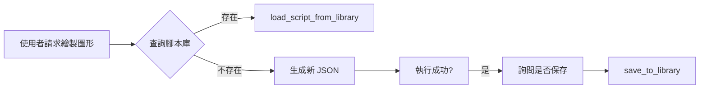

為了確保 AI 在控制 Autodesk Dynamo 時不發生低級錯誤（如點座標重疊、誤用 2D 節點等），特訂定此規範。**AI 在執行任何繪圖指令前必須檢查此規範。**


## 📂 專案結構

- `mcp_config.json`: **[核心設定]** 管理使用者、路徑規則與部屬步驟。
- `server.py`: 主要的 MCP 伺服器，定義 AI 調用的工具集 (Tools)。
- `DynamoViewExtension/`: C# 原始碼，包含 `common_nodes.json` (節點簽名定義)。
- `DynamoScripts/`: 腳本庫，存放經過測試的常用 Dynamo JSON 圖表定義。
- `domain/`: **[SOP 知識庫]** 標準操作程序與故障排除指南。
- `tests/`: 放置所有驗證、效能測試、功能檢查等 Python 腳本。
- `examples/`: 提供給開發者的基準範例。
- `image/`: **[視覺化產出]** 存放 `/image` 指令產出的腳本分析圖表與技術文檔。
- `deploy.ps1`: **[一鍵部署]** 編譯並安裝插件至 Dynamo 套件路徑。
- **`GEMINI.md`**: **[AI 必讀]** 完整的操作規範與節點創建方法。
- **`QUICK_REFERENCE.md`**: **[快速參考]** 常用範例與故障排除指南。

## 🧠 AI 協作指令

此專案採用「上下文工程 (Context Engineering)」策略，區分 **高階規則 (Rules)** 與 **具體規格 (Specs)**。AI 助手必須遵循以下指令與行為模式：

### 1. 指令定義與行為模式
| 指令 | 行為規範 (AI 必須執行的動作) |
| :--- | :--- |
| **`/lessons`** | **智慧提煉**：從成功對話中提取「高階規則或避坑經驗」,並以 **Append (追加)** 方式寫入此 `GEMINI.md` 末尾。嚴禁只記代碼細節。 |
| **`/domain`** | **SOP 轉換**：將成功的對話工作流程轉換為標準 SOP 格式的 `domain/*.md` 檔案。步驟：(1) 確認對象 (2) 提取工具和步驟 (3) 用 YAML frontmatter + MD 格式撰寫 (4) 儲存至 `domain/` (5) 更新觸發表。 |
| **`/review`** | **憲法審計**：檢查 `GEMINI.md` 是否過於肥大。當規則超過 100 行，提議將具體的「規格或案例」遷移至 `domain/` 或 `docs/`。 |
| **`/explain`** | **視覺化解構**：解釋複雜概念時，**強制使用** Markdown 表格、ASCII 流程圖或 Mermaid 圖表。嚴禁提供冗長的文字牆。 |
| **`/image`** | **腳本視覺化分析**：調用 gemini-3-pro-image-preview 模型，使用 Nano Banana Pro 分析使用者提供的 .dyn (JSON) 檔案，產出包含以下內容的繁體中文技術文檔與資訊圖表：(1) 📋 腳本資訊快報（用途目的、複雜難度、使用情境） (2) 📥 輸入參數表格 (3) ⚙️ 執行過程條列說明 (4) 📤 產出結果 (5) 📦 必要外掛清單 (6) 📊 Mermaid 邏輯流程圖（節點標籤必須用雙引號包裹）。所有輸出內容必須使用繁體中文（台灣工程慣用語），並將生成的圖表儲存至 `image/` 資料夾。 |


### 2. 核心行為義務 (不需要指令即可觸發)
- **自動預檢 (Auto-Precheck)**：在開始任何任務前，我 **必須主動** 檢索 `domain/`、`scripts/` 以及 `GEMINI.md`。如果已有先前成功的策略，必須優先參考，嚴禁重複撰寫類似邏輯的 JSON、PY。
- **規格驅動 (SDD)**：重大變更前應先更新 `domain/` 中的 MD 文件（規格），而非直接修改程式碼。

### 📂 腳本與知識組織規範
- **`domain/`**: 存放長期業務邏輯、法規分析策略、成功的 AI 協作經驗 (MD 格式)。
- **`DynamoScripts/`**: 存放穩定的底層核心 MCP 工具 (JSON)。
- **`examples/`**: 存放參數化、可重複調用的穩定工作流腳本(PY)。
- **`tests/`**: 存放任務導向、一次性或除錯用的雜餘腳本。
- **`image/`**: 存放 `/image` 指令產出的 Dynamo 腳本視覺化分析結果（包含 Mermaid 圖表、技術文檔）。


## 0. 啟動與狀態檢查 (Startup & Status Check)

> **📋 完整檢查流程請參考**：[`domain/startup_checklist.md`](domain/startup_checklist.md)

- **強制執行分析**：AI 在進行任何實質作業（放置節點、連線、載入腳本）前，**必須**先執行 `analyze_workspace` 工具。
- **幽靈連線 (Ghost Listener) 偵測法**：
    - **定義**：Revit 未關閉但重開了 Dynamo 視窗。
    - **特徵**：AI 執行指令回報成功，但使用者回報「沒看到東西」或「工作區是空的」。
    - **判定準則**：若 `analyze_workspace` 回傳的 `nodeCount > 1`（除了連線節點），但使用者表示是新開的空白檔案，**判定為幽靈連線**。
    - **處理邏輯**：AI 必須強制停止當前操作，引導使用者執行：`StopMCPServer` -> 刪除 Stop 節點 -> `StartMCPServer`。
    - **完整修復流程**：參考 [`domain/troubleshooting.md#幽靈連線`](domain/troubleshooting.md#幽靈連線)
- **SessionId 變動感知**：
    - 若 `sessionId` 與前次記錄不符，表示 Dynamo 伺服器已重新實例化。
    - AI 必須重置內部 `_nodeIdMap` 快取，避免使用舊的節點 GUID。
- **強制回報**：每次對話開始或環境變動後，**必須**主動回報：
    - `Workspace Name`: 當前檔案名稱。
    - `Node Count`: 當前節點數。
    - `Session State`: 確認 Session ID 是否延續或為新實例。

**相關文件**：
- 📋 [啟動檢查清單](domain/startup_checklist.md) - 標準化 AI 初始化流程
- 🔧 [故障排除 SOP](domain/troubleshooting.md) - 連線失敗、幽靈連線等問題解決方案


---

## 📚 經驗提煉與避坑指南 (Lessons Learned)

> **最後更新**: 2026-01-11 09:52 (GMT+8)  
> **提煉來源**: 多次 Dynamo 節點創建失敗與成功案例的總結

### 🎯 核心教訓 #1：Code Block 是唯一可靠的節點創建方法

**背景問題**：  
早期嘗試直接使用 `Point.ByCoordinates`、`Line.ByStartPointEndPoint` 等節點名稱創建節點時，總是失敗或產生不可預期的結果。

**根本原因**：  
Dynamo API 的 `CreateNodeCommand` 無法直接創建帶參數的幾何節點。這是 API 設計限制，並非 MCP 實作問題。

**黃金法則**：
| 規則 | 說明 |
|:---|:---|
| **节点名稱** | 永遠使用 `"Number"` (不是 "Code Block") |
| **代碼欄位** | 在 `value` 欄位寫完整的 DesignScript |
| **語法結尾** | 所有代碼必須以分號 `;` 結尾 |
| **轉換機制** | `GraphHandler.cs` 會自動將 `"Number"` 轉為 Code Block |

**實戰模板**：
```json
{
  "nodes": [{
    "id": "unique_id",
    "name": "Number",
    "value": "Geometry.Method(params);",
    "x": 300, "y": 300
  }],
  "connectors": []
}
```

---

### 🚫 核心教訓 #2：避免「分散式節點 + 連線」反模式

**失敗模式**：  
試圖創建多個 `Number` 節點分別存放 X、Y、Z 值，再透過 `connectors` 連接到 `Point.ByCoordinates` 節點。

**為何失敗**：
- Dynamo API 無法在創建時同步處理節點與連線的依賴關係
- 會導致「部分節點存在但連線失敗」的殭屍狀態

**正確做法**：  
將所有參數內嵌於單一 Code Block 的 DesignScript 代碼中：
```python
value = "Line.ByStartPointEndPoint(Point.ByCoordinates(0,0,0), Point.ByCoordinates(100,100,100));"
```

---

### ⚠️ 核心教訓 #3：Overload 陷阱與強制 3D 策略

**症狀**：  
`Point.ByCoordinates` 被誤判為 2D 版本，導致 Z 座標被忽略。

**診斷方法**：
1. 檢查 `common_nodes.json` 是否存在多個 Overload 版本
2. 若 `analyze_workspace` 回報警告，檢查節點埠位數量

**強制 3D 解決方案**：
```json
{
  "value": "Point.ByCoordinates(x, y, z);"
}
```
透過 Code Block 明確指定三個參數，繞過 Overload 解析問題。

**AI 行為準則**：
- 若無法百分之百確定使用哪個 Overload，**必須**列出選項並請求使用者確認
- 嚴禁盲目嘗試不同版本

---

### 🔍 核心教訓 #4：幽靈連線 (Ghost Listener) 偵測與修復

**定義**：  
Revit 未關閉但 Dynamo 視窗被重新開啟，導致 AI 指令成功但使用者看不到結果。

**判定準則**：
```
IF analyze_workspace.nodeCount > 1 
   AND 使用者回報「看不到節點」
THEN 判定為幽靈連線
```

**強制修復流程**：
1. `StopMCPServer` (斷開舊連線)
2. 手動刪除 Stop 節點
3. `StartMCPServer` (重新建立連線)

**預防措施**：  
每次對話開始時，強制執行 `analyze_workspace` 並回報：
- Workspace Name
- Node Count
- Session State (SessionId 是否變動)

---

### 📦 核心教訓 #5：腳本庫復用優先於重新生成

**最佳實踐流程**：


**腳本命名規範**：
- 描述性名稱：`grid_10x10`, `basic_cube_param`
- 不包含副檔名
- 小寫 + 底線

**參數化載入**：
```python
# 偏移 500 單位避免重疊
json_content = mcp.load_script_from_library(
    "basic_house", 
    base_x=500, 
    base_y=0
)
```

---

### 🛡️ 自我審查清單 (Pre-Flight Checklist)

執行任何節點創建指令前，AI 必須檢查：

- [ ] 節點名稱是否為 `"Number"` (不是 "Code Block")?
- [ ] `value` 欄位的代碼是否以 `;` 結尾?
- [ ] 若涉及 3D 幾何，是否明確指定 X、Y、Z 三個參數?
- [ ] 是否已執行 `analyze_workspace` 確認當前狀態?
- [ ] SessionId 是否與前次一致 (避免幽靈連線)?
- [ ] 是否有現成腳本可復用 (查詢 `get_script_library`)?

**故障處理原則**：
```
IF analyze_workspace 回傳 Warning 
THEN 停止重複嘗試 
     AND 分析根本原因 
     AND 修正邏輯後再執行
```

---

### 📌 總結：三大不可違背的鐵律

1. **Code Block 至上**：所有幾何創建必須透過 `"Number"` 節點 + DesignScript
2. **避免分散式節點**：參數內嵌於代碼，不依賴 `connectors`
3. **強制環境檢查**：每次操作前執行 `analyze_workspace`，偵測幽靈連線

**關鍵文件參考**：
- 節點簽名定義：`DynamoViewExtension/common_nodes.json`
- 腳本庫目錄：`DynamoScripts/*.json`
- 快速參考：`QUICK_REFERENCE.md`
