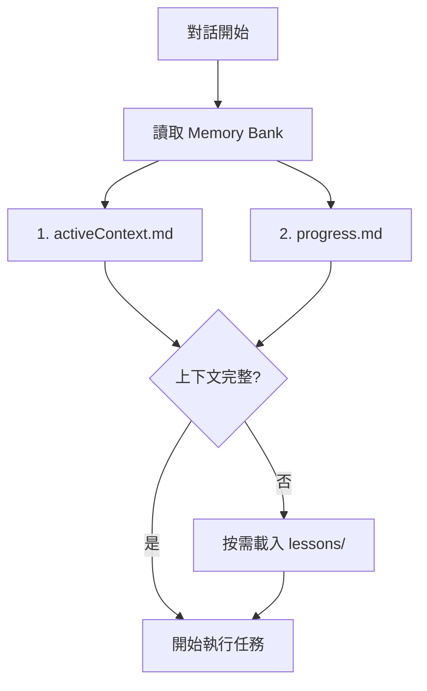

為了確保 AI 在控制 Autodesk Dynamo 時不發生低級錯誤（如點座標重疊、誤用 2D 節點等），特訂定此規範。**AI 在執行任何繪圖指令前必須檢查此規範。**

## 📂 專案結構

- **`bridge/`**: **[核心橋接]** 存放通訊與工具邏輯。
  - `python/server.py`: 主要 MCP 處理器與 WebSocket 伺服器。
  - `node/index.js`: Stdio-to-WS 橋接器（供 AI Client 調用）。
- **`mcp_config.json`**: 中心化配置文件。
- **`memory-bank/`**: **[AI 記憶核心]** 結構化知識管理。
  - `activeContext.md`: 當前工作焦點
  - `progress.md`: 版本進度追蹤
  - `techStack.md`: 技術堆疊說明
  - `lessons/`: 經驗教訓詳情
- `DynamoViewExtension/`: C# 原始碼，包含 `common_nodes.json` (節點簽名定義)。
- `DynamoScripts/`: 腳本庫，存放經過測試的常用 Dynamo JSON 圖表定義。
- `domain/`: **[SOP 知識庫]** 標準操作程序與故障排除指南。
  - `commands/`: 斜線指令 SOP 文件
- `tests/`: 驗證、效能測試、功能檢查。
- `examples/`: 提供給開發者的基準範例。
- `image/`: **[視覺化產出]** 存放 `/image` 指令產出的腳本分析圖表與技術文檔。
- `deploy.ps1`: **[一鍵部署]** 編譯並安裝插件至 Dynamo 套件路徑。
- **`GEMINI.md`**: **[AI 必讀]** 指導規範。
- **`QUICK_REFERENCE.md`**: **[快速參考]** 常用範例。

---

## 🧠 Memory Bank 運作規範

> AI 的記憶在每次對話後會重置。Memory Bank 是恢復上下文的唯一來源。

### 啟動流程 (每次對話開始)

### 文件優先序

| 優先級 | 文件 | 讀取時機 |
|:---|:---|:---|
| 🔴 必讀 | `memory-bank/activeContext.md` | 每次對話 |
| 🔴 必讀 | `memory-bank/progress.md` | 每次對話 |
| 🟡 按需 | `memory-bank/techStack.md` | 技術問題時 |
| 🟡 按需 | `memory-bank/lessons/*` | 遇到類似問題時 |

### 更新觸發條件

| 觸發條件 | 更新目標 | 指令 |
|:---|:---|:---|
| 發現新設計模式 | `lessons/` | `/lessons` |
| 完成版本里程碑 | `progress.md` | `/update-memory` |
| 上下文需釐清 | `activeContext.md` | `/update-memory` |
| 使用者明確要求 | 所有文件 | `/update-memory` |

---

## 🧠 AI 協作指令

此專案採用「上下文工程 (Context Engineering)」策略，區分 **高階規則 (Rules)** 與 **具體規格 (Specs)**。AI 助手必須遵循以下指令與行為模式：

### 1. 指令定義與行為模式

| 指令 | 行為規範 | SOP 文件 |
|:---|:---|:---|
| **`/lessons`** | 智慧提煉經驗教訓，存至 `lessons/` | [lessons.md](domain/commands/lessons.md) |
| **`/domain`** | SOP 轉換，存至 `domain/` | [domain.md](domain/commands/domain.md) |
| **`/review`** | 憲法審計，檢查 GEMINI.md 肥大程度 | [review.md](domain/commands/review.md) |
| **`/explain`** | 視覺化解構，強制使用圖表 | [explain.md](domain/commands/explain.md) |
| **`/image`** | 腳本視覺化分析 | [image.md](domain/commands/image.md) |
| **`/save`** | 資產入庫至 DynamoScripts/ | [save.md](domain/commands/save.md) |
| **`/update-memory`** | Memory Bank 全面更新 | [update-memory.md](domain/commands/update-memory.md) |
| **`/autotest`** | 自動化測試，驗證節點放置與連線功能 | [autotest.md](domain/commands/autotest.md) |
| **`/bugSave`** | 保存當前錯誤狀態供日後分析 | [bugSave.md](domain/commands/bugSave.md) |

### 2. 核心行為義務 (不需要指令即可觸發)

- **Memory Bank 優先原則**：每次對話開始時，**必須先讀取** `memory-bank/activeContext.md` 與 `progress.md`。
- **腳本庫優先原則 (Library-First Pattern)**：在開始任何任務前，**必須主動**查詢 `DynamoScripts/` 腳本庫。
- **自動預檢 (Auto-Precheck)**：必須先執行 `analyze_workspace` 確認環境狀態。
- **規格驅動 (SDD)**：重大變更前應先更新 `domain/` 中的 MD 文件。
- **文件同步義務**：更新 `README.md` 時，**必須同步更新** `README_EN.md`。

### 📂 腳本與知識組織規範

| 資料夾 | 用途 | 內容類型 |
|:---|:---|:---|
| `memory-bank/` | AI 記憶核心 | 上下文、進度、教訓 |
| `domain/` | 技術規格與 SOP | Markdown 文件 |
| `DynamoScripts/` | Dynamo 腳本庫 | JSON (給機器執行) |
| `examples/` | API 使用範例 | Python (教學用途) |
| `tests/` | 測試與診斷 | Python (臨時性質) |
| `image/` | 視覺化產出 | 圖片、分析報告 |

---

## 0. 啟動與狀態檢查 (Startup & Status Check)

> **📋 完整檢查流程請參考**：[`domain/startup_checklist.md`](domain/startup_checklist.md)

- **強制執行分析**：AI 在進行任何實質作業前，**必須**先執行 `analyze_workspace` 工具。
- **幽靈連線徹底修復**：WebSocket 方案透過持久性 TCP 連線解決了幽靈連線問題。
- **強制回報**：每次連線建立或環境變動後，AI 會收到 `Workspace FileName`。

**相關文件**：
- 📋 [啟動檢查清單](domain/startup_checklist.md)
- 🔧 [故障排除 SOP](domain/troubleshooting.md)
- 🎨 [視覺化分析 SOP](domain/visual_analysis_workflow.md)

---

## 📚 經驗提煉索引 (Lessons Learned)

> **詳細內容已遷移至 `memory-bank/lessons/`**，以下為摘要索引。

| ID | 標題 | 摘要 | 詳情 |
|:---|:---|:---|:---|
| #1 | 雙軌節點創建策略 | Code Block vs 原生節點，依場景選擇 | [node-creation.md](memory-bank/lessons/node-creation.md) |
| #3 | Overload 陷阱 | 優先傳遞 `toPortName` 讓 C# 動態比對 | [node-creation.md](memory-bank/lessons/node-creation.md) |
| #5,7,8 | 腳本庫組織規範 | 復用優先、禁止重複開發、產出物歸位 | [script-organization.md](memory-bank/lessons/script-organization.md) |
| #9 | UI 執行緒互操作 | 模型操作必須包裝在 Dispatcher.InvokeAsync | [ui-threading.md](memory-bank/lessons/ui-threading.md) |
| #10 | 原生節點連線 | 使用 `fromPort`/`toPort`，指定 `overload` | [node-creation.md](memory-bank/lessons/node-creation.md) |
| #11 | Python Script 注入 | 三重保障機制確保代碼正確顯示 | [python-injection.md](memory-bank/lessons/python-injection.md) |
| #12 | 跨語言 ID 映射 | Python 字串 ID ↔ C# GUID 雙向映射 | [id-mapping.md](memory-bank/lessons/id-mapping.md) |
| #13-14 | Session 路由 | 精確路由 + 逾時自動清理 | [session-routing.md](memory-bank/lessons/session-routing.md) |
| #15 | 無痛安裝 | 使用 Directory Junction 繞過權限 | [session-routing.md](memory-bank/lessons/session-routing.md) |

---

## 🛡️ 自我審查清單 (Pre-Flight Checklist)

### 通用檢查 (所有任務)

- [ ] 已讀取 `memory-bank/activeContext.md` 確認當前狀態
- [ ] 已執行 `analyze_workspace` 確認環境狀態
- [ ] SessionId 是否與前次一致 (避免幽靈連線)
- [ ] 是否有現成腳本可復用 (查詢 `get_script_library`)
- [ ] 產出物放置路徑是否符合規範 (嚴禁放根目錄)

### 軌道 A (Code Block) 專屬

- [ ] 節點名稱是否為 `"Number"` (不是 `"Code Block"`)
- [ ] `value` 欄位代碼是否以 `;` 結尾
- [ ] 若涉及 3D 幾何，是否明確指定 X、Y、Z 三個參數

### 軌道 B (原生節點) 專屬

- [ ] 使用 `fromPort`/`toPort` (不是 `fromIndex`/`toIndex`)
- [ ] 是否指定 `overload` (如 `"3D"`)
- [ ] 是否設置 `preview` 控制可見性

---

## 📌 當前三大不可違背鐵律

1. **Memory Bank 優先**：每次對話開始必須讀取 `memory-bank/` 文件。
2. **雙軌選擇**：根據場景選擇 Code Block 或原生節點，詳見 [決策流程](memory-bank/lessons/node-creation.md)。
3. **強制環境檢查**：每次操作前執行 `analyze_workspace`，偵測幽靈連線與 Session 變動。
4. **禁止節點控制**：嚴禁要求使用者放置 `StartMCPServer` 節點。使用 Dynamo 選單 `BIM Assistant`。

**關鍵文件參考**：
- 📘 [雙軌制詳細指南](domain/node_creation_strategy.md)
- 📋 [架構分析報告](domain/architecture_analysis.md)
- 🔧 節點簽名定義：`DynamoViewExtension/common_nodes.json`
- 📦 腳本庫目錄：`DynamoScripts/*.json`
- ⚡ [快速參考](QUICK_REFERENCE.md)
