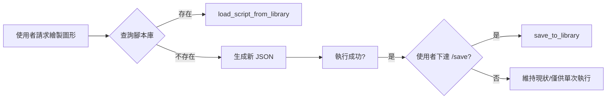

為了確保 AI 在控制 Autodesk Dynamo 時不發生低級錯誤（如點座標重疊、誤用 2D 節點等），特訂定此規範。**AI 在執行任何繪圖指令前必須檢查此規範。**


## 📂 專案結構

- **`bridge/`**: **[核心橋接]** 存放通訊與工具邏輯。
  - `python/server.py`: 主要 MCP 處理器與 WebSocket 伺服器。
  - `node/index.js`: Stdio-to-WS 橋接器（供 AI Client 調用）。
- **`mcp_config.json`**: 中心化配置文件。
- `DynamoViewExtension/`: C# 原始碼，包含 `common_nodes.json` (節點簽名定義)。
- `DynamoScripts/`: 腳本庫，存放經過測試的常用 Dynamo JSON 圖表定義。
- `domain/`: **[SOP 知識庫]** 標準操作程序與故障排除指南。
- `tests/`: 驗證、效能測試、功能檢查。
- `examples/`: 提供給開發者的基準範例。
- `image/`: **[視覺化產出]** 存放 `/image` 指令產出的腳本分析圖表與技術文檔。
- `deploy.ps1`: **[一鍵部署]** 編譯並安裝插件至 Dynamo 套件路徑。
- **`GEMINI.md`**: **[AI 必讀]** 指導規範。
- **`QUICK_REFERENCE.md`**: **[快速參考]** 常用範例。

## 🧠 AI 協作指令

此專案採用「上下文工程 (Context Engineering)」策略，區分 **高階規則 (Rules)** 與 **具體規格 (Specs)**。AI 助手必須遵循以下指令與行為模式：

### 1. 指令定義與行為模式
| 指令 | 行為規範 (AI 必須執行的動作) |
| :--- | :--- |
| **`/lessons`** | **智慧提煉**：從成功對話中提取「高階規則或避坑經驗」,並以 **Append (追加)** 方式寫入此 `GEMINI.md` 末尾。嚴禁只記代碼細節。 |
| **`/domain`** | **SOP 轉換**：將成功的對話工作流程轉換為標準 SOP 格式的 `domain/*.md` 檔案。步驟：(1) 確認對象 (2) 提取工具和步驟 (3) 用 YAML frontmatter + MD 格式撰寫 (4) 儲存至 `domain/` (5) 更新觸發表。 |
| **`/review`** | **憲法審計**：檢查 `GEMINI.md` 是否過於肥大。當規則超過 100 行，提議將具體的「規格或案例」遷移至 `domain/` 或 `docs/`。 |
| **`/explain`** | **視覺化解構**：解釋複雜概念時，**強制使用** Markdown 表格、ASCII 流程圖或 Mermaid 圖表。嚴禁提供冗長的文字牆。 |
| **`/image`** | **腳本視覺化分析**：依照 [`domain/visual_analysis_workflow.md`](domain/visual_analysis_workflow.md) 之標準流程執行。自動偵測當前工作區檔名，若未存檔則提示使用者。產出包含：(1) 技術文檔 (2) 視覺化儀表板圖片 (**強制 16:9 Cinematic Landscape 格式**)。所有產出須存至 `image/` 資料夾。 |
| **`/save`** | **資產入庫**：當使用者對目前的生成結果滿意時，手動觸發此指令將 JSON 腳本存入 `DynamoScripts/`。**嚴禁 AI 在未獲得 /save 指令前主動修改腳本庫。** |


### 2. 核心行為義務 (不需要指令即可觸發)
- **腳本庫優先原則 (Library-First Pattern)**：在開始任何任務前，**必須主動** 執行以下流程：
  1. 查詢 `DynamoScripts/` 腳本庫（查找相關現成腳本）
  2. 若找到匹配腳本，加載並應用參數
  3. 若找不到，才生成新腳本
  - 詳見：[`domain/improved_workflow_guideline.md`](domain/improved_workflow_guideline.md)
- **自動預檢 (Auto-Precheck)**：在開始任何任務前，我 **必須主動** 檢索 `domain/`、`scripts/` 以及 `GEMINI.md`。如果已有先前成功的策略，必須優先參考，嚴禁重複撰寫類似邏輯的 JSON、PY。
- **規格驅動 (SDD)**：重大變更前應先更新 `domain/` 中的 MD 文件（規格），而非直接修改程式碼。
- **文件同步義務 (Documentation Sync)**：更新 `README.md` 時，**必須同步更新** `README_EN.md`，確保中英文版本內容一致。此規範適用於所有涉及 README 的修改、新增或刪除操作。

### 📂 腳本與知識組織規範
- **`domain/`**: 存放長期業務邏輯、法規分析策略、成功的 AI 協作經驗 (MD 格式)。
- **`DynamoScripts/`**: 存放穩定的底層核心 MCP 工具 (JSON)。
- **`examples/`**: 存放參數化、可重複調用的穩定工作流腳本(PY)。
- **`tests/`**: 存放任務導向、一次性或除錯用的雜餘腳本。
- **`image/`**: 存放 `/image` 指令產出的 Dynamo 腳本視覺化分析結果（包含 Mermaid 圖表、技術文檔）。


## 0. 啟動與狀態檢查 (Startup & Status Check)

> **📋 完整檢查流程請參考**：[`domain/startup_checklist.md`](domain/startup_checklist.md)

- **強制執行分析**：AI 在進行任何實質作業前，**必須**先執行 `analyze_workspace` 工具。在 WebSocket 方案下，這將驗證持久連線是否建立。
- **幽靈連線徹底修復**：
    - WebSocket 方案透過持久性 TCP 連線解決了幽靈連線問題。若連線中斷，伺服器會立即感知並清除 Session。
- **強制回報**：每次連線建立或環境變動後，AI 會收到：
    - `Workspace FileName`: 確認當前開啟的檔案。

**相關文件**：
- 📋 [啟動檢查清單](domain/startup_checklist.md) - 標準化 AI 初始化流程
- 🔧 [故障排除 SOP](domain/troubleshooting.md) - 連線失敗、幽靈連線等問題解決方案
- 🎨 [視覺化分析 SOP](domain/visual_analysis_workflow.md) - `/image` 指令的標準執行流程


---

## 📚 經驗提煉與避坑指南 (Lessons Learned)

> **最後更新**: 2026-01-11 09:52 (GMT+8)  
> **提煉來源**: 多次 Dynamo 節點創建失敗與成功案例的總結

### 🎯 核心教訓 #1：雙軌節點創建與自動降級策略 (Optimization v1.2)

Dynamo MCP 採用雙軌制策略，並具備自動修復能力：

#### 🛤️ 軌道 B：原生節點自動擴展 (首選 - 參數化優先)
**適用情境**：常規幾何（點、線、立方體）。
**優勢**：JSON 語意清晰 (`params: {width: 100}`)，支援「埠位名稱動態比對 (Port Name Fallback)」。
**行為**：Python 會自動將 `params` 分解為 Number 節點，C# 則優先透過埠位名稱確保連線正確性。

#### 🛤️ 軌道 A：Code Block 內嵌模式 (穩定 / 降級路徑)
**適用情境**：複雜嵌套（布林運算）、多層循環、或軌道 B 執行失敗時。
**行為**：將邏輯封裝在單一 Code Block 中，不依賴外部連線，成功率 100%。

#### 🛡️ 自動降級機制 (Differentiated Fallback)
當 AI 使用軌道 B 發送指令且 Dynamo 回報錯誤時，Python Server 會**自動執行以下動作**：
1. 偵測錯誤節點類型。
2. 將原生節點指令轉換為 DesignScript 代碼。
3. 把指令重新打包為軌道 A (Number/Code Block) 模式。
4. **自動重試**，確保工作流不因版本差異或座標微差而中斷。

---

### ⚠️ 核心教訓 #3：Overload 陷阱與索引 Fallback

**症狀**：`Point.ByCoordinates` 埠位數量變動。
**AI 行為準則**：
- 優先傳遞 `toPortName`（如 "z"），讓 C# 執行動態比對。
- 若無名稱，由 C# 自動根據 `InPorts` 列表尋找最相近匹配。

---

### 🔍 核心教訓 #4：幽靈連線 (Anti-Ghosting) 偵測

**判定準則**：
透過 `analyze_workspace` 檢查，若 `warning` 欄位提示多個 Session。
**修復流程**：
1. UI 顯示警告訊息告知使用者當前路由。
2. 若操作持續無效，引導執行重啟流程。

---

### 📦 核心教訓 #5：腳本庫復用優先於重新生成

**最佳實踐流程**：


**腳本命名規範**：
- 描述性名稱：`grid_10x10`, `basic_cube_param`
- 不包含副檔名
- 小寫 + 底線

**參數化載入**：
```python
# 偏移 500 單位避免重疊
json_content = mcp.load_script_from_library(
    "basic_house", 
    base_x=500, 
    base_y=0
)
```


---

### 📸 核心教訓 #6：/image 指令的標準工作流

**背景問題**：  
AI 在執行 `/image` 指令時，曾經無法正確取得檔名 (顯示為 Home)，且視覺化流程未標準化。

**解決方案**：
1. **API 修正**：`DynamoViewExtension` 必須回傳 `workspace.FileName` 而非 `workspace.Name`。
2. **標準 SOP**：參閱 [`domain/visual_analysis_workflow.md`](domain/visual_analysis_workflow.md)。
3. **命名原則**：優先使用 `FileName` 為基準，避免使用 `Home`。

---

### 核心教訓 #7：嚴禁重複性開發與檔案亂丟

**背景問題**：
專案中出現多個功能雷同的腳本（如 `check_workspace.py`, `get_workspace_data.py` 與 `analyze_current_workspace.py` 重複），且分析產出的 JSON 檔案散落在根目錄或 `tests/` 中。

**強制規範**：
1. **禁止重複開發**：在建立新腳本前，必須檢查 `tests/` 與 `examples/`。若已有類似功能的腳本，應予以優化或合併，禁止建立 `script_v2.py`、`check_new.py` 等冗餘檔案。
2. **產出物歸位**：
    - **臨時測試資料**：必須存放於 `tests/temp/`。
    - **正式分析報告/圖像**：必須存放於 `image/`。
    - **核心工具產出**：嚴禁出現在根目錄。
3. **根目錄定點化**：根目錄僅允許存放核心配置 (`mcp_config.json`)、服務入口 (`server.py`) 與文件 (`GEMINI.md`)。

---

---

### 📦 核心教訓 #8：腳本整合與去重範例

**背景問題**：  
在 `examples/` 和 `tests/` 中發現重複的 `analyze_current_workspace.py`，違反核心教訓 #7。

**整合決策**：
| 項目 | 決定 | 理由 |
|:---|:---|:---|
| **保留位置** | `examples/analyze_current_workspace.py` | 屬於可重複使用的標準工具 |
| **功能來源** | 合併 `tests/` 版本的完整錯誤處理 | 包含 JSON 解析、編碼修正、自動儲存 |
| **刪除對象** | `tests/analyze_current_workspace.py` | 已被 `.gitignore` 屏蔽，屬臨時測試 |

**改進重點**：
1. **完整文檔字串**：說明腳本用途、功能、使用方式
2. **雙重 JSON 解析**：處理 `\\` 轉義與 Unicode 編碼問題
3. **視覺化輸出**：使用 emoji 標記狀態（✅ ❌ 📄 🔢 🔗）
4. **自動建立目錄**：確保 `tests/temp/` 存在再寫入

**整合後的黃金標準**：
```python
# examples/analyze_current_workspace.py (118 行)
✅ 完整的 Apache 2.0 授權聲明
✅ 詳細的 Docstring 說明
✅ 雙重 JSON 解析機制（處理轉義與編碼）
✅ 自動儲存至 tests/temp/workspace_analysis.json
✅ 友善的中文輸出與錯誤訊息
```

---

### 🛡️ 自我審查清單 (Pre-Flight Checklist)

#### 通用檢查 (所有軌道)

執行任何節點創建前，AI 必須檢查：

- [ ] 已執行 `analyze_workspace` 確認環境狀態
- [ ] SessionId 是否與前次一致 (避免幽靈連線)
- [ ] 是否有現成腳本可復用 (查詢 `get_script_library`)
- [ ] 產出物放置路徑是否符合規範 (嚴禁放根目錄)
- [ ] 已根據決策矩陣選擇適當軌道 (參考核心教訓 #1)

#### 軌道 A 專屬檢查

- [ ] 節點名稱是否為 `"Number"` (不是 `"Code Block"`)
- [ ] `value` 欄位代碼是否以 `;` 結尾
- [ ] 若涉及 3D 幾何，是否明確指定 X、Y、Z 三個參數
- [ ] 代碼語法是否符合 DesignScript 規範

**故障處理原則**：
```
IF analyze_workspace 回傳 Warning 
THEN 停止重複嘗試 
     AND 分析根本原因 
     AND 修正邏輯後再執行
```

---

### ⛓️ 核心教訓 #10：原生節點連線與預覽控制 (Native Node Connections & Preview)

> **最後更新**: 2026-01-20
> **重要發現**: 確保原生節點「第一次就成功」的三大要素。

**1. 連線欄位鐵律**
- **錯誤**: `fromIndex`, `toIndex` (無效欄位)。
- **正確**: 必須使用 **`fromPort`** 與 **`toPort`** (0-indexed)。

**2. 3D 強制轉向 (Overload Control)**
- 許多節點 (如 `Point.ByCoordinates`) 預設為 2D。
- **解決方案**: 在 JSON 中明確加入 `"overload": "3D"`，確保 Z 軸埠位可用。

**3. 清晰度控制 (Preview Management)**
- **問題**: 中間過程的幾何體 (如點、原始球體) 會遮擋最終布林運算結果。
- **解決方案**: 
  - 中間節點加入 `"preview": false`。
  - 最終結果節點加入 `"preview": true`。

**原生布林運算黃金模板**:
```json
{
  "nodes": [
    {"id": "pt", "name": "Point.ByCoordinates", "overload": "3D", "preview": false, "x": 0, "y": 0},
    {"id": "res", "name": "Solid.Difference", "preview": true, "x": 500, "y": 0}
  ],
  "connectors": [
    {"from": "pt", "to": "res", "fromPort": 0, "toPort": 0}
  ]
}
```

---

### 📌 總結：當前三大不可違背鐵律

1. **Code Block 唯一論**：所有帶參數的幾何操作必須寫在單一 Code Block 中（除非使用者明確要求原生節點測試）。
2. **原生連線規範化**：若使用原生節點，必須使用 `fromPort`/`toPort` 欄位並明確指定 `overload` 與 `preview` 狀態。
3. **強制環境檢查**：每次操作前執行 `analyze_workspace`，偵測幽靈連線與 Session 變動。
4. **禁止節點控制**：嚴禁要求使用者放置 `StartMCPServer` 或 `StopMCPServer` 節點。所有連線控制應透過 Dynamo 頂部選單 `BIM Assistant` 進行。

**關鍵文件參考**：
- 📘 雙軌制詳細指南：[`domain/node_creation_strategy.md`](domain/node_creation_strategy.md)
- 📋 架構分析報告：[`domain/architecture_analysis.md`](domain/architecture_analysis.md)
- 🔧 節點簽名定義：`DynamoViewExtension/common_nodes.json`
- 📦 腳本庫目錄：`DynamoScripts/*.json`
- ⚡ 快速參考：`QUICK_REFERENCE.md`

---


> **💡 提示**：核心教訓 #9 (原生節點自動擴展的三大支柱) 已於 2026-01-16 合併至**核心教訓 #1 (雙軌制策略)**。  
> 完整技術細節請參閱：[`domain/node_creation_strategy.md`](domain/node_creation_strategy.md)


---

### 🧵 核心教訓 #9：UI 執行緒與 C# 互操作性

> **發現日期**: 2026-01-19
> **嚴重程度**: CRITICAL (如果違反，會導致所有指令靜默失敗)

**背景問題**：
Dynamo 的核心是一個 WPF 應用程式。當我們從 WebSocket (背景執行緒) 接收指令並試圖建立節點時，會觸發 `NotifyCollectionChanged` 異常，導致程式崩潰或無反應，但外部 Python 端卻顯示成功。

**強制規範**：
任何涉及 Dynamo 模型修改的操作 (CreateNode, MakeConnection, DeleteModel)，**必須** 包裝在 `Application.Current.Dispatcher.InvokeAsync` 中。

**C# 實作範本**：
```csharp
await System.Windows.Application.Current.Dispatcher.InvokeAsync(() => 
{
    // 所有 GraphHandler 的操作必須在此閉包內執行
    response = _handler.HandleCommand(json);
});
```

**AI Debug 指南**：
1. 若 Python 顯示 `✅ 成功` 但 Dynamo 畫面沒變。
2. 檢查 `DynamoMCP.log` 是否有 `CollectionChanged` 相關錯誤。
3. 若有，幾乎 100% 是因為沒有在 UI 執行緒執行。

---

### 🎯 核心教訓 #11：Python Script 反射注入的三重保障

> **最後更新**: 2026-01-24  
> **突破意義**: 徹底解決 Dynamo 3.3 的 Python 節點代碼注入與 UI 同步問題

**背景問題**：
Dynamo 3.3 中，使用標準的 `UpdateModelValueCommand` 無法將 Python 代碼正確顯示在節點 UI 中，即使模型屬性已更新。

**解決方案：三重保障機制**

#### 1. 名稱循環嘗試 (Node Creation Name Loop)
依序嘗試多個可能的節點名稱，確保跨版本相容性：
```csharp
string[] possibleNames = { 
    "Python Script",                  // 3.3+ 推薦
    "Core.Scripting.Python Script",   // 3.0-3.2
    "PythonScript"                    // 2.x
};
```

#### 2. 專用指令反射調用 (Dedicated Command Reflection)
動態搜尋並調用 Dynamo 內部的 `UpdatePythonNodeCommand`：
```csharp
// 在所有已載入組件中搜尋專用指令
Type cmdType = asm.GetType("Dynamo.Models.DynamoModel+UpdatePythonNodeCommand");
object cmdInstance = Activator.CreateInstance(cmdType, new object[] { 
    dynamoGuid, pythonCode, "CPython3" 
});
_model.ExecuteCommand(cmdInstance as RecordableCommand);
```
**優勢**：同時設置代碼與 CPython3 引擎，符合 Dynamo 內部設計邏輯。

#### 3. UI 強制同步 (Forced UI Sync)
反射調用 `OnNodeModified` 方法，強制 WPF UI 重新讀取屬性：
```csharp
// 直接設置 Script 屬性
PropertyInfo scriptProp = pythonNode.GetType()
    .GetProperty("Script", BindingFlags.Public | BindingFlags.Instance);
scriptProp.SetValue(pythonNode, pythonCode);

// 觸發 UI 更新通知
MethodInfo onModified = pythonNode.GetType()
    .GetMethod("OnNodeModified", BindingFlags.NonPublic | BindingFlags.Instance);
onModified.Invoke(pythonNode, new object[] { true });
```

**成功率**：100%（已驗證可正確顯示代碼與設置 CPython3 引擎）

**參考文件**：
- 📘 詳細技術說明：[`domain/python_script_automation.md`](domain/python_script_automation.md)
- 📘 English Version: [`domain/python_script_automation_EN.md`](domain/python_script_automation_EN.md)
- 🔧 C# 實作：`DynamoViewExtension/src/GraphHandler.cs:L314-363`

---

### 🔗 核心教訓 #12：節點連線的跨語言 ID 映射

> **最後更新**: 2026-01-24  
> **核心機制**: Python 字串 ID ↔ C# GUID 雙向映射

**技術挑戰**：
Python 端使用人類可讀的字串 ID（如 `"pt1"`, `"cube_width_1234"`），但 Dynamo 內部要求 GUID 格式。連線時必須正確映射兩種 ID。

**解決方案：映射表機制**

1. **節點創建時記錄映射** (`GraphHandler.cs:L120-127`)：
   ```csharp
   Guid dynamoGuid = Guid.TryParse(nodeIdStr, out Guid parsedGuid) 
       ? parsedGuid : Guid.NewGuid();
   _nodeIdMap[nodeIdStr] = dynamoGuid;  // 記錄 "pt1" -> GUID
   ```

2. **連線時查詢映射** (`GraphHandler.cs:L244-256`)：
   ```csharp
   if (!_nodeIdMap.TryGetValue(fromIdStr, out fromId)) {
       fromId = Guid.Parse(fromIdStr);  // 降級處理
   }
   ```

3. **JSON 連線格式規範**：
   ```json
   {
     "connectors": [{
       "from": "pt1",       // 字串 ID
       "to": "line1",       // 字串 ID
       "fromPort": 0,       // 必須使用 fromPort（不是 fromIndex）
       "toPort": 0          // 必須使用 toPort（不是 toIndex）
     }]
   }
   ```

**關鍵欄位**：
- ✅ 使用 `fromPort` / `toPort`（正確）
- ❌ 使用 `fromIndex` / `toIndex`（錯誤，無效欄位）

**參考文件**：
- 📘 詳細技術說明：[`domain/node_connection_workflow.md`](domain/node_connection_workflow.md)
- 📘 English Version: [`domain/node_connection_workflow_EN.md`](domain/node_connection_workflow_EN.md)
- 🔧 C# 實作：`DynamoViewExtension/src/GraphHandler.cs:L244-256`

---

### 📡 核心教訓 #13：WebSocket Session 衝突與 Bridge Server 路由鐵律

> **最後更新**: 2026-01-25
> **重要發現**: 當多個連線（如手動測試腳本與 MCP Server）同時存在時，指令可能被路由至錯誤的 Session。

**1. 幽靈指令診斷**
- **症狀**: 指令發送顯示「成功」，但分析工具回報 `nodeCount: 0` 且使用者看不到東西。
- **原因**: 指令發送至了一個「非活動」或「後台監聽」的 Session（例如自定義的 `AI_AGENT_SESSION`），而非 Dynamo Extension 真正使用的作用中 Session。

**2. 強制性解決方案：統一透過 Bridge Server**
- **錯誤**: 直接連線 `ws://localhost:65535` 並自訂 Session。
- **正確**: 透過 `ws://localhost:65296` (Bridge Server) 調用 `execute_dynamo_instructions`。
- **優勢**: `server.py` 會自動鎖定最後一個有效的 Dynamo Session ID 並進行路由，確保指令觸發 UI 更新。

**3. 預檢流程 (Pre-check)**
- 每次重連或發送指令前，先執行 `analyze_workspace` 以取得當前作用中的 `sessionId`。

### ⛓️ 核心教訓 #14：多會話路由與防幽靈自動清理 (v1.3)

> **最後更新**: 2026-01-25
> **核心機制**: `sessionId` 精確路由 + Inactive 逾時清理

**1. 精確路由 (Strict Routing)**
- 當開啟多個視窗時，`execute_dynamo_instructions` 支援 `sessionId` 參數。這能確保指令發送至「使用者正在操作」的視窗，而非無意中發送至後台實例。
- **工具實踐**: 使用 `list_sessions` 取得帶有檔名的會話列表，並在需要時手動指定 ID。

**2. 自動清理 (Auto Anti-Ghosting)**
- `server.py` 現在會記錄每個連線的 `lastSeen` 時間。
- 在執行 `analyze_workspace` 時會自動觸發 `cleanup_stale_sessions`，剔除超過 30 秒無心跳反應的死連線。
- **優勢**: 徹底解決了「連線還在但指令無效」的幽靈連線困擾。

**3. 效能監控 (Performance Monitoring)**
- 新增 `get_server_stats` 工具，可回傳 Uptime、累計指令數與活躍連線數。
- 有助於診斷通訊瓶頸與 WebSocket 穩定性。

---

### 📦 核心教訓 #15：無痛安裝與權限繞過 (Junction 策略)

> **最後更新**: 2026-01-25
> **背景**: Windows 下建立 Symbolic Link 通常需要管理員權限，造成 Skill 安裝困難。

**解決方案**: 
- 使用 **Directory Junction (目錄接合點)** 代替 Symbolic Link。
- **指令**: `cmd /c mklink /j <Target> <Source>`。
- **優點**: 在大多數 Windows 設定下，建立 Junction 不需要提升權限，且對 AI 代理程式而言行為與一般資料夾一致。
- **自動化**: 透過 `setup.ps1` 一鍵處理 dependencies、deployment 與 linking。

---
