為了確保 AI 在控制 Autodesk Dynamo 時不發生低級錯誤（如點座標重疊、誤用 2D 節點等），特訂定此規範。**AI 在執行任何繪圖指令前必須檢查此規範。**


## 📂 專案結構

- **`bridge/`**: **[核心橋接]** 存放通訊與工具邏輯。
  - `python/server.py`: 主要 MCP 處理器與 WebSocket 伺服器。
  - `node/index.js`: Stdio-to-WS 橋接器（供 AI Client 調用）。
- **`mcp_config.json`**: 中心化配置文件。
- `DynamoViewExtension/`: C# 原始碼，包含 `common_nodes.json` (節點簽名定義)。
- `DynamoScripts/`: 腳本庫，存放經過測試的常用 Dynamo JSON 圖表定義。
- `domain/`: **[SOP 知識庫]** 標準操作程序與故障排除指南。
- `tests/`: 驗證、效能測試、功能檢查。
- `examples/`: 提供給開發者的基準範例。
- `image/`: **[視覺化產出]** 存放 `/image` 指令產出的腳本分析圖表與技術文檔。
- `deploy.ps1`: **[一鍵部署]** 編譯並安裝插件至 Dynamo 套件路徑。
- **`GEMINI.md`**: **[AI 必讀]** 指導規範。
- **`QUICK_REFERENCE.md`**: **[快速參考]** 常用範例。

## 🧠 AI 協作指令

此專案採用「上下文工程 (Context Engineering)」策略，區分 **高階規則 (Rules)** 與 **具體規格 (Specs)**。AI 助手必須遵循以下指令與行為模式：

### 1. 指令定義與行為模式
| 指令 | 行為規範 (AI 必須執行的動作) |
| :--- | :--- |
| **`/lessons`** | **智慧提煉**：從成功對話中提取「高階規則或避坑經驗」,並以 **Append (追加)** 方式寫入此 `GEMINI.md` 末尾。嚴禁只記代碼細節。 |
| **`/domain`** | **SOP 轉換**：將成功的對話工作流程轉換為標準 SOP 格式的 `domain/*.md` 檔案。步驟：(1) 確認對象 (2) 提取工具和步驟 (3) 用 YAML frontmatter + MD 格式撰寫 (4) 儲存至 `domain/` (5) 更新觸發表。 |
| **`/review`** | **憲法審計**：檢查 `GEMINI.md` 是否過於肥大。當規則超過 100 行，提議將具體的「規格或案例」遷移至 `domain/` 或 `docs/`。 |
| **`/explain`** | **視覺化解構**：解釋複雜概念時，**強制使用** Markdown 表格、ASCII 流程圖或 Mermaid 圖表。嚴禁提供冗長的文字牆。 |
| **`/image`** | **腳本視覺化分析**：依照 [`domain/visual_analysis_workflow.md`](domain/visual_analysis_workflow.md) 之標準流程執行。自動偵測當前工作區檔名，若未存檔則提示使用者。產出包含：(1) 技術文檔 (2) 視覺化儀表板圖片 (**強制 16:9 Cinematic Landscape 格式**)。所有產出須存至 `image/` 資料夾。 |


### 2. 核心行為義務 (不需要指令即可觸發)
- **自動預檢 (Auto-Precheck)**：在開始任何任務前，我 **必須主動** 檢索 `domain/`、`scripts/` 以及 `GEMINI.md`。如果已有先前成功的策略，必須優先參考，嚴禁重複撰寫類似邏輯的 JSON、PY。
- **規格驅動 (SDD)**：重大變更前應先更新 `domain/` 中的 MD 文件（規格），而非直接修改程式碼。
- **文件同步義務 (Documentation Sync)**：更新 `README.md` 時，**必須同步更新** `README_EN.md`，確保中英文版本內容一致。此規範適用於所有涉及 README 的修改、新增或刪除操作。

### 📂 腳本與知識組織規範
- **`domain/`**: 存放長期業務邏輯、法規分析策略、成功的 AI 協作經驗 (MD 格式)。
- **`DynamoScripts/`**: 存放穩定的底層核心 MCP 工具 (JSON)。
- **`examples/`**: 存放參數化、可重複調用的穩定工作流腳本(PY)。
- **`tests/`**: 存放任務導向、一次性或除錯用的雜餘腳本。
- **`image/`**: 存放 `/image` 指令產出的 Dynamo 腳本視覺化分析結果（包含 Mermaid 圖表、技術文檔）。


## 0. 啟動與狀態檢查 (Startup & Status Check)

> **📋 完整檢查流程請參考**：[`domain/startup_checklist.md`](domain/startup_checklist.md)

- **強制執行分析**：AI 在進行任何實質作業前，**必須**先執行 `analyze_workspace` 工具。在 WebSocket 方案下，這將驗證持久連線是否建立。
- **幽靈連線徹底修復**：
    - WebSocket 方案透過持久性 TCP 連線解決了幽靈連線問題。若連線中斷，伺服器會立即感知並清除 Session。
- **強制回報**：每次連線建立或環境變動後，AI 會收到：
    - `Workspace FileName`: 確認當前開啟的檔案。

**相關文件**：
- 📋 [啟動檢查清單](domain/startup_checklist.md) - 標準化 AI 初始化流程
- 🔧 [故障排除 SOP](domain/troubleshooting.md) - 連線失敗、幽靈連線等問題解決方案
- 🎨 [視覺化分析 SOP](domain/visual_analysis_workflow.md) - `/image` 指令的標準執行流程


---

## 📚 經驗提煉與避坑指南 (Lessons Learned)

> **最後更新**: 2026-01-11 09:52 (GMT+8)  
> **提煉來源**: 多次 Dynamo 節點創建失敗與成功案例的總結

### 🎯 核心教訓 #1：節點創建策略 (Node Creation Strategy)

> **最後更新**: 2026-01-19  
> **重要變更**: 允許使用原生節點或 Code Block，根據情境選擇最佳方案。

**核心行為規範**：
- ✅ **簡單幾何**: 使用單一 Code Block（一次性計算）
- ✅ **複雜流程**: 使用原生節點 + 連線（視覺化邏輯）
- ✅ **必須使用正確的 JSON 格式**：`"name"` 欄位 + 直接座標值

---

#### 🛤️ 選項 A: Code Block 內嵌模式（簡單幾何）

**適用情境**：
- 單一幾何物件（一條線、一個點）
- 不需要視覺化中間步驟
- 快速原型

**實戰模板**:
```json
{
  "nodes": [{
    "id": "line_01",
    "name": "Number",
    "value": "Line.ByStartPointEndPoint(Point.ByCoordinates(0,0,0), Point.ByCoordinates(100,100,100));",
    "x": 300, "y": 300
  }],
  "connectors": []
}
```

**優點**: 簡潔、成功率 100%  
**缺點**: 無法視覺化流程

---

#### 🛤️ 選項 B: 原生節點模式（複雜流程）

**適用情境**：
- 需要視覺化中間步驟
- 多個節點組成的流程
- 需要調試或修改參數

**實戰模板**:
```json
{
  "nodes": [
    {"id": "num_x", "name": "Number", "value": "0", "x": 0, "y": 0},
    {"id": "num_y", "name": "Number", "value": "0", "x": 0, "y": 50},
    {"id": "num_z", "name": "Number", "value": "0", "x": 0, "y": 100},
    {"id": "pt1", "name": "Point.ByCoordinates", "x": 300, "y": 50}
  ],
  "connectors": [
    {"from": "num_x", "to": "pt1", "fromIndex": 0, "toIndex": 0},
    {"from": "num_y", "to": "pt1", "fromIndex": 0, "toIndex": 1},
    {"from": "num_z", "to": "pt1", "fromIndex": 0, "toIndex": 2}
  ]
}
```

**關鍵格式要求** ⚠️：
1. **必須使用 `"name"` 欄位** (不是 `"type"`)
2. **座標直接寫在節點中** (不要用 `"inputs"` 物件)
3. **參數值用 Number 節點 + connectors**

**優點**: 視覺化清晰、易於調試  
**缺點**: JSON 較長

---

### ⚠️ 核心教訓 #3：Overload 陷阱與強制 3D 策略

**症狀**：  
`Point.ByCoordinates` 被誤判為 2D 版本，導致 Z 座標被忽略。

**診斷方法**：
1. 檢查 `common_nodes.json` 是否存在多個 Overload 版本
2. 若 `analyze_workspace` 回報警告，檢查節點埠位數量

**強制 3D 解決方案**：
```json
{
  "value": "Point.ByCoordinates(x, y, z);"
}
```
透過 Code Block 明確指定三個參數，繞過 Overload 解析問題。

**AI 行為準則**：
- 若無法百分之百確定使用哪個 Overload，**必須**列出選項並請求使用者確認
- 嚴禁盲目嘗試不同版本

---

### 🔍 核心教訓 #4：幽靈連線 (Ghost Listener) 偵測與修復

**定義**：  
Revit 未關閉但 Dynamo 視窗被重新開啟，導致 AI 指令成功但使用者看不到結果。

**判定準則**：
```
IF analyze_workspace.nodeCount > 1 
   AND 使用者回報「看不到節點」
THEN 判定為幽靈連線
```

**強制修復流程**：
1. `StopMCPServer` (斷開舊連線)
2. 重啟 Dynamo 以清除殘留狀態
3. 重新連線

**預防措施**：  
每次對話開始時，強制執行 `analyze_workspace` 並回報：
- Workspace Name
- Node Count
- Session State (SessionId 是否變動)

---

### 📦 核心教訓 #5：腳本庫復用優先於重新生成

**最佳實踐流程**：

```mermaid
graph LR
    A[使用者請求繪製圖形] --> B{查詢腳本庫}
    B -->|存在| C[load_script_from_library]
    B -->|不存在| D[生成新 JSON]
    D --> E[執行成功?]
    E -->|是| F[詢問是否保存]
    F --> G[save_to_library]
```


**腳本命名規範**：
- 描述性名稱：`grid_10x10`, `basic_cube_param`
- 不包含副檔名
- 小寫 + 底線

**參數化載入**：
```python
# 偏移 500 單位避免重疊
json_content = mcp.load_script_from_library(
    "basic_house", 
    base_x=500, 
    base_y=0
)
```


---

### 📸 核心教訓 #6：/image 指令的標準工作流

**背景問題**：  
AI 在執行 `/image` 指令時，曾經無法正確取得檔名 (顯示為 Home)，且視覺化流程未標準化。

**解決方案**：
1. **API 修正**：`DynamoViewExtension` 必須回傳 `workspace.FileName` 而非 `workspace.Name`。
2. **標準 SOP**：參閱 [`domain/visual_analysis_workflow.md`](domain/visual_analysis_workflow.md)。
3. **命名原則**：優先使用 `FileName` 為基準，避免使用 `Home`。

---

### 核心教訓 #7：嚴禁重複性開發與檔案亂丟

**背景問題**：
專案中出現多個功能雷同的腳本（如 `check_workspace.py`, `get_workspace_data.py` 與 `analyze_current_workspace.py` 重複），且分析產出的 JSON 檔案散落在根目錄或 `tests/` 中。

**強制規範**：
1. **禁止重複開發**：在建立新腳本前，必須檢查 `tests/` 與 `examples/`。若已有類似功能的腳本，應予以優化或合併，禁止建立 `script_v2.py`、`check_new.py` 等冗餘檔案。
2. **產出物歸位**：
    - **臨時測試資料**：必須存放於 `tests/temp/`。
    - **正式分析報告/圖像**：必須存放於 `image/`。
    - **核心工具產出**：嚴禁出現在根目錄。
3. **根目錄定點化**：根目錄僅允許存放核心配置 (`mcp_config.json`)、服務入口 (`server.py`) 與文件 (`GEMINI.md`)。

---

---

### 📦 核心教訓 #8：腳本整合與去重範例

**背景問題**：  
在 `examples/` 和 `tests/` 中發現重複的 `analyze_current_workspace.py`，違反核心教訓 #7。

**整合決策**：
| 項目 | 決定 | 理由 |
|:---|:---|:---|
| **保留位置** | `examples/analyze_current_workspace.py` | 屬於可重複使用的標準工具 |
| **功能來源** | 合併 `tests/` 版本的完整錯誤處理 | 包含 JSON 解析、編碼修正、自動儲存 |
| **刪除對象** | `tests/analyze_current_workspace.py` | 已被 `.gitignore` 屏蔽，屬臨時測試 |

**改進重點**：
1. **完整文檔字串**：說明腳本用途、功能、使用方式
2. **雙重 JSON 解析**：處理 `\\` 轉義與 Unicode 編碼問題
3. **視覺化輸出**：使用 emoji 標記狀態（✅ ❌ 📄 🔢 🔗）
4. **自動建立目錄**：確保 `tests/temp/` 存在再寫入

**整合後的黃金標準**：
```python
# examples/analyze_current_workspace.py (118 行)
✅ 完整的 Apache 2.0 授權聲明
✅ 詳細的 Docstring 說明
✅ 雙重 JSON 解析機制（處理轉義與編碼）
✅ 自動儲存至 tests/temp/workspace_analysis.json
✅ 友善的中文輸出與錯誤訊息
```

---

### 🛡️ 自我審查清單 (Pre-Flight Checklist)

#### 通用檢查 (所有軌道)

執行任何節點創建前，AI 必須檢查：

- [ ] 已執行 `analyze_workspace` 確認環境狀態
- [ ] SessionId 是否與前次一致 (避免幽靈連線)
- [ ] 是否有現成腳本可復用 (查詢 `get_script_library`)
- [ ] 產出物放置路徑是否符合規範 (嚴禁放根目錄)
- [ ] 已根據決策矩陣選擇適當軌道 (參考核心教訓 #1)

#### 軌道 A 專屬檢查

- [ ] 節點名稱是否為 `"Number"` (不是 `"Code Block"`)
- [ ] `value` 欄位代碼是否以 `;` 結尾
- [ ] 若涉及 3D 幾何，是否明確指定 X、Y、Z 三個參數
- [ ] 代碼語法是否符合 DesignScript 規範

**故障處理原則**：
```
IF analyze_workspace 回傳 Warning 
THEN 停止重複嘗試 
     AND 分析根本原因 
     AND 修正邏輯後再執行
```

---

### ⛓️ 核心教訓 #10：原生節點連線與預覽控制 (Native Node Connections & Preview)

> **最後更新**: 2026-01-20
> **重要發現**: 確保原生節點「第一次就成功」的三大要素。

**1. 連線欄位鐵律**
- **錯誤**: `fromIndex`, `toIndex` (無效欄位)。
- **正確**: 必須使用 **`fromPort`** 與 **`toPort`** (0-indexed)。

**2. 3D 強制轉向 (Overload Control)**
- 許多節點 (如 `Point.ByCoordinates`) 預設為 2D。
- **解決方案**: 在 JSON 中明確加入 `"overload": "3D"`，確保 Z 軸埠位可用。

**3. 清晰度控制 (Preview Management)**
- **問題**: 中間過程的幾何體 (如點、原始球體) 會遮擋最終布林運算結果。
- **解決方案**: 
  - 中間節點加入 `"preview": false`。
  - 最終結果節點加入 `"preview": true`。

**原生布林運算黃金模板**:
```json
{
  "nodes": [
    {"id": "pt", "name": "Point.ByCoordinates", "overload": "3D", "preview": false, "x": 0, "y": 0},
    {"id": "res", "name": "Solid.Difference", "preview": true, "x": 500, "y": 0}
  ],
  "connectors": [
    {"from": "pt", "to": "res", "fromPort": 0, "toPort": 0}
  ]
}
```

---

### 📌 總結：當前三大不可違背鐵律

1. **Code Block 唯一論**：所有帶參數的幾何操作必須寫在單一 Code Block 中（除非使用者明確要求原生節點測試）。
2. **原生連線規範化**：若使用原生節點，必須使用 `fromPort`/`toPort` 欄位並明確指定 `overload` 與 `preview` 狀態。
3. **強制環境檢查**：每次操作前執行 `analyze_workspace`，偵測幽靈連線與 Session 變動。

**關鍵文件參考**：
- 📘 雙軌制詳細指南：[`domain/node_creation_strategy.md`](domain/node_creation_strategy.md)
- 📋 架構分析報告：[`domain/architecture_analysis.md`](domain/architecture_analysis.md)
- 🔧 節點簽名定義：`DynamoViewExtension/common_nodes.json`
- 📦 腳本庫目錄：`DynamoScripts/*.json`
- ⚡ 快速參考：`QUICK_REFERENCE.md`

---


> **💡 提示**：核心教訓 #9 (原生節點自動擴展的三大支柱) 已於 2026-01-16 合併至**核心教訓 #1 (雙軌制策略)**。  
> 完整技術細節請參閱：[`domain/node_creation_strategy.md`](domain/node_creation_strategy.md)


---

### 🧵 核心教訓 #9：UI 執行緒與 C# 互操作性

> **發現日期**: 2026-01-19
> **嚴重程度**: CRITICAL (如果違反，會導致所有指令靜默失敗)

**背景問題**：
Dynamo 的核心是一個 WPF 應用程式。當我們從 WebSocket (背景執行緒) 接收指令並試圖建立節點時，會觸發 `NotifyCollectionChanged` 異常，導致程式崩潰或無反應，但外部 Python 端卻顯示成功。

**強制規範**：
任何涉及 Dynamo 模型修改的操作 (CreateNode, MakeConnection, DeleteModel)，**必須** 包裝在 `Application.Current.Dispatcher.InvokeAsync` 中。

**C# 實作範本**：
```csharp
await System.Windows.Application.Current.Dispatcher.InvokeAsync(() => 
{
    // 所有 GraphHandler 的操作必須在此閉包內執行
    response = _handler.HandleCommand(json);
});
```

**AI Debug 指南**：
1. 若 Python 顯示 `✅ 成功` 但 Dynamo 畫面沒變。
2. 檢查 `DynamoMCP.log` 是否有 `CollectionChanged` 相關錯誤。
3. 若有，幾乎 100% 是因為沒有在 UI 執行緒執行。


