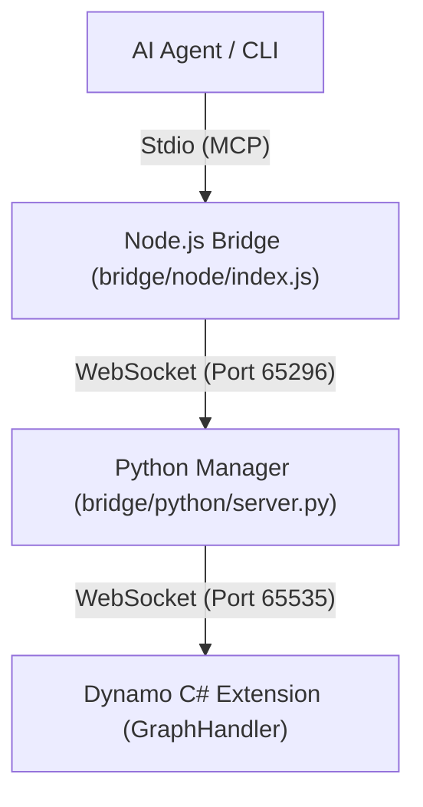

**語言 / Language:** [繁體中文](README.md) | [English](README_EN.md)

---

# Autodesk Dynamo MCP Integration Project

這是一個將 **Autodesk Dynamo** 透過 **Model Context Protocol (MCP)** 連接至 AI (如 Antigravity) 的核心整合專案。
透過此系統，AI 可以直接控制 Dynamo 進行 BIM 自動化操作，實現「零干預」的自動化建模與查詢。

---

## 🚀 最新版本 v3.4：強化分析與視覺化 (Enhanced Analysis & Visualization)

本專案已升級至 **v3.4**，引入了強大的腳本分析工具與節點管理功能：

1.  **視覺化分析 (`/image`)**：自動解析 Dynamo 腳本並生成 Mermaid 流程圖與分析報告，支援大型複雜圖表 (100+ 節點)。
2.  **節點分組 (`create_group`)**：支援將選定節點組織成組，提升圖表可讀性與管理效率。
3.  **穩定性優化**：修復了大型圖表分析時的 WebSocket 逾時問題，並增強了自動啟動機制的可靠性。
4.  **倉儲結構優化**：整理根目錄，將日誌、測試工具與實驗腳本分類存放，確保開發環境整潔。

---

## 🏗️ 系統架構



---

## 📂 專案結構

- `bridge/`: **[核心橋接]** 存放通訊與工具邏輯。
  - `python/server.py`: 主要 MCP 處理器與 WebSocket 伺服器。
  - `node/index.js`: Stdio-to-WS 橋接器。
- `memory-bank/`: **[AI 記憶核心]** 結構化知識管理（`activeContext.md`, `progress.md`, `branch_status.md` 等）。
- `domain/`: **[SOP 知識庫]** 標準操作程序、斜線指令文件與故障排除指南。
- `DynamoScripts/`: 腳本庫，存放經過測試的常用 Dynamo JSON 圖表定義。
- `DynamoViewExtension/`: C# 原始碼，包含 `common_nodes.json` (節點簽名定義)。
- `tools/`: **[新]** 存放各種輔助工具、部署腳本與修復指令。
- `logs/`: **[新]** 集中存放所有伺服器日誌與錯誤報告。
- `trials/`: **[新]** 存放開發過程中的實驗性腳本與過渡文件。
- `tests/`: 功能驗證工具。
- `image/`: 存放 `/image` 指令產出的視覺化儀表板。
- `deploy.ps1`: **[一鍵部署]** 編譯並安裝插件至 Dynamo 套件路徑。
- **`mcp_config.json`**: 中心化配置文件。
- **`GEMINI.md`**: **[AI 必讀]** 指令規範與實作細節。

---

## ✨ 核心功能

### 1. 全類型節點放置 (Universal Node Placement)
- ✅ **原生節點**：所有 Dynamo 內建節點
- ✅ **Zero-Touch DLL**：外掛套件（Archi-lab, BimorphNodes 等）
- ✅ **Custom Nodes/DYF**：自定義節點（Clockwork, Data-Shapes 等）
- 🔧 **技術**：Deep Scan 機制提取內部 `CreationName`（GUID 或完整簽名）

### 2. Python Script 自動化 (Python Script Automation)
- ✅ **節點創建**：自動放置 Python Script 節點
- ✅ **代碼注入**：將 Python 代碼寫入節點並確保 UI 顯示
- ✅ **引擎設置**：自動切換至 CPython3 引擎
- 🔧 **技術**：純反射三重保障機制（參閱 [`domain/python_script_automation.md`](domain/python_script_automation.md)）

### 3. 節點連線 (Node Connection)
- ✅ **自動連線**：程式化建立節點間的連線
- ✅ **ID 映射**：跨語言字串 ID → GUID 轉換
- ✅ **預覽控制**：設定中間節點隱藏、最終結果顯示
- 🔧 **技術**：跨語言 ID 映射機制（參閱 [`domain/node_connection_workflow.md`](domain/node_connection_workflow.md)）

---

## 🤖 AI Agent 使用指南

本專案透過 **Model Context Protocol (MCP)** 提供 AI 自動化介面，支援多種 AI Agent。

### 支援的 AI Agent

- ✅ **Antigravity** (Google Deepmind)
- ✅ **Claude Desktop** (Anthropic)
- ✅ **Gemini CLI** (Google)
- ✅ 任何支援 MCP 的 AI Agent

### 快速開始（適用所有 AI）

#### 1. 配置 MCP 連線

**Antigrav**ity / Gemini CLI**:
```json
"dynamo-mcp": {
  "command": "node",
  "args": ["絕對路徑/bridge/node/index.js"]
}
```

**Claude Desktop**:
```json
"dynamo-mcp": {
  "command": "node",
  "args": ["絕對路徑\\bridge\\node\\index.js"]
}
```

#### 2. 使用 AI Guide

**通用文檔**（適用所有 AI Agent）：
- 📘 [快速開始指南](docs/ai-guide/quick-start.md) - AI 操作 Dynamo 的完整指引
- 📘 [模板參考](docs/ai-guide/templates.md) - 7 個即用 JSON 模板說明

**技術文檔**（深入細節）：
- 📋 [節點創建策略](domain/node_creation_strategy.md)
- 📋 [Python Script 自動化](domain/python_script_automation.md)
- 📋 [節點連線工作流程](domain/node_connection_workflow.md)

**如何使用**：
```
# 告訴 AI 參考文檔
"請參考 docs/ai-guide/quick-start.md 來創建 Dynamo 節點"
```

#### 3. 可用的 MCP 工具

- `execute_dynamo_instructions` - 創建節點與連線
- `analyze_workspace` - 分析工作區狀態
- `search_nodes` - 搜尋可用節點 (舊名: list_available_nodes)
- `run_autotest` - 執行自動化測試
- `get_script_library` - 取得腳本庫清單
- `clear_workspace` - 清除工作區
- `list_sessions` - 查看連線工作階段
- `get_workspace_version` - 取得工作區版本 (樂觀鎖控制)

### Antigravity 專屬功能（可選）

Antigravity 用戶可安裝 Skill 以獲得自動觸發功能：

**符號連結方式**（推薦開發者）：
```powershell
New-Item -ItemType SymbolicLink `
  -Path "$env:USERPROFILE\.gemini\antigravity\skills\dynamo-automation" `
  -Target "C:\Users\LU\AI\AutodeskDynamo_MCP\.skills\dynamo-automation"
```

**手動複製方式**：
```powershell
Copy-Item -Recurse ".skills\dynamo-automation" `
  "$env:USERPROFILE\.gemini\antigravity\skills\"
```

安裝後，Antigravity 會自動識別 Dynamo 相關請求並載入專業指引。

---

## 🛠️ 安裝與部署

1.  **執行部署**:
    - 在專案目錄執行：`.\deploy.ps1`
2.  **啟動機制**:
    - **手動啟動 (Python)**: `python bridge/python/server.py`
    - **Node.js 橋接**: 由 AI Client 自動啟動。

---

## 📖 使用與控制 (Clients)

### 1. Antigravity / Gemini CLI
在設定中加入：
```json
"dynamo-mcp": {
  "command": "node",
  "args": ["絕對路徑/bridge/node/index.js"]
}
```

### 2. Claude Desktop (推薦)
```json
"dynamo-mcp": {
  "command": "node",
  "args": [
    "絕對路徑\\bridge\\node\\index.js"
  ]
}
```
> [!IMPORTANT]
> **連線順序**：AI 用戶端啟動前，建議先手動啟動 `python bridge/python/server.py` 以確保 WS 埠口可用。
設定完成後，Claude 列表中會出現 `dynamo-mcp` (綠燈)，即可開始使用。

---

## ⚖️ 權利聲明 (License)

Copyright 2026 ChimingLu.

Licensed under the Apache License, Version 2.0 (the "License");
you may not use this file except in compliance with the License.
You may obtain a copy of the License at

    http://www.apache.org/licenses/LICENSE-2.0

Unless required by applicable law or agreed to in writing, software
distributed under the License is distributed on an "AS IS" BASIS,
WITHOUT WARRANTIES OR CONDITIONS OF ANY KIND, either express or implied.
See the License for the specific language governing permissions and
limitations under the License.
