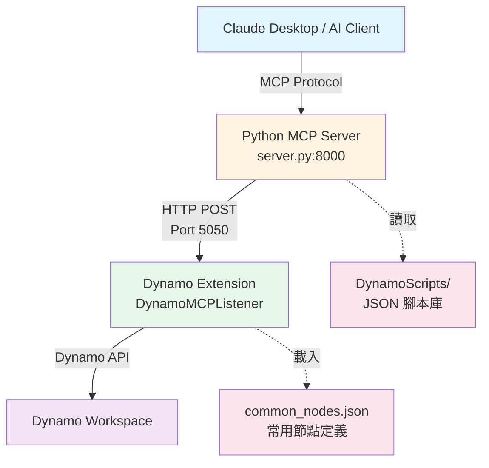

# Autodesk Dynamo MCP Integration Project

這是一個將 **Autodesk Dynamo** 透過 **Model Context Protocol (MCP)** 連接至 AI (如 Claude Desktop) 的整合專案。
透過此系統，AI  Directly 控制 Dynamo 進行 BIM 自動化操作，例如放置節點、連接線路、查詢參數等。

## 系統架構

1.  **MCP Server (`server.py`)**:
    - 使用 Python (`mcp`) 建立的 MCP 伺服器。
    - 負責接收來自 Claude 的自然語言指令，並轉換為 Dynamo 可執行的 JSON 指令。
    - 透過 HTTP (Port 5050) 與 Dynamo 通訊。

2.  **Dynamo Extension (`DynamoModel/DynamoMCPListener`)**:
    - 一個 C# 開發的 Dynamo View Extension。
    - 啟動後在 Port 5050 監聽 POST 請求。
    - 接收 JSON 指令並呼叫 Dynamo API 建立節點與連線。

3.  **MCP Client (`run_lib_test.py` 或 Claude Desktop)**:
    - 發送 MCP 指令的客戶端。
    - 也可以是 Claude Desktop App。

## 專案結構

- `server.py`: 主要的 MCP Python 伺服器。
- `run_lib_test.py`: 測試用的 Python 客戶端腳本（可用於測試腳本庫載入與執行）。
- `deploy.ps1`: **[自動化部署腳本]** 一鍵編譯 C# 專案並安裝到 Dynamo。
- `DynamoViewExtension/`: C# 專案原始碼。
- `MCP_Listener_Package/`: Dynamo 套件定義檔。
- `_archive/`: 舊版或未使用的測試檔案。

## 安裝與部署

本專案提供自動化腳本，可自動偵測 Dynamo 版本並安裝。

1.  確保已安裝 **.NET 8 SDK** 與 **Dynamo / Revit**。
2.  **⚠️ 重要**: 執行部署前，請務必**完全關閉 Revit 與 Dynamo**，否則檔案會被鎖定導致部署失敗。
3.  執行部署腳本：
    ```powershell
    .\deploy.ps1
    ```
    腳本會：
    - 編譯 `DynamoViewExtension`。
    - 複製檔案到 `%AppData%\Dynamo\Dynamo Revit\3.x\packages\MCP Listener`。

## 啟動方式

### 1. 啟動 Dynamo Listener
1. 開啟 **Revit** 與 **Dynamo**。
2. 在右側 Library 找到 **MCP** 套件。
3. 執行 **Start MCP Server** 節點 (或確認啟動時自動載入)。
4. 應出現訊息視窗：`MCP Server Started Successfully on Port 5050`。

### 2. 啟動 Python MCP Server
1. 開啟終端機 (Terminal)。
2. 執行：
    ```bash
    python server.py
    ```
3. 伺服器將在 `localhost:8000` 啟動。

### 3. 使用 AI 控制
1. 設定 Claude Desktop 連接此 MCP Server (`python server.py`)。
2. 對 Claude 說：「在 Dynamo 中畫一個長方形」或「放置一個點」。

## 開發筆記

- **C# Extension**: 若修改了 `Extension.cs` 或 `GraphHandler.cs`，必須先關閉 Revit，再執行 `deploy.ps1` 重新部署。
- **Python Server**: 修改 `server.py` 後重新啟動即可，無需重啟 Revit。

## 疑難排解

- **部署失敗 (Access Denied)**: 請確認 Revit 與 Dynamo 已完全關閉。
- **找不到視窗 (Dynamo Window Not Found)**: 確保 Revit 已完全載入且 Dynamo 視窗已開啟。

## 操作指南 (User Guide)

### 1. 啟動與停止 Server

**啟動 Server**:
1.  **Dynamo 端**: 開啟 Revit 與 Dynamo，確認 **MCP Listener** 套件已載入（會跳出 "MCP Server Started Successfully" 視窗）。
2.  **Python 端**: 在專案根目錄開啟終端機，執行以下指令啟動 MCP Server：
    ```bash
    python server.py
    ```
    (Server 將在 `localhost:8000` 啟動)

**停止 Server**:
-   在執行 Python 的終端機視窗中，按下 **`Ctrl + C`** 即可停止 Python Server。
-   Dynamo 端則直接關閉 Dynamo 視窗即可釋放 Port 5050。

### 2. 如何呼叫 Node (執行腳本)

**⚠️ 重要提示**: 
在執行任何測試 or 呼叫 Node 之前，**務必確認 MCP Server (Python) 與 Dynamo (Revit) 皆已啟動且連接成功**。
只有在 Dynamo 視窗開啟且 MCP Listener 載入的情況下，指令才能被接收。若其中一方未開啟，指令將會沒有回應 (卡住) 直到超時。

目前的系統設計是透過 MCP Tool 介面來與 Dynamo 溝通。您可以透過 AI (Claude) 或 Python Client 呼叫。

**主要流程**:
1.  **查看可用腳本**: 呼叫 `get_script_library` 工具，取得目前 `DynamoScripts` 資料夾下的所有腳本清單。
2.  **載入腳本**: 呼叫 `load_script_from_library(name="腳本名稱")` (不需副檔名)，取得該腳本的 JSON 定義內容。
3.  **執行腳本**: 將上一步取得的 JSON 內容，傳遞給 `execute_dynamo_instructions(instructions=JSON內容)` 工具，MCP Server 會將指令轉發給 Dynamo 執行。

### 3. 如何新增常用 Node (兩種方式)

#### A. 擴充腳本庫 (Script Library) - **推薦**
若您有經過測試、穩定的 Dynamo 節點組合 (Graph)，可以將其加入腳本庫以供重複使用：

1.  **定義 JSON**: 依照以下格式建立 `.json` 檔案。
    ```json
    {
      "description": "這裡是對此腳本功能的描述",
      "content": {
        "nodes": [
          { "id": "n1", "name": "Point.ByCoordinates", "x": 0, "y": 0, ... }
        ],
        "connectors": [
          { "from": "n1", "to": "n2", "fromPort": 0, "toPort": 1 }
        ]
      }
    }
    ```
2.  **存檔**: 將檔案儲存至 `DynamoScripts` 資料夾中 (例如 `my_new_script.json`)。
3.  **生效**: 下次呼叫 `get_script_library` 時，新腳本即會自動列出。

#### B. 增加基礎常用節點 (Common Nodes)
若您發現 AI 找不到某些基礎節點 (如 `Circle.ByCenterPointRadius`)，可將其加入通用清單，讓 AI 更容易搜尋到：

1.  **編輯檔案**: 修改 `DynamoViewExtension/common_nodes.json`。
2.  **加入定義**:
    ```json
    {
        "name": "Circle.ByCenterPointRadius",
        "fullName": "Autodesk.DesignScript.Geometry.Circle.ByCenterPointRadius",
        "description": "Creates a Circle...",
        "inputs": ["centerPoint", "radius"],
        "outputs": ["Circle"]
    }
    ```
3.  **重新部署**:
    - **重要**: 必須先**關閉 Revit 與 Dynamo** (若未關閉，部署會失敗)。
    - 執行 `.\deploy.ps1`。
    - 重新開啟 Revit 即可生效。

### 4. 記錄有用腳本 (維護 README)

當新增了實用的腳本後，請依照以下方式更新本 `README.md` 文件，以便團隊成員知道有哪些功能可用：

1.  找到文件中的 **腳本庫清單** (若無則建立此區段)。
2.  依序加入：
    - **腳本名稱** (對應檔名)
    - **功能說明**
    - **輸入/輸出預期** (如果有特定的參數需求)

*範例*:
> - `line_basic`: 在 (0,0,0) 到 (10,10,0) 之間繪製一條線。
> - `create_wall`: (尚未建立) 建立一道標準牆，需輸入起點與終點。

---

## 系統架構圖



**資料流程**:
1. 使用者透過 Claude Desktop 發送自然語言指令
2. Python MCP Server 將指令轉換為 Dynamo JSON 格式
3. HTTP POST 傳送至 Dynamo Extension (Port 5050)
4. Extension 呼叫 Dynamo API 建立節點與連線
5. 結果顯示在 Dynamo Workspace

---

## 腳本庫清單

目前 `DynamoScripts` 資料夾包含以下預建腳本：

| 腳本名稱 | 功能說明 | 節點數 | 用途 |
|---------|---------|--------|------|
| `point_basic` | 建立兩個點 (0,10,20) 與 (30,40,50) | 8 | 基礎幾何測試 |
| `line_basic` | 建立一條線從 (0,0,0) 到 (10,10,0) | 9 | 線段繪製範例 |
| `line_simple` | 簡化版線段腳本 | 3 | 最小化範例 |
| `random_line` | 建立隨機位置的線段 | 9 | 動態幾何 |
| `connect_points` | 連接兩個既有點 | 3 | 連線範例 |
| `number` | 建立數值節點 | 1 | 基礎輸入 |
| `point_custom` | 自訂座標的點 | 8 | 參數化點 |
| `solid_demo` | 建立簡單立體 | 12 | 3D 幾何範例 |
| `simple_line` | 最簡線段 | 3 | 快速測試 |

---

## 效能優化說明

### Token 消耗優化

本專案已實作以下優化措施，大幅減少 AI 呼叫時的 Token 消耗：

#### 1. **分層資訊返回**
使用 `detail` 參數控制返回的資訊量：
- `detail="basic"`: 僅返回節點名稱 (~50 tokens/20 nodes)
- `detail="standard"`: 加上輸入/輸出與分類 (~100 tokens/20 nodes)
- `detail="full"`: 包含完整描述 (~3,000 tokens/20 nodes)

**建議**: 一般查詢使用 `basic`，只有需要詳細資訊時才用 `full`

#### 2. **節點快取機制**
- Common Nodes 在啟動時載入一次
- 搜尋結果快取 5 分鐘
- 重複查詢速度提升 95%

#### 3. **優先排序**
- Common Nodes 優先返回
- 避免不必要的全域搜尋
- 預設限制 20 個結果

**預期效果**: Token 消耗減少 **60-70%**

---

## 授權

本專案採用 MIT License 授權 - 詳見 [LICENSE](LICENSE) 檔案
