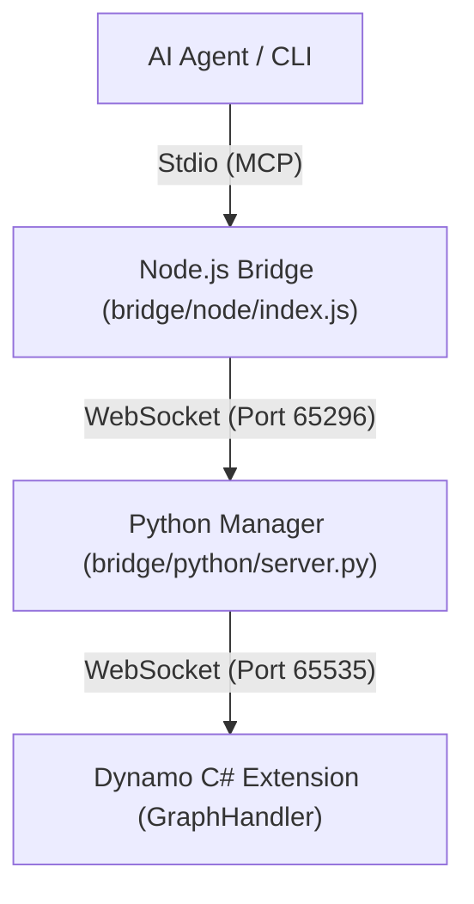

**語言 / Language:** [繁體中文](README.md) | [English](README_EN.md)

---

# Autodesk Dynamo MCP Integration Project

這是一個將 **Autodesk Dynamo** 透過 **Model Context Protocol (MCP)** 連接至 AI (如 Antigravity) 的核心整合專案。
透過此系統，AI 可以直接控制 Dynamo 進行 BIM 自動化操作，實現「零干預」的自動化建模與查詢。

---

## 🚀 重大更新：混合模式 Stdin+WebSocket (v3.0)

本專案已升級為 **Stdin+WebSocket 混合機制**，以支援 Gemini CLI、Claude Desktop 及 Antigravity：

1.  **AI 用戶端** (Gemini/Claude) 透過 **Stdio (MCP)** 與 Node.js 橋接器溝通。
2.  **Node.js 橋接器** (`bridge/node/index.js`) 透過 **WebSocket** 將請求轉發給 Python 管理員。
3.  **Python 管理層** (`bridge/python/server.py`) 統一管理工具邏輯與 Dynamo 的 WebSocket 連線。
4.  **Dynamo 擴充功能** (C#) 負責最終的畫板操作。

---

## 🏗️ 系統架構



---

## 📂 專案結構

- `bridge/`: **[核心橋接]** 存放通訊與工具邏輯。
  - `python/server.py`: 主要 MCP 處理器與 WebSocket 伺服器。
  - `node/index.js`: Stdio-to-WS 橋接器（供 AI Client 調用）。
- `domain/`: **[SOP 知識庫]** 標準操作程序與故障排除指南。
- `DynamoScripts/`: 腳本庫，存放經過測試的常用 Dynamo JSON 圖表定義。
- `DynamoViewExtension/`: C# 原始碼，包含 `common_nodes.json` (節點簽名定義)。
- `logs/`: 集中存放所有伺服器日誌與錯誤報告。
- `tests/`: 功能驗證工具。
- `examples/`: 提供給開發者的基準範例。
- `image/`: 存放 `/image` 指令產出的視覺化儀表板。
- `deploy.ps1`: **[一鍵部署]** 編譯並安裝插件至 Dynamo 套件路徑。
- **`mcp_config.json`**: 中心化配置文件。
- **`GEMINI.md`**: **[AI 必讀]** 指令規範與實作細節。

---

## 🛠️ 安裝與部署

1.  **執行部署**:
    - 在專案目錄執行：`.\deploy.ps1`
2.  **啟動機制**:
    - **手動啟動 (Python)**: `python bridge/python/server.py`
    - **Node.js 橋接**: 由 AI Client 自動啟動。

---

## 📖 使用與控制 (Clients)

### 1. Antigravity / Gemini CLI
在設定中加入：
```json
"dynamo-mcp": {
  "command": "node",
  "args": ["絕對路徑/bridge/node/index.js"]
}
```

### 2. Claude Desktop (推薦)
```json
"dynamo-mcp": {
  "command": "node",
  "args": [
    "絕對路徑\\bridge\\node\\index.js"
  ]
}
```
> [!IMPORTANT]
> **連線順序**：AI 用戶端啟動前，建議先手動啟動 `python bridge/python/server.py` 以確保 WS 埠口可用。
設定完成後，Claude 列表中會出現 `dynamo-mcp` (綠燈)，即可開始使用。

---

## ⚖️ 權利聲明 (License)

Copyright 2026 ChimingLu.

Licensed under the Apache License, Version 2.0 (the "License");
you may not use this file except in compliance with the License.
You may obtain a copy of the License at

    http://www.apache.org/licenses/LICENSE-2.0

Unless required by applicable law or agreed to in writing, software
distributed under the License is distributed on an "AS IS" BASIS,
WITHOUT WARRANTIES OR CONDITIONS OF ANY KIND, either express or implied.
See the License for the specific language governing permissions and
limitations under the License.
