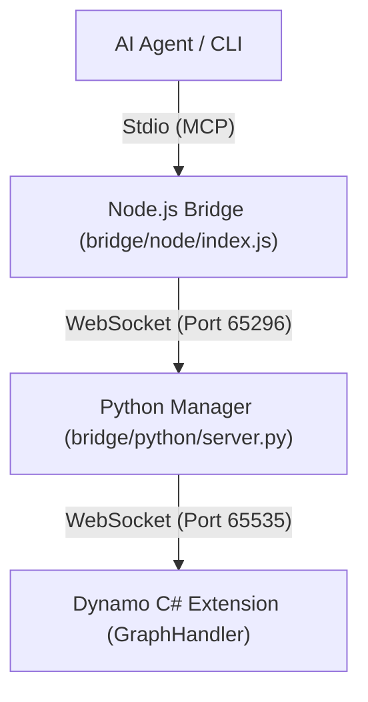

**語言 / Language:** [繁體中文](README.md) | [English](README_EN.md)

---

# Autodesk Dynamo MCP Integration Project

This is a core integration project that connects **Autodesk Dynamo** to AI systems (such as Claude Desktop) through the **Model Context Protocol (MCP)**.
With this system, AI can directly control Dynamo for BIM automation operations, enabling "zero-intervention" automated modeling and querying.

---

## 🚀 Major Update: Hybrid Stdin+WebSocket Mode (v3.0)

This project has been upgraded to a **Hybrid Stdin+WebSocket mechanism** to support Gemini CLI, Claude Desktop, and Antigravity:

1.  **AI Client** (Gemini/Claude) communicates with the Node.js bridge via **Stdio (MCP)**.
2.  **Node.js Bridge** (`bridge/node/index.js`) forwards requests to the Python manager via **WebSocket**.
3.  **Python Manager** (`bridge/python/server.py`) manages tool logic and the WebSocket connection to Dynamo.
4.  **Dynamo Extension** (C#) handles final canvas operations.

---

## 🏗️ System Architecture



---

## 📂 Project Structure

- `bridge/`: **[Core Bridge]** Communication and tool logic.
  - `python/server.py`: Main MCP processor and WebSocket server.
  - `node/index.js`: Stdio-to-WS bridge.
- `domain/`: **[SOP Knowledge Base]** Standard Operating Procedures and Troubleshooting.
- `DynamoScripts/`: Script library for tested Dynamo JSON graph definitions.
- `DynamoViewExtension/`: C# source code, including `common_nodes.json`.
- `logs/`: Central repository for server logs and error reports.
- `tests/`: Functional verification tools.
- `examples/`: Reference examples for developers.
- `image/`: Visualization dashboards produced by `/image`.
- `deploy.ps1`: **[One-click Deployment]** Build and install the extension to the Dynamo package path.
- **`mcp_config.json`**: Centralized configuration file.
- **`GEMINI.md`**: **[AI Essential Read]** Instruction guidelines and implementation details.

---

## 🛠️ Installation & Deployment

1.  **Run Deployment**:
    - Execute: `.\deploy.ps1` in the project root.
2.  **Startup Mechanism**:
    - **Manual Start (Python)**: `python bridge/python/server.py`
    - **Node.js Bridge**: Switched/Started automatically by the AI Client.

---

## 🔥 Core Operational Tools (AI Tools)

| Tool Name | Functionality | Use Case |
|---------|---------|----------|
| `execute_dynamo_instructions` | Place nodes and connectors on the canvas | Core automated modeling |
| `clear_workspace` | **[NEW]** One-click workspace clearing | Redesign or redrawing |
| `analyze_workspace` | Query current node status and errors | Debugging and status checking |
| `list_available_nodes` | Search available Dynamo nodes (including .dyf) | Find modeling tools |
| `save/load_script_to_library` | Persist snapshot scripts to script library | Modular reuse |

> [!TIP]
> **Prevent Overlapping Features**: When executing `execute_dynamo_instructions`, you can set `clear_before_execute=True` to automatically clear the canvas before drawing new geometry.

> [!IMPORTANT]
> **Ensure Stable Connection**: Please make sure to place the `MCPControls.StartMCPServer` node in your Dynamo workspace. This ensures the HTTP server operates in the correct context, avoiding connection interruptions due to auto-start mechanism recycling or insufficient permissions.

---

## 🏥 System Health Check

The new version supports health check endpoints for real-time system status queries and problem diagnosis:

**Usage Example**:
```python
import urllib.request, json

req = urllib.request.Request(
    "http://127.0.0.1:5050/mcp/",
    data=json.dumps({"action": "health_check"}).encode(),
    headers={'Content-Type': 'application/json'}
)
response = urllib.request.urlopen(req)
health = json.loads(response.read().decode())
print(f"Status: {health['status']}, Uptime: {health['uptimeSeconds']} seconds")
```

**Response Example**:
```json
{
  "status": "healthy",
  "version": "2.3",
  "sessionId": "abc-123...",
  "processId": 12345,
  "uptimeSeconds": 3600,
  "workspace": {"name": "Home", "nodeCount": 15}
}
```

## 📖 Usage and Control (Clients)

### 1. Antigravity / Gemini CLI
Add the following to Antigravity's MCP configuration:
```json
"dynamo-mcp": {
  "command": "python",
  "args": ["absolute/path/to/server.py"]
}
```

### 2. Claude Desktop (Recommended)
Click the "Edit Config" button in Claude Desktop settings and add the following:
> **Note**: You must use the `python` command, and the path must be an **absolute path** (e.g. `D:\\AI\\...`).

```json
"dynamo-mcp": {
  "command": "python",
  "args": [
    "D:\\AI\\An\\AutodeskDynamo_MCP\\server.py"
  ]
}
```
After configuration, `dynamo-mcp` (green light) will appear in the Claude list, and you can start using it.

---

## ⚖️ License

Copyright 2026 ChimingLu.

Licensed under the Apache License, Version 2.0 (the "License");
you may not use this file except in compliance with the License.
You may obtain a copy of the License at

    http://www.apache.org/licenses/LICENSE-2.0

Unless required by applicable law or agreed to in writing, software
distributed under the License is distributed on an "AS IS" BASIS,
WITHOUT WARRANTIES OR CONDITIONS OF ANY KIND, either express or implied.
See the License for the specific language governing permissions and
limitations under the License.
