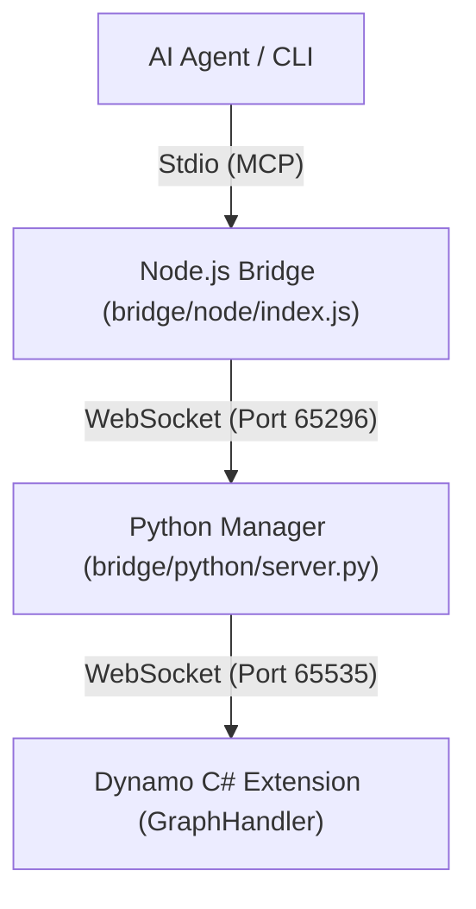

**語言 / Language:** [繁體中文](README.md) | [English](README_EN.md)

---

# Autodesk Dynamo MCP Integration Project

This is a core integration project that connects **Autodesk Dynamo** to AI systems (such as Claude Desktop) through the **Model Context Protocol (MCP)**.
With this system, AI can directly control Dynamo for BIM automation operations, enabling "zero-intervention" automated modeling and querying.

---

## 🚀 Latest Version v3.4: Enhanced Analysis & Visualization
The project has been upgraded to **v3.4**, introducing powerful script analysis tools and node management features:

1.  **Visualization Analysis (`/image`)**: Automatically analyze Dynamo scripts and generate Mermaid flowcharts and analysis reports, supporting large complex graphs (100+ nodes).
2.  **Node Grouping (`create_group`)**: Support for organizing selected nodes into groups to improve graph readability and management efficiency.
3.  **Stability Optimization**: Fixed WebSocket timeout issues when analyzing large graphs and enhanced the reliability of the auto-startup mechanism.
4.  **Repository Structure Optimization**: Reorganized the root directory, classifying logs, testing tools, and experimental scripts into dedicated folders to ensure a clean development environment.

---

## 🏗️ System Architecture



---

## 📂 Project Structure

- `bridge/`: **[Core Bridge]** Communication and tool logic.
  - `python/server.py`: Main MCP processor and WebSocket server.
  - `node/index.js`: Stdio-to-WS bridge.
- `memory-bank/`: **[AI Core Memory]** Structured knowledge management (`activeContext.md`, `progress.md`, etc.).
- `domain/`: **[SOP Knowledge Base]** Standard Operating Procedures, Slash Command docs, and Troubleshooting.
- `DynamoScripts/`: Script library for tested Dynamo JSON graph definitions.
- `DynamoViewExtension/`: C# source code, including `common_nodes.json`.
- `tools/`: **[NEW]** Auxiliary tools, deployment scripts, and fix commands.
- `logs/`: **[NEW]** Central repository for server logs and error reports.
- `trials/`: **[NEW]** Experimental scripts and transition documents from the development process.
- `tests/`: Functional verification tools.
- `image/`: Visualization dashboards produced by `/image`.
- `deploy.ps1`: **[One-click Deployment]** Build and install the extension to the Dynamo package path.
- **`mcp_config.json`**: Centralized configuration file.
- **`GEMINI.md`**: **[AI Essential Read]** Instruction guidelines and implementation details.

---

## ✨ Core Features

### 1. Universal Node Placement
- ✅ **Native Nodes**: All built-in Dynamo nodes
- ✅ **Zero-Touch DLLs**: External packages (Archi-lab, BimorphNodes, etc.)
- ✅ **Custom Nodes/DYF**: Custom nodes (Clockwork, Data-Shapes, etc.)
- 🔧 **Technology**: Deep Scan mechanism extracts internal `CreationName` (GUID or full signature)

### 2. Python Script Automation
- ✅ **Node Creation**: Automatically place Python Script nodes
- ✅ **Code Injection**: Inject Python code into nodes with UI synchronization
- ✅ **Engine Selection**: Automatically switch to CPython3 engine
- 🔧 **Technology**: Pure reflection triple-guarantee mechanism (see [`domain/python_script_automation_EN.md`](domain/python_script_automation_EN.md))

### 3. Node Connection
- ✅ **Auto-Connection**: Programmatically create connections between nodes
- ✅ **ID Mapping**: Cross-language string ID → GUID conversion
- ✅ **Preview Control**: Hide intermediate nodes, show final results
- 🔧 **Technology**: Cross-language ID mapping mechanism (see [`domain/node_connection_workflow_EN.md`](domain/node_connection_workflow_EN.md))

---

## 🤖 AI Agent Usage Guide

This project provides an AI automation interface through **Model Context Protocol (MCP)**, supporting multiple AI agents.

### Supported AI Agents

- ✅ **Antigravity** (Google Deepmind)
- ✅ **Claude Desktop** (Anthropic)
- ✅ **Gemini CLI** (Google)
- ✅ Any MCP-compatible AI Agent

### Quick Start (Universal for All AI)

#### 1. Configure MCP Connection

**Antigravity / Gemini CLI**:
```json
"dynamo-mcp": {
  "command": "node",
  "args": ["absolute/path/to/bridge/node/index.js"]
}
```

**Claude Desktop**:
```json
"dynamo-mcp": {
  "command": "node",
  "args": ["absolute\\path\\to\\bridge\\node\\index.js"]
}
```

#### 2. Use AI Guide

**Universal Documentation** (for all AI Agents):
- 📘 [Quick Start Guide](docs/ai-guide/quick-start.md) - Complete guide for AI to operate Dynamo
- 📘 [Templates Reference](docs/ai-guide/templates.md) - 7 ready-to-use JSON templates

**Technical Documentation** (in-depth details):
- 📋 [Node Creation Strategy](domain/node_creation_strategy.md)
- 📋 [Python Script Automation](domain/python_script_automation_EN.md)
- 📋 [Node Connection Workflow](domain/node_connection_workflow_EN.md)

**How to Use**:
```
# Tell AI to reference documentation
"Please refer to docs/ai-guide/quick-start.md to create Dynamo nodes"
```

#### 3. Available MCP Tools

- `execute_dynamo_instructions` - Create nodes and connections
- `analyze_workspace` - Analyze workspace state
- `search_nodes` - Search available nodes (formerly `list_available_nodes`)
- `run_autotest` - Execute automated tests
- `get_script_library` - Get script library list
- `clear_workspace` - Clear workspace
- `list_sessions` - List active sessions
- `get_workspace_version` - Get workspace version (Optimistic locking)

### Antigravity-Specific Features (Optional)

Antigravity users can install the Skill for automatic triggering:

**Symbolic Link Method** (recommended for developers):
```powershell
New-Item -ItemType SymbolicLink `
  -Path "$env:USERPROFILE\.gemini\antigravity\skills\dynamo-automation" `
  -Target "C:\Path\To\AutodeskDynamo_MCP\.skills\dynamo-automation"
```

**Manual Copy Method**:
```powershell
Copy-Item -Recurse ".skills\dynamo-automation" `
  "$env:USERPROFILE\.gemini\antigravity\skills\"
```

After installation, Antigravity will automatically recognize Dynamo-related requests and load specialized guidance.

---

## 🛠️ Installation & Deployment

1.  **Run Deployment**:
    - Execute: `.\deploy.ps1` in the project root.
2.  **Startup Mechanism**:
    - **Manual Start (Python)**: `python bridge/python/server.py`
    - **Node.js Bridge**: Switched/Started automatically by the AI Client.

---

## 🔥 Core Operational Tools (AI Tools)

| Tool Name | Functionality | Use Case |
|---------|---------|----------|
| `execute_dynamo_instructions` | Place nodes and connectors on the canvas | Core automated modeling |
| `clear_workspace` | **[NEW]** One-click workspace clearing | Redesign or redrawing |
| `analyze_workspace` | Query current node status and errors | Debugging and status checking |
| `search_nodes` | Search available Dynamo nodes (including .dyf) | Find modeling tools |
| `get_script_library` | Get list of available scripts | Modular reuse |

> [!TIP]
> **Prevent Overlapping Features**: When executing `execute_dynamo_instructions`, you can set `clear_before_execute=True` to automatically clear the canvas before drawing new geometry.

> [!IMPORTANT]
> **Ensure Stable Connection**: Please ensure the `BIM Assistant` -> `Connect to MCP Server` is checked in the Dynamo Top Menu. By default, "Auto-Connect on Startup" is enabled to ensure the extension operates in the correct context automatically.

---

## 🏥 System Health Check

The new version supports health check endpoints for real-time system status queries and problem diagnosis:

**Usage Example**:
```python
import urllib.request, json

req = urllib.request.Request(
    "ws://127.0.0.1:65296",
    data=json.dumps({"action": "health_check"}).encode(),
    headers={'Content-Type': 'application/json'}
)
response = urllib.request.urlopen(req)
health = json.loads(response.read().decode())
print(f"Status: {health['status']}, Uptime: {health['uptimeSeconds']} seconds")
```

**Response Example**:
```json
{
  "status": "healthy",
  "version": "2.3",
  "sessionId": "abc-123...",
  "processId": 12345,
  "uptimeSeconds": 3600,
  "workspace": {"name": "Home", "nodeCount": 15}
}
```

## 📖 Usage and Control (Clients)

### 1. Antigravity / Gemini CLI
Add the following to Antigravity's MCP configuration:
```json
"dynamo-mcp": {
  "command": "python",
  "args": ["absolute/path/to/server.py"]
}
```

### 2. Claude Desktop (Recommended)
Click the "Edit Config" button in Claude Desktop settings and add the following:

```json
"dynamo-mcp": {
  "command": "node",
  "args": [
    "absolute\\path\\to\\bridge\\node\\index.js"
  ]
}
```
> [!IMPORTANT]
> **Connection Order**: Before starting the AI Client, it is recommended to manually start `python bridge/python/server.py` to ensure the WS port is available.
> After configuration, `dynamo-mcp` (green light) will appear in the Claude list, and you can start using it.

---

## ⚖️ License

Copyright 2026 ChimingLu.

Licensed under the Apache License, Version 2.0 (the "License");
you may not use this file except in compliance with the License.
You may obtain a copy of the License at

    http://www.apache.org/licenses/LICENSE-2.0

Unless required by applicable law or agreed to in writing, software
distributed under the License is distributed on an "AS IS" BASIS,
WITHOUT WARRANTIES OR CONDITIONS OF ANY KIND, either express or implied.
See the License for the specific language governing permissions and
limitations under the License.
