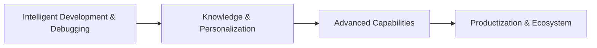

# 🗺️ Autodesk Dynamo MCP - Development Roadmap

> **Language:** [繁體中文](ROADMAP.md) | [English](ROADMAP_EN.md)

This document outlines the future development direction and plans for the Autodesk Dynamo MCP Integration Project.

---

## 📍 Current Version

**v3.1** (2026-01-25) - UI Modernization & Menu Integration

---

## 🎯 Strategic Positioning

**Revit MCP vs. Dynamo MCP Division of Labor**

| Agent | Focus Area |
|:---:|:---|
| **Revit MCP** | BIM database management, property read/write, Transaction processing |
| **Dynamo MCP** | **Geometry Library** utilization, validating complex execution logic through visual programming |

---

## 🏗️ Feature Planning Overview

This project is organized into four major aspects based on **Development Lifecycle** and **Feature Attributes**:

---

## I. Intelligent Development & Debugging

> Solving pain points during development, improving code quality and logical correctness.

### 🔧 Smart Debugging & Logic Optimization
- [ ] Proactively detect workspace errors
- [ ] Auto-repair broken or incorrect connections
- [ ] Identify performance-poor node combinations
- [ ] Suggest replacements following best practices

### 📐 Workspace Standardization (IPO Mode)
- [ ] Resolve "Spaghetti Code" chaos
- [ ] Auto-group by **Input → Process → Output**
- [ ] Visual color marking for nodes
- [ ] Establish maintainable program architecture

### 📊 List Logic Deep Analysis
- [ ] Visual simulation for data flow issues (Lacing, Levels)
- [ ] Display Shortest/Longest/Cross Product structure differences before computation
- [ ] Prevent data misalignment issues

---

## II. Knowledge & Personalization

> Positioning Agent as a mentor, solving information anxiety and passing on experience.

### 🔍 Solving Node Search & Application Pain Points
- [x] Precise node recommendations and usage example queries *(v3.1 basic version)*
- [ ] Solve "don't know which node to use" anxiety
- [ ] Solve "don't know what plugins exist" exploration difficulties

### 🧠 AI Agent Learning & Personalized Knowledge Base
- [ ] Read team's historical `.dyn` files (Legacy Data)
- [ ] Learn specific node usage habits and unique techniques
- [ ] Provide context-aware suggestions matching user style

### 📚 Education & Real-time Mentoring
- [ ] Provide "Learning by Doing" real-time tutorials for native nodes
- [ ] Explain underlying principles of nodes
- [ ] Help beginners overcome technical barriers

---

## III. Advanced Capabilities

> Helping users break through Dynamo's native limitations for complex computations.

### 🐍 Python Node Generation & API Integration
- [x] Auto-write Python Scripts for tasks native nodes cannot handle *(v3.1)*
- [x] Python code injection and CPython3 engine setup *(v3.1)*
- [ ] External API integration (web data, AI services)
- [ ] Complex syntax encapsulation

### 🎨 Generative Design Collaboration
- [ ] Clarify design goals, variables, and constraints through conversation
- [ ] Auto-generate scripts conforming to Generative Design specifications
- [ ] Assist users in geometry optimization computations

---

## IV. Productization & Ecosystem

> Focusing on "usability" after delivery and integration with other systems.

### 📄 Intent Understanding & Automated Documentation
- [ ] Analyze script business purpose
- [ ] Auto-generate technical documentation
- [ ] Generate end-user operation manuals
- [ ] Achieve "code done, docs done simultaneously"

### 🎮 Dynamo Player Smart Packaging
- [ ] Act as "Smart Packager" role
- [ ] Auto-identify and suggest Input/Output nodes
- [ ] Optimize Player interface
- [ ] Rename technical parameters to user-friendly prompts
- [ ] Assist with group sorting

### 🤝 Multi-Agent Collaboration Ecosystem
- [ ] Collaborate with **Revit MCP**
- [ ] Revit MCP handles database read/write
- [ ] Dynamo MCP handles complex geometry computation and logic processing
- [ ] Form complete workflow

---

## 📊 Version Milestones

| Version | Key Features | Status |
|:---:|:---|:---:|
| **v3.2** | Performance Dashboard, API Versioning | 🔄 Planning |
| **v3.3** | Multi-Instance Support, Workspace Snapshots | 📋 Pending |
| **v4.0** | Smart Debugging, IPO Mode Organization | 📋 Pending |
| **v4.1** | Enhanced Node Recommendations, Personalized KB | 📋 Pending |
| **v4.2** | List Logic Visualization, Education Module | 📋 Pending |
| **v5.0** | Generative Design Collaboration | 📋 Pending |
| **v5.1** | Auto Documentation, Player Smart Packaging | 📋 Pending |
| **v6.0** | Multi-Agent Collaboration Ecosystem | 💭 Vision |

**Status Legend:**
- ✅ Completed
- 🔄 Planning
- 📋 Pending
- 💭 Vision

---

## 💡 Community Proposals

Feel free to submit feature suggestions via GitHub Issues! Please use the `enhancement` label.

**How to Contribute:**
1. Open an Issue describing your idea
2. Discuss feasibility and implementation approach
3. Submit a Pull Request

---

## 📝 Update History

- **2026-02-03**: Integrated four-aspect feature concepts, restructured RoadMap architecture

---

> This Roadmap will be continuously updated based on project progress and community feedback.
