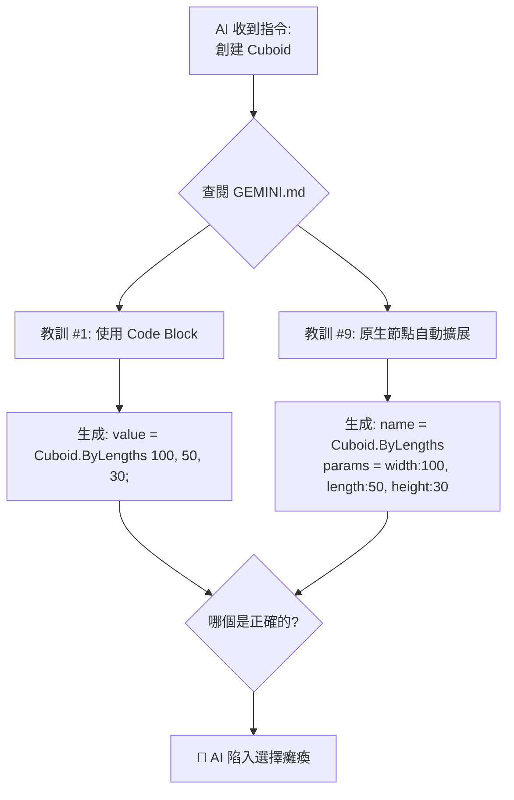
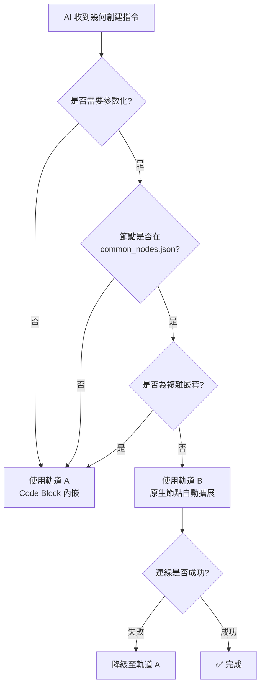

# Dynamo MCP 節點創建策略 - 架構分析與改善方案

## 🔍 問題診斷：策略衝突根本原因

### 衝突點識別

在 `GEMINI.md` 中發現兩個相互矛盾的核心教訓：

| 衝突項目 | 核心教訓 #1 | 核心教訓 #9 |
|:---|:---|:---|
| **方法論** | Code Block 至上 | 原生節點自動擴展 |
| **創建方式** | 所有幾何必須用 `"Number"` + DesignScript | 可直接創建原生節點 (如 `Cuboid.ByLengths`) + 自動生成輔助 Number 節點 |
| **連線依賴** | 避免分散式節點 + 連線 | 依賴 `server.py` 自動生成連線 |
| **適用時期** | 2026-01-11 之前 (早期設計) | 2026-01-13 之後 (布林運算成功後) |
| **行為影響** | AI 必須將所有參數內嵌於單一代碼中 | AI 可使用 `params` 欄位,由系統自動擴展 |

### 造成的 AI 決策困境



---

## 📊 現況實作分析

### 當前系統支援的兩種方法

#### 方法 A：Code Block 內嵌模式 (Legacy)

**實作位置**: `GraphHandler.cs` Line 130-158

```json
{
  "nodes": [{
    "id": "line1",
    "name": "Number",
    "value": "Line.ByStartPointEndPoint(Point.ByCoordinates(0,0,0), Point.ByCoordinates(100,100,100));",
    "x": 300, "y": 300
  }],
  "connectors": []
}
```

**優勢**:
- ✅ 100% 可靠,無連線失敗風險
- ✅ 適合複雜嵌套幾何 (如 `Solid.Difference(cube, sphere)`)
- ✅ 與 Dynamo 原生設計哲學一致

**劣勢**:
- ❌ JSON 可讀性差 (所有邏輯擠在一個字串)
- ❌ 難以參數化 (無法輕易提取出 `width`, `height` 等語義參數)
- ❌ 對 AI 語言模型的 token 消耗較高

---

#### 方法 B：原生節點自動擴展 (Current)

**實作位置**: `server.py` Line 414-470 + `GraphHandler.cs` Line 160-222

**Python 端自動擴展邏輯**:
```python
# server.py:430-467
if (strategy in ["NATIVE_DIRECT", "NATIVE_WITH_OVERLOAD"]) and params:
    for i, port_name in enumerate(input_ports):
        if port_name in params:
            # 創建輔助 Number 節點
            param_node = {
                "id": f"{node_id}_{port_name}_{timestamp}",
                "name": "Number",
                "value": str(params[port_name]),
                "x": node.get("x", 0) - 200,
                "y": node.get("y", 0) + (i * 80),
                "_strategy": "CODE_BLOCK"
            }
            expanded_nodes.append(param_node)
            
            # 自動創建連線
            expanded_connectors.append({
                "from": param_node_id,
                "to": node_id,
                "fromPort": 0,
                "toPort": i
            })
```

**C# 端 ID 映射機制**:
```csharp
// GraphHandler.cs:120-127
Guid dynamoGuid = Guid.TryParse(nodeIdStr, out Guid parsedGuid) ? parsedGuid : Guid.NewGuid();
_nodeIdMap[nodeIdStr] = dynamoGuid; // 字串 ID -> GUID 映射
```

**使用範例**:
```json
{
  "nodes": [{
    "id": "cube1",
    "name": "Cuboid.ByLengths",
    "params": {
      "width": 100,
      "length": 50,
      "height": 30
    },
    "x": 500, "y": 300,
    "preview": false
  }],
  "connectors": []
}
```

**自動轉換結果** (Python 端):
````json
{
  "nodes": [
    {"id": "cube1", "name": "Cuboid.ByLengths", "x": 500, "y": 300},
    {"id": "cube1_width_1234", "name": "Number", "value": "100", "x": 300, "y": 300},
    {"id": "cube1_length_1234", "name": "Number", "value": "50", "x": 300, "y": 380},
    {"id": "cube1_height_1234", "name": "Number", "value": "30", "x": 300, "y": 460}
  ],
  "connectors": [
    {"from": "cube1_width_1234", "to": "cube1", "fromPort": 0, "toPort": 0},
    {"from": "cube1_length_1234", "to": "cube1", "fromPort": 0, "toPort": 1},
    {"from": "cube1_height_1234", "to": "cube1", "fromPort": 0, "toPort": 2}
  ]
}
````

**優勢**:
- ✅ JSON 結構清晰,語義化強 (`params: {width: 100}`)
- ✅ 易於參數化與重複使用 (`base_x`, `base_y` 偏移)
- ✅ 自動繼承 `preview` 屬性,視覺化控制更精細

**劣勢**:
- ❌ 依賴跨語言 ID 映射機制,技術複雜度高
- ❌ 若連線失敗會產生「殭屍節點」(節點存在但未連接)
- ❌ 需要維護 `common_nodes.json` 的埠位順序定義

---

## 🎯 改善方案：雙軌制策略 (Dual-Track Strategy)

### 核心原則：「讓 AI 根據場景自主選擇」

不強制統一方法,而是建立清晰的「決策樹」,讓 AI 根據任務複雜度選擇最優方法。

### 決策矩陣

| 場景類型 | 推薦方法 | 判定準則 |
|:---|:---:|:---|
| **簡單單體幾何** | 方法 A (Code Block) | 無嵌套、參數固定 (如 `Point.ByCoordinates(0,0,0)`) |
| **參數化節點** | 方法 B (自動擴展) | 需要可調參數 (如 `Cuboid` 的 `width`, `height`) |
| **複雜布林運算** | 方法 A (Code Block) | 多層嵌套 (如 `Solid.Difference(Cuboid(...), Sphere(...))`) |
| **腳本庫腳本** | 方法 B (自動擴展) | 需要 `base_x`, `base_y` 偏移與參數覆寫 |
| **調試失敗後** | 方法 A (Code Block) | 方法 B 連線失敗時的降級策略 |

---

### 實作改進計畫

#### 1️⃣ 更新 `GEMINI.md` - 合併衝突的教訓

**改進方向**:
- 將「核心教訓 #1」與「核心教訓 #9」合併為「**核心教訓 #1：雙軌節點創建策略**」
- 明確標註適用場景,避免 AI 陷入選擇困境

**新版架構** (範例):
```markdown
### 🎯 核心教訓 #1：雙軌節點創建策略

Dynamo MCP 支援兩種節點創建方法,各有適用場景：

#### 軌道 A：Code Block 內嵌模式 (穩定可靠)

**適用場景**：
- 簡單單體幾何 (無需參數化)
- 複雜嵌套幾何 (如布林運算)
- 調試失敗時的降級策略

**黃金法則**：
| 規則 | 說明 |
|:---|:---|
| 節點名稱 | `"Number"` |
| 代碼欄位 | 完整 DesignScript (如 `Point.ByCoordinates(0,0,0);`) |
| 語法結尾 | 必須以 `;` 結尾 |

**範例**：
```json
{
  "nodes": [{
    "id": "line1",
    "name": "Number",
    "value": "Line.ByStartPointEndPoint(Point.ByCoordinates(0,0,0), Point.ByCoordinates(100,100,100));",
    "x": 300, "y": 300
  }]
}
```

---

#### 軌道 B：原生節點自動擴展 (參數化優先)

**適用場景**：
- 需要參數化的節點 (如 `Cuboid.ByLengths`)
- 腳本庫復用 (需要 `base_x`, `base_y` 偏移)
- 需要隱藏中間節點 (透過 `preview: false`)

**前提條件**：
- ✅ 節點已定義於 `common_nodes.json`
- ✅ 埠位順序已正確配置
- ✅ `server.py` 自動擴展機制已啟用

**範例**：
```json
{
  "nodes": [{
    "id": "cube1",
    "name": "Cuboid.ByLengths",
    "params": {"width": 100, "length": 50, "height": 30},
    "x": 500, "y": 300,
    "preview": false
  }]
}
```

---

#### 決策流程



---

#### AI 自我審查清單 (更新版)

執行節點創建前,AI 必須檢查：

**通用檢查**：
- [ ] 已執行 `analyze_workspace` 確認環境狀態
- [ ] SessionId 是否與前次一致 (避免幽靈連線)
- [ ] 是否有現成腳本可復用

**軌道 A (Code Block) 專屬**：
- [ ] `value` 欄位代碼是否以 `;` 結尾
- [ ] 若涉及 3D 幾何,是否明確指定 X、Y、Z 三個參數

**軌道 B (自動擴展) 專屬**：
- [ ] 節點是否存在於 `common_nodes.json`
- [ ] 埠位順序是否與 metadata 定義一致
- [ ] 是否需要指定 `overload` (如 `Point.ByCoordinates` 的 2D/3D 版本)
- [ ] 若連線失敗,是否已準備降級至軌道 A

---

#### 2️⃣ 增強 `server.py` - 自動降級機制

**改進目標**：當方法 B 連線失敗時,自動轉換為方法 A 並重試。

**實作位置**: `server.py:execute_dynamo_instructions()`

**偽代碼**:
```python
def execute_dynamo_instructions(...):
    try:
        # 嘗試原生節點自動擴展
        result = _execute_with_auto_expansion(json_data)
        return result
    except ConnectionFailureError as e:
        MCPLogger.Warning(f"[Auto-Expansion Failed] {e}, 降級至 Code Block 模式")
        # 自動轉換為 Code Block
        fallback_json = _convert_to_code_block(json_data)
        return _execute_with_code_block(fallback_json)
```

---

#### 3️⃣ 創建新文件 `domain/node_creation_strategy.md`

**用途**：
- 完整記錄雙軌制的技術細節
- 提供實際案例比對
- 作為 AI 查詢的權威參考

**內容架構** (YAML frontmatter):
```yaml
---
title: "Dynamo 節點創建策略指南"
version: "2.0"
last_update: "2026-01-16"
applies_to: ["GEMINI.md", "server.py", "GraphHandler.cs"]
---
```

---

## 📋 實作檢查清單

**階段 1：文檔重構** (優先執行)
- [ ] 合併 `GEMINI.md` 核心教訓 #1 與 #9
- [ ] 更新「三大不可違背的鐵律」(Line 287-291)
- [ ] 創建 `domain/node_creation_strategy.md`
- [ ] 更新 `QUICK_REFERENCE.md` 參考連結

**階段 2：程式碼增強** (可選)
- [ ] 實作 `server.py` 自動降級機制
- [ ] 新增連線失敗偵測 (檢查 C# 回傳的錯誤碼)
- [ ] 增加 Debug 日誌 (記錄選擇的軌道與原因)

**階段 3：驗證測試** (建議)
- [ ] 建立測試案例：簡單幾何 (Point, Line)
- [ ] 建立測試案例：參數化節點 (Cuboid, Sphere)
- [ ] 建立測試案例：複雜嵌套 (Solid.Difference)
- [ ] 建立測試案例：連線失敗情境 (觸發降級機制)

---

## 🎓 總結與建議

### 核心洞察

**衝突根源**：
- `GEMINI.md` 記錄了「演進式經驗」,未及時整合早期與後期的技術進步
- 核心教訓 #1 反映了「API 限制時期」的權宜之計
- 核心教訓 #9 代表了「ID 映射機制突破後」的新能力

**最佳解**：
- ❌ 不應刪除任何一方 (兩者都是有效方法)
- ✅ 應建立「場景化決策樹」,讓 AI 自主選擇
- ✅ 提供自動降級機制,確保 100% 成功率

### 下一步行動建議

1. **立即執行** (30 分鐘內):
   - 更新 `GEMINI.md`,合併衝突的教訓
   - 與使用者討論雙軌制方案

2. **短期優化** (本週內):
   - 創建 `domain/node_creation_strategy.md`
   - 實作自動降級機制

3. **長期維護** (每月):
   - 定期檢查 `GEMINI.md` 是否有新的經驗衝突
   - 更新決策矩陣 (根據實際使用反饋)

---

**文件版本**: v1.0  
**撰寫日期**: 2026-01-16  
**適用範圍**: `GEMINI.md`, `server.py`, `GraphHandler.cs`
