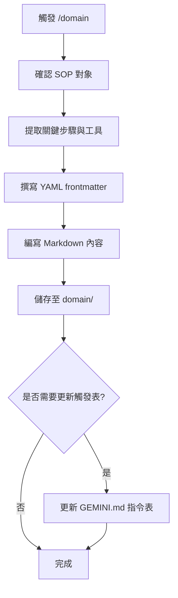

# /domain 指令 SOP

## 📋 指令目的

將成功的對話工作流程轉換為標準 SOP 格式，存放於 `domain/` 資料夾。

---

## 🔄 執行流程



---

## 📁 產出位置

| 類型 | 路徑 |
|:---|:---|
| SOP 文件 | `domain/*.md` |
| 指令 SOP | `domain/commands/*.md` |

---

## ✏️ 撰寫規範

### YAML Frontmatter

```yaml
---
title: "SOP 標題"
version: 1.0
last_update: 2026-02-04
applies_to: ["server.py", "GraphHandler.cs"]
---
```

### 內容結構

```markdown
# [SOP 標題]

## 📋 目的
[簡述此 SOP 解決的問題]

## 🔧 前置條件
- [必要工具/環境]
- [必要權限]

## 🔄 執行步驟

### 步驟 1：[動作名稱]
[詳細說明]

### 步驟 2：[動作名稱]
[詳細說明]

## ⚠️ 注意事項
- [重要提醒]

## 📎 相關文件
- [連結]
```

---

## 📦 分類規則

| 內容類型 | 存放位置 |
|:---|:---|
| 斜線指令 SOP | `domain/commands/` |
| 技術流程 SOP | `domain/` |
| 故障排除 | `domain/troubleshooting.md` |
| 架構分析 | `domain/architecture_*.md` |

---

## ⚠️ 注意事項

1. **避免與 lessons 混淆**：
   - `domain/` = 「怎麼做」(How-to)
   - `lessons/` = 「為什麼」(Why / 避坑經驗)

2. **命名規範**：
   - 小寫 + 底線
   - 描述性名稱
   - 例：`python_script_automation.md`

3. **雙語同步**：若為重要 SOP，需同時建立 `*_EN.md` 版本

---

## 📝 範例：成功執行結果

**使用者對話**：成功完成 Python Script 節點自動化流程

**AI 執行**：
1. 建立 `domain/python_script_automation.md`
2. 建立 `domain/python_script_automation_EN.md`

**回報**：
```
✅ 已建立 SOP：Python Script 節點自動化
   📁 中文版：domain/python_script_automation.md
   📁 英文版：domain/python_script_automation_EN.md
```
