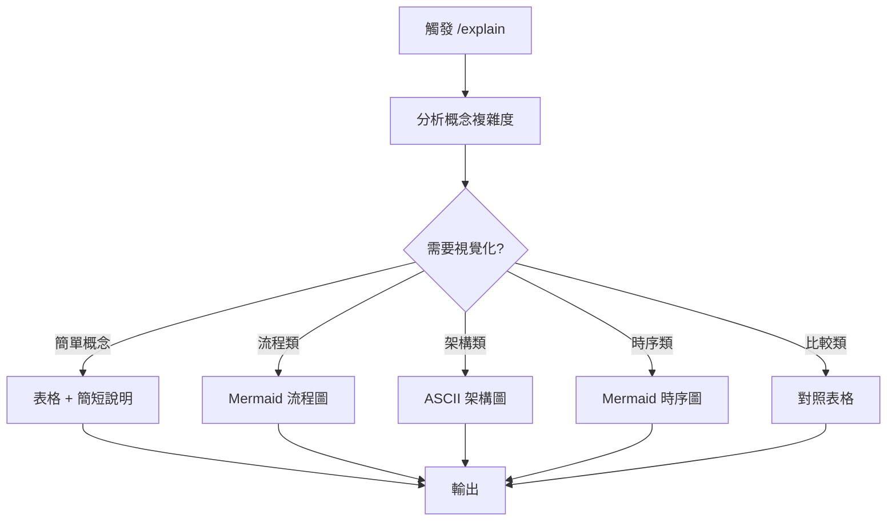

# /explain 指令 SOP

## 📋 指令目的

解釋複雜概念時，**強制使用**視覺化工具，避免冗長的文字牆。

---

## 🔄 執行流程



---

## 📊 視覺化工具選擇

| 概念類型 | 推薦工具 | 範例 |
|:---|:---|:---|
| 流程/決策 | Mermaid flowchart | 節點創建決策樹 |
| 時間序列 | Mermaid sequenceDiagram | API 調用順序 |
| 架構關係 | ASCII 圖 / Mermaid graph | 系統架構 |
| 對比分析 | Markdown 表格 | 軌道 A vs B |
| 狀態變化 | Mermaid stateDiagram | 連線狀態 |

---

## ✏️ 輸出規範

### ❌ 禁止

- 超過 5 段的純文字說明
- 無結構的列點
- 未經格式化的程式碼

### ✅ 要求

- 每個解釋必須包含至少一個視覺化元素
- 程式碼必須有語法高亮
- 複雜概念分階段解釋

---

## 📝 範例

### 使用者請求
「解釋雙軌節點創建策略」

### AI 回應結構

```markdown
## 雙軌節點創建策略

### 概念圖
[Mermaid 決策流程圖]

### 對比表
| 軌道 | 適用場景 | 優勢 | 劣勢 |
|:---|:---|:---|:---|

### 程式碼範例
\`\`\`json
// 軌道 A 範例
\`\`\`

\`\`\`json
// 軌道 B 範例
\`\`\`

### 相關文件
- [詳細說明](memory-bank/lessons/node-creation.md)
```

---

## ⚠️ 注意事項

1. **控制長度**：單次解釋不超過螢幕一頁
2. **漸進式**：複雜概念分多次解釋
3. **互動確認**：完成後詢問是否需要更深入說明
