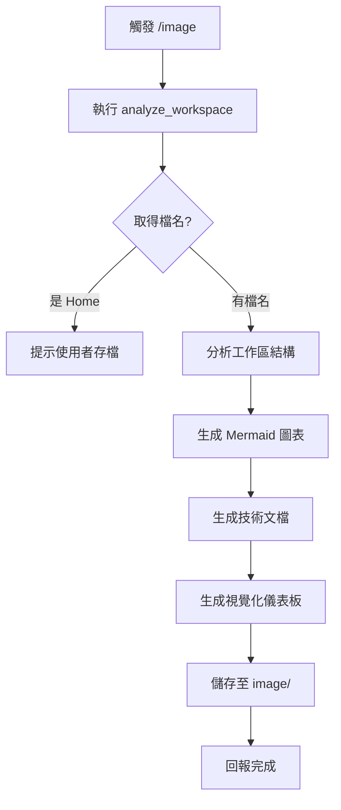

# /image 指令 SOP

## 📋 指令目的

對當前 Dynamo 工作區進行視覺化分析，產出技術文檔與儀表板圖片。

---

## 🔄 執行流程



---

## 📁 產出物

| 產出 | 格式 | 存放位置 |
|:---|:---|:---|
| 技術文檔 | Markdown | `image/[filename]_analysis.md` |
| 儀表板圖片 | PNG/WebP | `image/[filename]_dashboard.*` |
| Mermaid 原始碼 | 內嵌於 MD | - |

---

## 🎨 視覺化規範

### 儀表板圖片要求

- **格式**：16:9 Cinematic Landscape
- **內容**：
  - 節點統計
  - 連線關係圖
  - 輸入/輸出識別
  - 資料流方向

### 技術文檔結構

```markdown
# [FileName] 技術分析

## 📊 基本資訊
- 節點數量：X
- 連線數量：Y
- 群組數量：Z

## 🔗 節點關係圖
\`\`\`mermaid
graph LR
    ...
\`\`\`

## 📥 輸入節點
| 節點 ID | 類型 | 參數 |
|:---|:---|:---|

## 📤 輸出節點
| 節點 ID | 類型 | 預覽 |
|:---|:---|:---|

## 💡 優化建議
- [建議 1]
- [建議 2]
```

---

## ⚠️ 注意事項

1. **檔名處理**：
   - 若 `workspace.FileName` 為 `null`，顯示為 `Home`
   - 提示使用者先存檔再執行 `/image`

2. **API 版本**：
   - 使用 `workspace.FileName` 而非 `workspace.Name`
   - 參考核心教訓 #6

3. **儲存規範**：
   - 所有產出必須存至 `image/` 資料夾
   - 禁止放在根目錄或 `tests/`

---

## 📎 相關文件

- 📘 詳細 SOP：[`domain/visual_analysis_workflow.md`](visual_analysis_workflow.md)
- 🎨 核心教訓 #6：`/image` 指令的標準工作流
