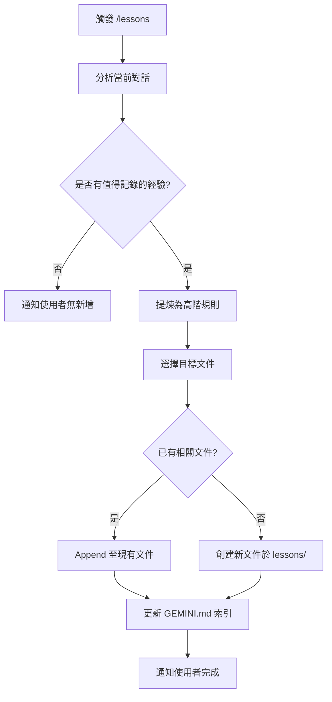

# /lessons 指令 SOP

## 📋 指令目的

從成功對話中提取「高階規則或避坑經驗」，並結構化保存至 Memory Bank。

---

## 🔄 執行流程



---

## 📁 產出位置

| 類型 | 路徑 |
|:---|:---|
| 詳細內容 | `memory-bank/lessons/*.md` |
| 摘要索引 | `GEMINI.md` 經驗提煉索引章節 |

---

## ✏️ 撰寫規範

### YAML Frontmatter

```yaml
---
id: 16
title: "新發現的經驗教訓"
date: 2026-02-04
severity: MEDIUM  # LOW / MEDIUM / HIGH / CRITICAL
related: [1, 5]   # 相關教訓 ID（可選）
---
```

### 內容結構

```markdown
# 核心教訓 #16：[標題]

> **發現日期**: YYYY-MM-DD
> **嚴重程度**: [severity]

## 背景問題
[描述遇到的問題]

## 解決方案
[具體做法]

## 關鍵程式碼
\`\`\`[language]
// 最小可行範例
\`\`\`

## 參考文件
- 📘 [相關文件連結]
```

---

## ⚠️ 注意事項

1. **只記錄高階規則**：不記錄具體代碼細節，細節應放在 `domain/` SOP 中
2. **避免重複**：先檢查 `lessons/` 是否已有類似教訓
3. **嚴禁直接寫入 GEMINI.md**：應先寫入 `lessons/`，再更新索引
4. **ID 遞增**：查看現有最大 ID，新教訓 ID = 最大 ID + 1

---

## 📝 範例：成功執行結果

**使用者對話**：發現 Dynamo 3.3 中某個 API 行為變更

**AI 執行**：
1. 建立 `memory-bank/lessons/dynamo33-api-change.md`
2. 更新 `GEMINI.md` 索引表新增一行

**回報**：
```
✅ 已記錄核心教訓 #16：Dynamo 3.3 API 行為變更
   📁 詳情：memory-bank/lessons/dynamo33-api-change.md
   📋 索引已更新：GEMINI.md
```
