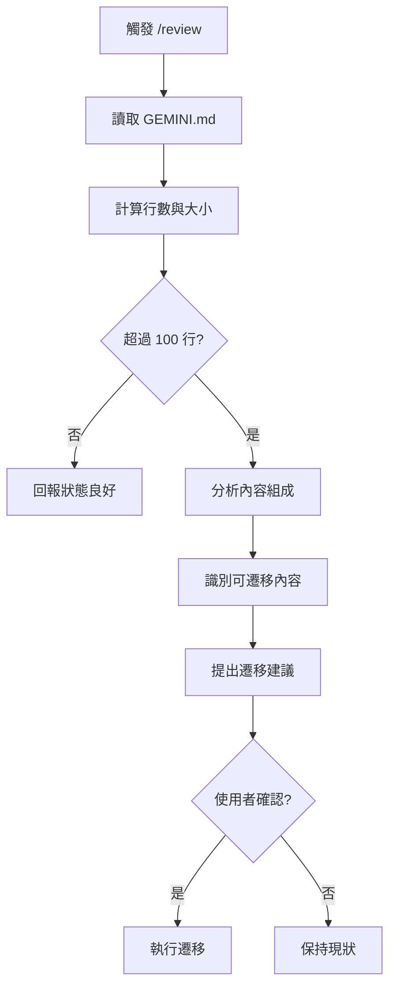

# /review 指令 SOP

## 📋 指令目的

執行「憲法審計」，檢查 GEMINI.md 是否過於肥大，並提議遷移策略。

---

## 🔄 執行流程



---

## 📊 審計指標

| 指標 | 閾值 | 說明 |
|:---|:---|:---|
| 總行數 | > 200 行 | 建議精簡 |
| 檔案大小 | > 15KB | 警告 |
| 核心教訓數量 | > 10 條 | 建議遷移至 lessons/ |

---

## 🔍 審計項目

### 1. 內容分類

| 類型 | 應保留在 GEMINI.md | 應遷移 |
|:---|:---|:---|
| AI 行為規範 | ✅ | - |
| Memory Bank 運作規範 | ✅ | - |
| 指令定義表格 | ✅ | - |
| 核心教訓詳情 | ❌ | `lessons/` |
| 程式碼範例 (長) | ❌ | `domain/` |
| 架構分析 | ❌ | `domain/` |

### 2. 連結完整性

- 檢查所有內部連結是否有效
- 確認遷移後的文件已更新索引

---

## 📝 輸出格式

### 審計報告

```markdown
## 📊 GEMINI.md 審計報告

**審計日期**: 2026-02-04
**目前狀態**: ⚠️ 需要精簡

| 指標 | 當前值 | 建議值 |
|:---|:---|:---|
| 總行數 | 473 | < 200 |
| 檔案大小 | 22KB | < 10KB |
| 核心教訓 | 15 條 | < 5 條 (索引) |

### 建議遷移項目

1. ~~核心教訓 #1-#15 詳情~~ → `memory-bank/lessons/`
2. ~~程式碼範例~~ → 保留於 lessons 內
3. ~~架構分析~~ → 已存在 `domain/`

### 預期效果

遷移後 GEMINI.md 預計減少至 ~150 行 (~8KB)
```

---

## ⚠️ 注意事項

1. **不可刪除核心規範**：AI 行為義務、自我審查清單必須保留
2. **保持索引完整**：遷移後必須更新索引連結
3. **遞增式執行**：可分批遷移，不需一次完成
