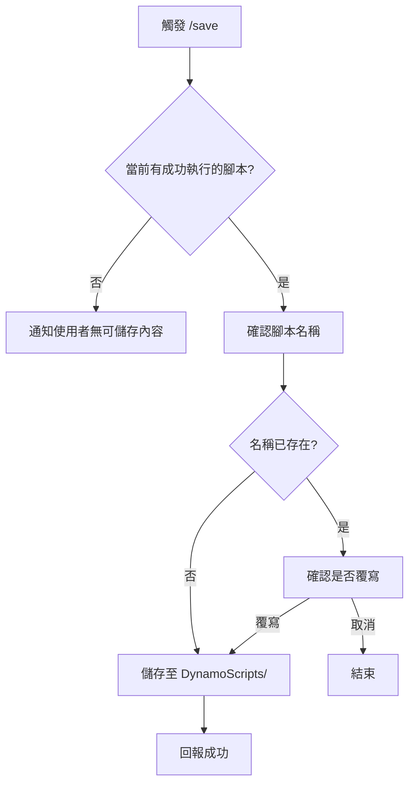

# /save 指令 SOP

## 📋 指令目的

將當前成功執行的 Dynamo JSON 腳本存入 `DynamoScripts/` 腳本庫，供未來復用。

---

## 🔄 執行流程



---

## 📁 產出位置

| 路徑 | 說明 |
|:---|:---|
| `DynamoScripts/[name].json` | 腳本庫文件 |

---

## ✏️ 命名規範

| 規則 | 正確範例 | 錯誤範例 |
|:---|:---|:---|
| 小寫 | `basic_cube` | `Basic_Cube` |
| 底線分隔 | `random_line` | `random-line` |
| 描述性 | `solid_boolean_demo` | `test1` |
| 無副檔名 | `welcome_test` | `welcome_test.json` |

---

## 📋 腳本格式要求

```json
{
  "nodes": [
    {
      "id": "unique_id",
      "name": "NodeType",
      "x": 100,
      "y": 100
    }
  ],
  "connectors": [
    {
      "from": "source_id",
      "to": "target_id",
      "fromPort": 0,
      "toPort": 0
    }
  ]
}
```

---

## ⚠️ 注意事項

1. **嚴禁自動儲存**：
   - AI **不可**在未獲得 `/save` 指令前主動修改腳本庫
   - 這是保護使用者資產的重要規範

2. **驗證完整性**：
   - 儲存前確認 JSON 格式正確
   - 確認所有節點 ID 唯一
   - 確認連線的 from/to 節點存在

3. **備註建議**：
   - 可在 JSON 中加入 `_description` 欄位說明用途
   - 不影響 Dynamo 執行

---

## 📝 範例

### 使用者請求
「/save」

### AI 確認
```
📦 準備儲存腳本至腳本庫

腳本內容：
- 節點數量：5
- 連線數量：4
- 主要功能：繪製隨機立方體

請提供腳本名稱（或使用建議名稱：random_cuboid）：
```

### 使用者回應
「random_cuboid」

### AI 執行
```
✅ 腳本已儲存
   📁 路徑：DynamoScripts/random_cuboid.json
   📋 可透過 load_script_from_library("random_cuboid") 載入
```
