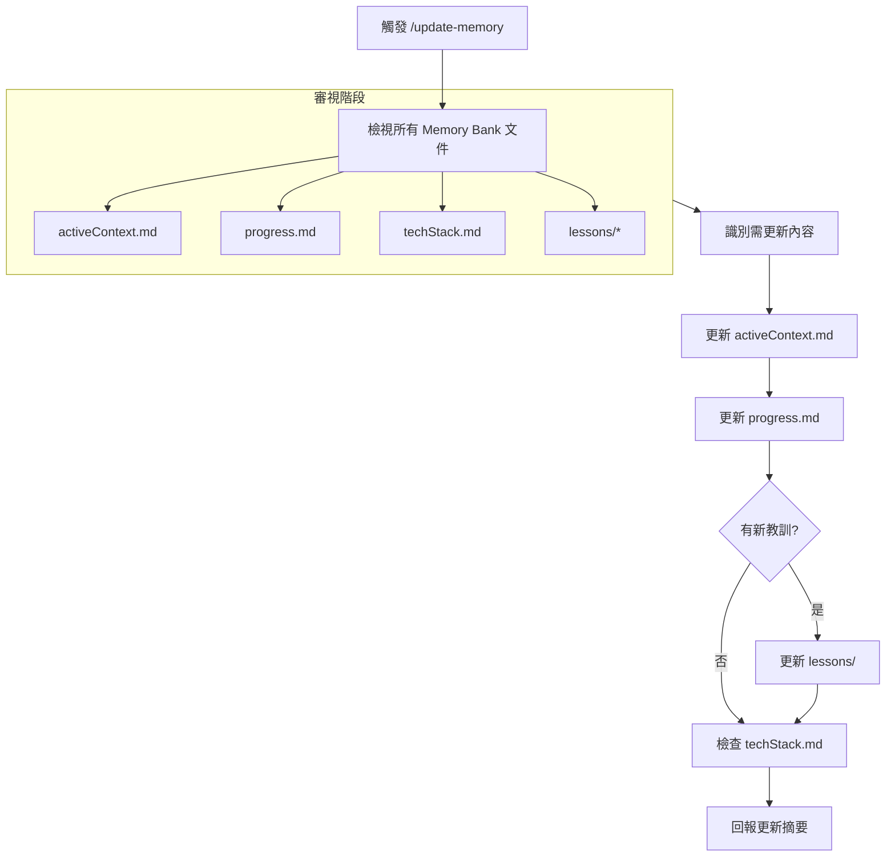

# /update-memory 指令 SOP

## 📋 指令目的

全面更新 Memory Bank 文件，確保 AI 上下文與專案狀態同步。

---

## 🔄 執行流程



---

## 📁 更新優先序

| 優先級 | 文件 | 更新頻率 |
|:---|:---|:---|
| 🔴 必更新 | `activeContext.md` | 每次 |
| 🔴 必更新 | `progress.md` | 每次 |
| 🟡 視情況 | `lessons/*.md` | 有新發現時 |
| 🟢 偶爾 | `techStack.md` | 技術變更時 |

---

## ✏️ 更新內容指南

### activeContext.md

```markdown
## 📍 當前狀態
- 更新版本號（若有變更）
- 更新主要工作項目

## 🎯 近期決策
- 新增本次對話的重要決策

## 🔄 進行中任務
- 更新任務完成狀態

## ⚠️ 待解決問題
- 記錄新發現的問題
```

### progress.md

```markdown
## 🔄 版本變更
- 更新重大變更表格

## ✅ 已完成功能
- 勾選已完成項目

## 🚧 進行中
- 更新進行中狀態

## ❓ 已知問題
- 新增/解決問題
```

---

## 📋 更新檢查清單

- [ ] `activeContext.md` - 當前工作焦點已更新
- [ ] `progress.md` - 版本狀態已更新
- [ ] 所有內部連結有效
- [ ] 日期已更新為今日
- [ ] 無重複內容

---

## 📝 輸出格式

```markdown
## 📊 Memory Bank 更新報告

**更新日期**: 2026-02-04

### 更新摘要

| 文件 | 狀態 | 變更 |
|:---|:---|:---|
| activeContext.md | ✅ 已更新 | 新增任務完成狀態 |
| progress.md | ✅ 已更新 | v3.2 規劃變更 |
| techStack.md | ➖ 無變更 | - |
| lessons/ | ✅ 新增 | #16 新教訓 |

### 下一步建議
- [建議 1]
- [建議 2]
```

---

## ⚠️ 注意事項

1. **完整審視**：即使某些文件不需更新，也必須確認狀態
2. **避免過度更新**：只更新實際變更的內容
3. **保持一致性**：確保各文件間的資訊一致
4. **時間戳記**：更新 `最後更新` 日期
