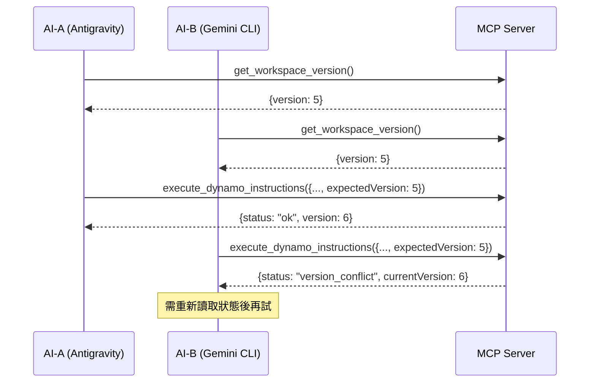

# 多 AI 客戶端使用指南

## 概述

Dynamo MCP 支援多個 AI 工具同時連接並控制 Dynamo。本指南說明如何安全地在多客戶端環境下操作。

## 支援的 AI 工具

| 工具 | 原生 MCP | 通用橋接工具 | 版本鎖 |
|:---|:---:|:---:|:---:|
| **Antigravity** | ✅ | ✅ | ✅ |
| **Claude Desktop** | ✅ | ✅ | ✅ |
| **Gemini CLI** | ❌ | ✅ | ✅ |
| **Cursor** | ⚠️ | ✅ | ✅ |
| **Ollama (API)** | ❌ | ✅ | ✅ |

## 衝突避免機制

### 樂觀鎖 + 版本號

每次寫入操作都會遞增版本號。客戶端可以指定 `expectedVersion` 來確保操作的原子性：



## 使用方式

### 1. 取得當前版本

```json
{
  "name": "get_workspace_version",
  "arguments": {}
}
```

回傳:
```json
{
  "status": "ok",
  "version": 5,
  "sessionId": "abc-123",
  "lastWriter": "antigravity",
  "lastWriteTime": 1738597234.567
}
```

### 2. 安全寫入（推薦）

```json
{
  "name": "execute_dynamo_instructions",
  "arguments": {
    "instructions": "{\"nodes\": [...]}",
    "clientId": "gemini-cli",
    "expectedVersion": 5
  }
}
```

成功回傳:
```json
{
  "status": "ok",
  "version": 6,
  "clientId": "gemini-cli",
  "sessionId": "abc-123"
}
```

衝突回傳:
```json
{
  "status": "version_conflict",
  "message": "版本衝突：預期 5，實際 6。請重新讀取工作區狀態後再試。",
  "currentVersion": 6,
  "lastWriter": "antigravity"
}
```

### 3. 通用工具橋接（適用於 Gemini CLI 等）

不支援原生 MCP `resources/read` 的客戶端可使用：

```json
{
  "name": "read_dynamo_resource",
  "arguments": {
    "resourceType": "nodes"
  }
}
```

回傳包含 `_version` 欄位:
```json
{
  "status": "ok",
  "nodes": [...],
  "_version": 5,
  "_sessionId": "abc-123"
}
```

## 最佳實踐

### 推薦的安全寫入流程

```python
# 步驟 1：讀取當前狀態與版本
state = read_dynamo_resource(resourceType="nodes")
current_version = state["_version"]

# 步驟 2：分析狀態並生成修改指令
new_nodes = generate_nodes(based_on=state)

# 步驟 3：使用版本鎖寫入
result = execute_dynamo_instructions(
    instructions=json.dumps(new_nodes),
    clientId="my-ai-tool",
    expectedVersion=current_version
)

# 步驟 4：處理結果
if result["status"] == "version_conflict":
    # 有其他客戶端修改了工作區
    # 回到步驟 1 重新讀取狀態
    pass
elif result["status"] == "ok":
    # 成功
    new_version = result["version"]
```

### 客戶端識別命名規範

| 工具 | 建議 clientId |
|:---|:---|
| Antigravity | `antigravity` |
| Claude Desktop | `claude-desktop` |
| Gemini CLI | `gemini-cli` |
| Cursor | `cursor` |
| 自訂腳本 | `script-{name}` |

## 錯誤處理

| 錯誤狀態 | 說明 | 建議處理 |
|:---|:---|:---|
| `version_conflict` | 其他客戶端已修改工作區 | 重新讀取狀態後再試 |
| `session_not_found` | 指定的 Session 不存在 | 使用 `list_sessions` 確認 |
| `error` | 一般執行錯誤 | 檢查錯誤訊息 |

## 注意事項

1. **向下相容**：未提供 `clientId` 時使用 `"anonymous"`，未提供 `expectedVersion` 時不進行版本檢查
2. **會話隔離**：每個 Dynamo 視窗有獨立的版本號
3. **讀取不受限**：`read_dynamo_resource` 和 `get_workspace_version` 不會修改版本號
