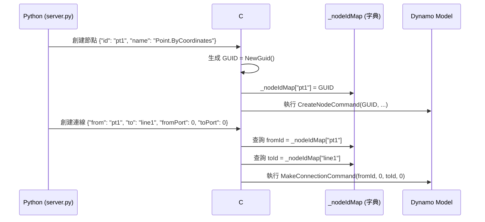

# Dynamo 節點連線工作流程指南

## 📌 概述

本文件記錄 Dynamo MCP 專案中節點自動連線的技術實作，解決跨語言 ID 映射與預覽控制問題，實現 100% 可靠的程式化連線。

---

## 🎯 連線機制原理

### Dynamo 原生連線系統

Dynamo 使用 `MakeConnectionCommand` 在節點間建立連線：

```csharp
public class MakeConnectionCommand : RecordableCommand
{
    public Guid NodeId { get; }        // 來源節點 GUID
    public int PortIndex { get; }      // 來源埠位索引
    public Guid OtherNodeId { get; }   // 目標節點 GUID
    public int OtherPortIndex { get; } // 目標埠位索引
    // ...
}
```

### 埠位索引規則

| 屬性 | 說明 | 索引規則 |
|:---|:---|:---|
| **輸入埠位** (Input Ports) | 節點左側，接收資料 | 從上到下：0, 1, 2, ... |
| **輸出埠位** (Output Ports) | 節點右側，輸出資料 | 從上到下：0, 1, 2, ... |

**重要提醒**：絕大多數節點只有 **1 個輸出埠位**（索引 0），但可能有多個輸入埠位。

---

## 🌉 跨語言 ID 映射機制

### 設計挑戰

| 層級 | ID 類型 | 範例 | 用途 |
|:---|:---|:---|:---|
| **Python 端** | 字串 | `"pt1"`, `"cube_width_1234"` | 人類可讀，便於參數化 |
| **C# 端** | GUID | `3fa85f64-5717-4562-b3fc-2c963f66afa6` | Dynamo 內部識別碼 |

**核心問題**：如何在連線時將 Python 字串 ID 轉換為正確的 C# GUID？

---

### 解決方案：雙向映射表

#### Python → C# 映射流程



#### C# 端實作細節

**節點創建時記錄映射**（GraphHandler.cs:L120-127）：

```csharp
private void CreateNode(JToken n)
{
    string nodeIdStr = n["id"]?.ToString();
    
    // 嘗試解析為 GUID，若失敗則生成新 GUID
    Guid dynamoGuid = Guid.TryParse(nodeIdStr, out Guid parsedGuid) 
        ? parsedGuid 
        : Guid.NewGuid();
    
    // 記錄映射關係
    _nodeIdMap[nodeIdStr] = dynamoGuid;
    
    MCPLogger.Info($"[CreateNode] 映射 ID: {nodeIdStr} -> {dynamoGuid}");
    
    // 執行創建指令
    var cmd = new DynamoModel.CreateNodeCommand(
        dynamoGuid, nodeName, x, y, false, false
    );
    _model.ExecuteCommand(cmd);
}
```

**連線時查詢映射**（GraphHandler.cs:L244-256）：

```csharp
private void CreateConnection(JToken c)
{
    string fromIdStr = c["from"]?.ToString();
    string toIdStr = c["to"]?.ToString();
    int fromPort = c["fromPort"]?.Value<int>() ?? 0;
    int toPort = c["toPort"]?.Value<int>() ?? 0;
    
    // 從映射表查詢 GUID
    Guid fromId, toId;
    
    if (!_nodeIdMap.TryGetValue(fromIdStr, out fromId)) {
        // 降級處理：嘗試直接解析字串為 GUID
        fromId = Guid.Parse(fromIdStr);
        MCPLogger.Warning($"[Connection] ID '{fromIdStr}' 未在映射表中，嘗試直接解析");
    }
    
    if (!_nodeIdMap.TryGetValue(toIdStr, out toId)) {
        toId = Guid.Parse(toIdStr);
        MCPLogger.Warning($"[Connection] ID '{toIdStr}' 未在映射表中，嘗試直接解析");
    }
    
    // 執行連線指令
    var cmd = new DynamoModel.MakeConnectionCommand(
        fromId, fromPort, PortType.Output,
        new DynamoModel.MakeConnectionCommand.Mode(0)
    );
    cmd.ModelGuid = toId;
    cmd.PortIndex = toPort;
    
    _model.ExecuteCommand(cmd);
    MCPLogger.Info($"[Connection] 已連接：{fromIdStr}[{fromPort}] -> {toIdStr}[{toPort}]");
}
```

---

## 🔗 JSON 連線格式規範

### 標準格式

```json
{
  "connectors": [
    {
      "from": "來源節點 ID (字串)",
      "to": "目標節點 ID (字串)",
      "fromPort": 0,
      "toPort": 0
    }
  ]
}
```

### 欄位說明

| 欄位 | 類型 | 必填 | 說明 |
|:---|:---|:---:|:---|
| `from` | String | ✅ | 來源節點的 Python 字串 ID |
| `to` | String | ✅ | 目標節點的 Python 字串 ID |
| `fromPort` | Integer | ✅ | 來源節點輸出埠位索引 (0-indexed) |
| `toPort` | Integer | ✅ | 目標節點輸入埠位索引 (0-indexed) |

**⚠️ 重要提醒**：
- **必須使用 `fromPort` 與 `toPort`**（不是 `fromIndex` 或 `toIndex`）
- 埠位索引從 **0** 開始
- 輸出埠位通常只有索引 0，輸入埠位可能有多個

---

## 🤖 Python 端自動連線生成

### 軌道 B 的自動擴展機制

當使用「原生節點自動擴展」（參考 [`node_creation_strategy.md`](node_creation_strategy.md)），Python 端會自動生成輔助節點與連線。

#### 實作邏輯（server.py:L414-470）

```python
def expand_native_nodes(instruction):
    """
    自動擴展原生節點的參數為獨立 Number 節點並建立連線。
    """
    expanded_nodes = []
    expanded_connectors = []
    
    for node in instruction["nodes"]:
        strategy = node.get("_strategy", "")
        params = node.get("params", {})
        
        # 檢查是否需要擴展
        if strategy in ["NATIVE_DIRECT", "NATIVE_WITH_OVERLOAD"] and params:
            # 取得節點 metadata
            node_info = get_node_info(node["name"])
            input_ports = node_info.get("inputs", [])
            
            # 為每個參數創建 Number 節點
            for i, port_name in enumerate(input_ports):
                if port_name in params:
                    param_node_id = f"{node['id']}_{port_name}_{int(time.time() * 1000)}"
                    
                    # 創建參數節點
                    param_node = {
                        "id": param_node_id,
                        "name": "Number",
                        "value": str(params[port_name]),
                        "x": node.get("x", 0) - 200,  # 放置在主節點左側
                        "y": node.get("y", 0) + (i * 80),
                        "_strategy": "CODE_BLOCK",
                        "preview": node.get("preview", True)  # 繼承主節點設定
                    }
                    expanded_nodes.append(param_node)
                    
                    # 創建連線
                    connector = {
                        "from": param_node_id,
                        "to": node["id"],
                        "fromPort": 0,  # Number 節點只有一個輸出埠位
                        "toPort": i     # 按埠位順序連接
                    }
                    expanded_connectors.append(connector)
        
        # 保留主節點（移除 params 欄位）
        main_node = {k: v for k, v in node.items() if k != "params"}
        expanded_nodes.append(main_node)
    
    # 合併原有連線
    expanded_connectors.extend(instruction.get("connectors", []))
    
    return {
        "nodes": expanded_nodes,
        "connectors": expanded_connectors
    }
```

#### 自動擴展範例

**輸入 JSON**：
```json
{
  "nodes": [{
    "id": "cube1",
    "name": "Cuboid.ByLengths",
    "params": {"width": 100, "length": 50, "height": 30},
    "x": 500,
    "y": 300
  }]
}
```

**自動擴展後**：
```json
{
  "nodes": [
    {"id": "cube1", "name": "Cuboid.ByLengths", "x": 500, "y": 300},
    {"id": "cube1_width_1706083200000", "name": "Number", "value": "100", "x": 300, "y": 300},
    {"id": "cube1_length_1706083200000", "name": "Number", "value": "50", "x": 300, "y": 380},
    {"id": "cube1_height_1706083200000", "name": "Number", "value": "30", "x": 300, "y": 460}
  ],
  "connectors": [
    {"from": "cube1_width_1706083200000", "to": "cube1", "fromPort": 0, "toPort": 0},
    {"from": "cube1_length_1706083200000", "to": "cube1", "fromPort": 0, "toPort": 1},
    {"from": "cube1_height_1706083200000", "to": "cube1", "fromPort": 0, "toPort": 2}
  ]
}
```

---

## 🎨 預覽控制最佳實踐

### 問題場景

在布林運算或複雜幾何流程中，中間過程的幾何體（如原始球體、立方體）會遮擋最終結果，影響視覺判斷。

### 解決方案：preview 屬性

```json
{
  "nodes": [
    {
      "id": "pt1",
      "name": "Point.ByCoordinates",
      "params": {"x": 50, "y": 25, "z": 15},
      "preview": false,
      "x": 100,
      "y": 100
    },
    {
      "id": "sphere1",
      "name": "Sphere.ByCenterPointRadius",
      "params": {"centerPoint": "...", "radius": 20},
      "preview": false,
      "x": 300,
      "y": 100
    },
    {
      "id": "result",
      "name": "Solid.Difference",
      "preview": true,
      "x": 700,
      "y": 100
    }
  ],
  "connectors": [
    {"from": "pt1", "to": "sphere1", "fromPort": 0, "toPort": 0},
    {"from": "sphere1", "to": "result", "fromPort": 0, "toPort": 1}
  ]
}
```

### 繼承機制

在軌道 B 的自動擴展中，輔助參數節點會自動繼承主節點的 `preview` 設定：

```python
param_node = {
    # ...
    "preview": node.get("preview", True)  # 預設為 True
}
```

**最佳實踐**：
- 中間節點（點、原始幾何）：`"preview": false`
- 最終結果節點：`"preview": true`

---

## 📊 實戰案例

### 案例 1：Select Model Element → Python Script

**目標**：自動連接 Revit 元素選擇器與 Python 分析腳本。

**測試腳本**：`tests/temp/run_connector_test.py`

**JSON 指令**：
```json
{
  "nodes": [
    {
      "id": "selector",
      "name": "Select Model Element",
      "x": 100,
      "y": 300
    },
    {
      "id": "py_script",
      "name": "Python Script",
      "pythonCode": "OUT = IN[0].Name",
      "x": 500,
      "y": 300
    }
  ],
  "connectors": [
    {
      "from": "selector",
      "to": "py_script",
      "fromPort": 0,
      "toPort": 0
    }
  ]
}
```

**執行結果**：
- ✅ 兩個節點成功創建
- ✅ 連線正確建立
- ✅ Python 節點可接收選擇器輸出

**日誌輸出**：
```
[2026-01-24 15:11:13] [INFO] [CreateNode] 映射 ID: selector -> 3fa85f64-5717-4562-b3fc-2c963f66afa6
[2026-01-24 15:11:13] [INFO] [CreateNode] 映射 ID: py_script -> 7c9e6679-7425-40de-944b-e07fc1f90ae7
[2026-01-24 15:11:13] [INFO] [Connection] 已連接：selector[0] -> py_script[0]
```

---

## 🛡️ 故障排查指南

### 問題 1：殭屍節點（節點存在但無連線）

**症狀**：
- 節點已創建在畫布上
- 連線未建立
- 日誌無錯誤訊息

**診斷方法**：
```powershell
# 檢查映射表記錄
Select-String -Path "$env:AppData\Dynamo\MCP\DynamoMCP.log" -Pattern "映射 ID"
```

**可能原因**：
1. Python 字串 ID 未被記錄在 `_nodeIdMap` 中
2. 連線指令在映射記錄前執行（順序問題）

**解決方案**：
```csharp
// 確保節點創建完成後才執行連線
foreach (JToken n in nodes) {
    CreateNode(n);  // 先創建所有節點
}

foreach (JToken c in connectors) {
    CreateConnection(c);  // 再創建所有連線
}
```

---

### 問題 2：埠位索引錯誤

**症狀**：
- 連線建立但連接到錯誤的埠位
- Dynamo 顯示 "Port index out of range" 錯誤

**診斷方法**：
- 檢查節點 `common_nodes.json` 中的 `inputs` 陣列順序
- 對比實際連線的 `toPort` 值

**解決方案**：
```json
// 確認 common_nodes.json 中的埠位定義
{
  "Cuboid.ByLengths": {
    "inputs": ["width", "length", "height"],  // 順序：0, 1, 2
    // ...
  }
}
```

---

### 問題 3：連線欄位名稱錯誤

**症狀**：
- 連線未建立
- 日誌顯示 "fromIndex 或 toIndex 欄位未找到"

**原因**：
使用了錯誤的欄位名稱（`fromIndex`/`toIndex` 而非 `fromPort`/`toPort`）。

**解決方案**：
```json
// ❌ 錯誤
{"from": "a", "to": "b", "fromIndex": 0, "toIndex": 1}

// ✅ 正確
{"from": "a", "to": "b", "fromPort": 0, "toPort": 1}
```

---

## 🔗 相關文件

- 📘 [節點創建策略指南](node_creation_strategy.md) - 軌道 B 自動擴展機制
- 📋 [核心教訓 #10：原生節點連線與預覽控制](../GEMINI.md#核心教訓-10原生節點連線與預覽控制-native-node-connections--preview)
- 🔧 [GraphHandler.cs 實作](../DynamoViewExtension/src/GraphHandler.cs)
- 🐍 [server.py 自動擴展邏輯](../bridge/python/server.py)

---

**文件版本**: v1.0  
**撰寫日期**: 2026-01-24  
**維護者**: AI Collaboration Team  
**語言**: 繁體中文 (zh-TW)
