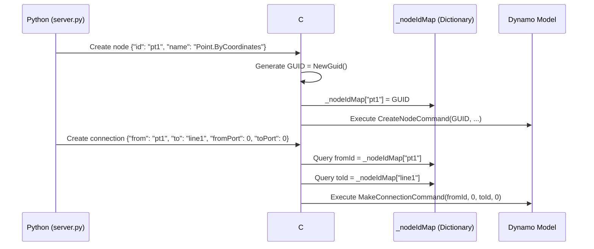

# Dynamo Node Connection Workflow Guide

## 📌 Overview

This document records the technical implementation of automated node connections in the Dynamo MCP project, resolving cross-language ID mapping and preview control issues to achieve 100% reliable programmatic connections.

---

## 🎯 Connection Mechanism Principles

### Dynamo Native Connection System

Dynamo uses `MakeConnectionCommand` to establish connections between nodes:

```csharp
public class MakeConnectionCommand : RecordableCommand
{
    public Guid NodeId { get; }        // Source node GUID
    public int PortIndex { get; }      // Source port index
    public Guid OtherNodeId { get; }   // Target node GUID
    public int OtherPortIndex { get; } // Target port index
    // ...
}
```

### Port Index Rules

| Property | Description | Index Rules |
|:---|:---|:---|
| **Input Ports** | Left side of node, receives data | Top to bottom: 0, 1, 2, ... |
| **Output Ports** | Right side of node, outputs data | Top to bottom: 0, 1, 2, ... |

**Important Note**: Most nodes have only **1 output port** (index 0), but may have multiple input ports.

---

## 🌉 Cross-Language ID Mapping Mechanism

### Design Challenge

| Layer | ID Type | Example | Purpose |
|:---|:---|:---|:---|
| **Python Side** | String | `"pt1"`, `"cube_width_1234"` | Human-readable, easy to parameterize |
| **C# Side** | GUID | `3fa85f64-5717-4562-b3fc-2c963f66afa6` | Dynamo internal identifier |

**Core Problem**: How to convert Python string IDs to correct C# GUIDs when creating connections?

---

### Solution: Bidirectional Mapping Table

#### Python → C# Mapping Flow



#### C# Implementation Details

**Record Mapping During Node Creation** (GraphHandler.cs:L120-127):

```csharp
private void CreateNode(JToken n)
{
    string nodeIdStr = n["id"]?.ToString();
    
    // Try to parse as GUID, generate new GUID if fails
    Guid dynamoGuid = Guid.TryParse(nodeIdStr, out Guid parsedGuid) 
        ? parsedGuid 
        : Guid.NewGuid();
    
    // Record mapping relationship
    _nodeIdMap[nodeIdStr] = dynamoGuid;
    
    MCPLogger.Info($"[CreateNode] Mapped ID: {nodeIdStr} -> {dynamoGuid}");
    
    // Execute creation command
    var cmd = new DynamoModel.CreateNodeCommand(
        dynamoGuid, nodeName, x, y, false, false
    );
    _model.ExecuteCommand(cmd);
}
```

**Query Mapping During Connection** (GraphHandler.cs:L244-256):

```csharp
private void CreateConnection(JToken c)
{
    string fromIdStr = c["from"]?.ToString();
    string toIdStr = c["to"]?.ToString();
    int fromPort = c["fromPort"]?.Value<int>() ?? 0;
    int toPort = c["toPort"]?.Value<int>() ?? 0;
    
    // Query GUID from mapping table
    Guid fromId, toId;
    
    if (!_nodeIdMap.TryGetValue(fromIdStr, out fromId)) {
        // Fallback: try to parse string directly as GUID
        fromId = Guid.Parse(fromIdStr);
        MCPLogger.Warning($"[Connection] ID '{fromIdStr}' not in mapping table, attempting direct parse");
    }
    
    if (!_nodeIdMap.TryGetValue(toIdStr, out toId)) {
        toId = Guid.Parse(toIdStr);
        MCPLogger.Warning($"[Connection] ID '{toIdStr}' not in mapping table, attempting direct parse");
    }
    
    // Execute connection command
    var cmd = new DynamoModel.MakeConnectionCommand(
        fromId, fromPort, PortType.Output,
        new DynamoModel.MakeConnectionCommand.Mode(0)
    );
    cmd.ModelGuid = toId;
    cmd.PortIndex = toPort;
    
    _model.ExecuteCommand(cmd);
    MCPLogger.Info($"[Connection] Connected: {fromIdStr}[{fromPort}] -> {toIdStr}[{toPort}]");
}
```

---

## 🔗 JSON Connection Format Specification

### Standard Format

```json
{
  "connectors": [
    {
      "from": "Source node ID (string)",
      "to": "Target node ID (string)",
      "fromPort": 0,
      "toPort": 0
    }
  ]
}
```

### Field Descriptions

| Field | Type | Required | Description |
|:---|:---|:---:|:---|
| `from` | String | ✅ | Python string ID of source node |
| `to` | String | ✅ | Python string ID of target node |
| `fromPort` | Integer | ✅ | Source node output port index (0-indexed) |
| `toPort` | Integer | ✅ | Target node input port index (0-indexed) |

**⚠️ Important Reminders**:
- **Must use `fromPort` and `toPort`** (not `fromIndex` or `toIndex`)
- Port indices start from **0**
- Output ports typically only have index 0, input ports may have multiple

---

## 🤖 Python-Side Auto-Connection Generation

### Track B Auto-Expansion Mechanism

When using "Native Node Auto-Expansion" (see [`node_creation_strategy.md`](node_creation_strategy.md)), the Python side automatically generates auxiliary nodes and connections.

#### Implementation Logic (server.py:L414-470)

```python
def expand_native_nodes(instruction):
    """
    Automatically expand native node parameters into independent Number nodes and create connections.
    """
    expanded_nodes = []
    expanded_connectors = []
    
    for node in instruction["nodes"]:
        strategy = node.get("_strategy", "")
        params = node.get("params", {})
        
        # Check if expansion needed
        if strategy in ["NATIVE_DIRECT", "NATIVE_WITH_OVERLOAD"] and params:
            # Get node metadata
            node_info = get_node_info(node["name"])
            input_ports = node_info.get("inputs", [])
            
            # Create Number node for each parameter
            for i, port_name in enumerate(input_ports):
                if port_name in params:
                    param_node_id = f"{node['id']}_{port_name}_{int(time.time() * 1000)}"
                    
                    # Create parameter node
                    param_node = {
                        "id": param_node_id,
                        "name": "Number",
                        "value": str(params[port_name]),
                        "x": node.get("x", 0) - 200,  # Place to left of main node
                        "y": node.get("y", 0) + (i * 80),
                        "_strategy": "CODE_BLOCK",
                        "preview": node.get("preview", True)  # Inherit main node setting
                    }
                    expanded_nodes.append(param_node)
                    
                    # Create connection
                    connector = {
                        "from": param_node_id,
                        "to": node["id"],
                        "fromPort": 0,  # Number node has only one output port
                        "toPort": i     # Connect in port order
                    }
                    expanded_connectors.append(connector)
        
        # Keep main node (remove params field)
        main_node = {k: v for k, v in node.items() if k != "params"}
        expanded_nodes.append(main_node)
    
    # Merge existing connections
    expanded_connectors.extend(instruction.get("connectors", []))
    
    return {
        "nodes": expanded_nodes,
        "connectors": expanded_connectors
    }
```

#### Auto-Expansion Example

**Input JSON**:
```json
{
  "nodes": [{
    "id": "cube1",
    "name": "Cuboid.ByLengths",
    "params": {"width": 100, "length": 50, "height": 30},
    "x": 500,
    "y": 300
  }]
}
```

**After Auto-Expansion**:
```json
{
  "nodes": [
    {"id": "cube1", "name": "Cuboid.ByLengths", "x": 500, "y": 300},
    {"id": "cube1_width_1706083200000", "name": "Number", "value": "100", "x": 300, "y": 300},
    {"id": "cube1_length_1706083200000", "name": "Number", "value": "50", "x": 300, "y": 380},
    {"id": "cube1_height_1706083200000", "name": "Number", "value": "30", "x": 300, "y": 460}
  ],
  "connectors": [
    {"from": "cube1_width_1706083200000", "to": "cube1", "fromPort": 0, "toPort": 0},
    {"from": "cube1_length_1706083200000", "to": "cube1", "fromPort": 0, "toPort": 1},
    {"from": "cube1_height_1706083200000", "to": "cube1", "fromPort": 0, "toPort": 2}
  ]
}
```

---

## 🎨 Preview Control Best Practices

### Problem Scenario

In boolean operations or complex geometric workflows, intermediate geometric shapes (like raw spheres, cuboids) can obscure the final result, affecting visual judgment.

### Solution: preview Property

```json
{
  "nodes": [
    {
      "id": "pt1",
      "name": "Point.ByCoordinates",
      "params": {"x": 50, "y": 25, "z": 15},
      "preview": false,
      "x": 100,
      "y": 100
    },
    {
      "id": "sphere1",
      "name": "Sphere.ByCenterPointRadius",
      "params": {"centerPoint": "...", "radius": 20},
      "preview": false,
      "x": 300,
      "y": 100
    },
    {
      "id": "result",
      "name": "Solid.Difference",
      "preview": true,
      "x": 700,
      "y": 100
    }
  ],
  "connectors": [
    {"from": "pt1", "to": "sphere1", "fromPort": 0, "toPort": 0},
    {"from": "sphere1", "to": "result", "fromPort": 0, "toPort": 1}
  ]
}
```

### Inheritance Mechanism

In Track B auto-expansion, auxiliary parameter nodes automatically inherit the main node's `preview` setting:

```python
param_node = {
    # ...
    "preview": node.get("preview", True)  # Default is True
}
```

**Best Practices**:
- Intermediate nodes (points, primitive geometry): `"preview": false`
- Final result nodes: `"preview": true`

---

## 📊 Real-World Cases

### Case 1: Select Model Element → Python Script

**Goal**: Automatically connect Revit element selector to Python analysis script.

**Test Script**: `tests/temp/run_connector_test.py`

**JSON Command**:
```json
{
  "nodes": [
    {
      "id": "selector",
      "name": "Select Model Element",
      "x": 100,
      "y": 300
    },
    {
      "id": "py_script",
      "name": "Python Script",
      "pythonCode": "OUT = IN[0].Name",
      "x": 500,
      "y": 300
    }
  ],
  "connectors": [
    {
      "from": "selector",
      "to": "py_script",
      "fromPort": 0,
      "toPort": 0
    }
  ]
}
```

**Execution Results**:
- ✅ Two nodes successfully created
- ✅ Connection correctly established
- ✅ Python node can receive selector output

**Log Output**:
```
[2026-01-24 15:11:13] [INFO] [CreateNode] Mapped ID: selector -> 3fa85f64-5717-4562-b3fc-2c963f66afa6
[2026-01-24 15:11:13] [INFO] [CreateNode] Mapped ID: py_script -> 7c9e6679-7425-40de-944b-e07fc1f90ae7
[2026-01-24 15:11:13] [INFO] [Connection] Connected: selector[0] -> py_script[0]
```

---

## 🛡️ Troubleshooting Guide

### Issue 1: Zombie Nodes (Nodes Exist Without Connections)

**Symptoms**:
- Nodes created on canvas
- Connections not established
- No error messages in logs

**Diagnostic Method**:
```powershell
# Check mapping table records
Select-String -Path "$env:AppData\Dynamo\MCP\DynamoMCP.log" -Pattern "Mapped ID"
```

**Possible Causes**:
1. Python string ID not recorded in `_nodeIdMap`
2. Connection command executed before mapping recorded (sequencing issue)

**Solution**:
```csharp
// Ensure all nodes created before executing connections
foreach (JToken n in nodes) {
    CreateNode(n);  // Create all nodes first
}

foreach (JToken c in connectors) {
    CreateConnection(c);  // Then create all connections
}
```

---

### Issue 2: Incorrect Port Index

**Symptoms**:
- Connection established but connects to wrong port
- Dynamo shows "Port index out of range" error

**Diagnostic Method**:
- Check `inputs` array order in `common_nodes.json`
- Compare actual connection's `toPort` value

**Solution**:
```json
// Confirm port definition in common_nodes.json
{
  "Cuboid.ByLengths": {
    "inputs": ["width", "length", "height"],  // Order: 0, 1, 2
    // ...
  }
}
```

---

### Issue 3: Incorrect Connection Field Names

**Symptoms**:
- Connections not established
- Logs show "fromIndex or toIndex field not found"

**Cause**:
Using incorrect field names (`fromIndex`/`toIndex` instead of `fromPort`/`toPort`).

**Solution**:
```json
// ❌ Wrong
{"from": "a", "to": "b", "fromIndex": 0, "toIndex": 1}

// ✅ Correct
{"from": "a", "to": "b", "fromPort": 0, "toPort": 1}
```

---

## 🔗 Related Documents

- 📘 [Node Creation Strategy Guide](node_creation_strategy.md) - Track B auto-expansion mechanism
- 📋 [Core Lesson #10: Native Node Connections & Preview Control](../GEMINI.md#核心教訓-10原生節點連線與預覽控制-native-node-connections--preview)
- 🔧 [GraphHandler.cs Implementation](../DynamoViewExtension/src/GraphHandler.cs)
- 🐍 [server.py Auto-Expansion Logic](../bridge/python/server.py)

---

**Document Version**: v1.0  
**Creation Date**: 2026-01-24  
**Maintainer**: AI Collaboration Team  
**Language**: English (en)
