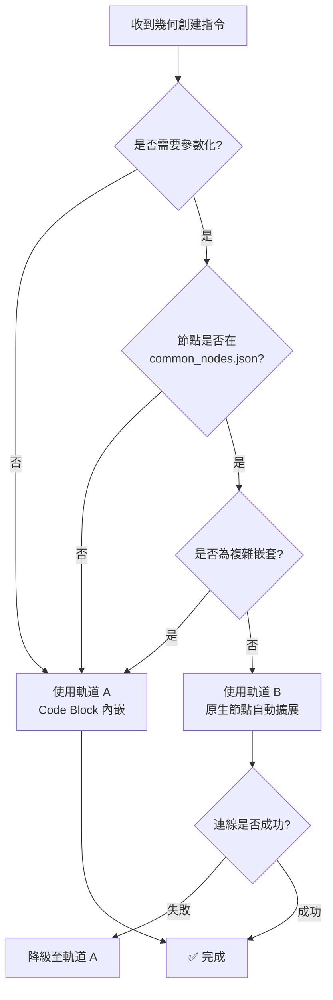

# Dynamo 節點創建策略指南

## 📌 概述

Dynamo MCP 支援兩種節點創建方法，各有適用場景。本文件提供完整的技術細節與決策指引，作為 AI 執行幾何創建任務時的權威參考。

---

## 🎯 雙軌制策略 (Dual-Track Strategy)

### 核心原則

**不強制統一方法**，而是根據任務特性選擇最優策略：
- **軌道 A (Code Block 內嵌)**：追求可靠性，適合複雜嵌套幾何
- **軌道 B (原生節點自動擴展)**：追求可讀性與參數化，適合獨立節點

---

## 🛤️ 軌道 A：Code Block 內嵌模式

### 適用場景

| 場景類型 | 範例 | 原因 |
|:---|:---|:---|
| **簡單單體幾何** | `Point.ByCoordinates(0,0,0)` | 參數固定，無需調整 |
| **複雜嵌套幾何** | `Solid.Difference(Cuboid(...), Sphere(...))` | API 限制，無法分散創建 |
| **快速原型驗證** | 測試新幾何概念 | 最短路徑，無需配置 metadata |
| **降級策略** | 軌道 B 連線失敗後 | 保證 100% 成功率 |

### 黃金法則

| 規則 | 說明 | 示例 |
|:---|:---|:---|
| **節點名稱** | 永遠使用 `"Number"` | ❌ `"Code Block"` ✅ `"Number"` |
| **代碼欄位** | 在 `value` 欄位寫完整 DesignScript | `"value": "Point.ByCoordinates(0,0,0);"` |
| **語法結尾** | 所有代碼必須以 `;` 結尾 | ❌ `"(0,0,0)"` ✅ `"(0,0,0);"` |
| **轉換機制** | `GraphHandler.cs` 自動將 `"Number"` 轉為 Code Block | 不需要手動指定節點類型 |

### 實作範例

#### 範例 1：簡單點座標
```json
{
  "nodes": [{
    "id": "pt1",
    "name": "Number",
    "value": "Point.ByCoordinates(0, 0, 0);",
    "x": 300,
    "y": 300
  }],
  "connectors": []
}
```

#### 範例 2：複雜布林運算
```json
{
  "nodes": [{
    "id": "result1",
    "name": "Number",
    "value": "Solid.Difference(Cuboid.ByLengths(100,50,30), Sphere.ByCenterPointRadius(Point.ByCoordinates(50,25,15), 20));",
    "x": 500,
    "y": 300
  }],
  "connectors": []
}
```

#### 範例 3：多層嵌套幾何
```json
{
  "nodes": [{
    "id": "complex1",
    "name": "Number",
    "value": "Line.ByStartPointEndPoint(Point.ByCoordinates(0,0,0), Point.ByCoordinates(100,100,100));",
    "x": 300,
    "y": 300
  }],
  "connectors": []
}
```

### 優勢與限制

| 優勢 ✅ | 限制 ❌ |
|:---|:---|
| 100% 可靠，無連線失敗風險 | JSON 可讀性較差 (邏輯擠在字串中) |
| 適合複雜嵌套幾何 | 難以參數化 (無法輕易提取 `width`, `height`) |
| 與 Dynamo 原生設計哲學一致 | 對 AI token 消耗較高 (長字串) |
| 無需配置 `common_nodes.json` | 無法利用 `base_x`, `base_y` 偏移特性 |

---

## 🚀 軌道 B：原生節點自動擴展

### 適用場景

| 場景類型 | 範例 | 原因 |
|:---|:---|:---|
| **參數化節點** | `Cuboid.ByLengths(width, length, height)` | 需要可調參數 |
| **腳本庫復用** | 載入已保存的腳本並偏移 | 支援 `base_x`, `base_y` 參數 |
| **視覺化控制** | 隱藏中間幾何 | 可設定 `preview: false` |
| **模組化設計** | 獨立的參數化元件 | 便於重複使用與調整 |

### 前提條件

| 檢查項目 | 驗證方法 | 失敗處理 |
|:---|:---|:---|
| ✅ 節點已定義於 `common_nodes.json` | 搜尋節點名稱 | 降級至軌道 A |
| ✅ 埠位順序已正確配置 | 檢查 `inputs` 陣列 | 手動修正 metadata |
| ✅ `server.py` 自動擴展機制已啟用 | 檢查 Line 414-470 | 確認程式碼未被註解 |

### 技術原理

#### Python 端自動擴展邏輯 (`server.py:414-470`)

```python
# 1. 檢查節點策略
strategy = node.get("_strategy", "")
params = node.get("params", {})

# 2. 若為原生節點且有參數，進行自動擴展
if (strategy in ["NATIVE_DIRECT", "NATIVE_WITH_OVERLOAD"]) and params:
    # 取得正確的埠位順序
    input_ports = node_info.get("inputs", [])
    
    # 3. 為每個參數建立 Number 節點
    for i, port_name in enumerate(input_ports):
        if port_name in params:
            param_node = {
                "id": f"{node_id}_{port_name}_{timestamp}",
                "name": "Number",
                "value": str(params[port_name]),
                "x": node.get("x", 0) - 200,  # 放在主節點左側
                "y": node.get("y", 0) + (i * 80),
                "_strategy": "CODE_BLOCK",
                "preview": node.get("preview", True)  # 繼承父節點設定
            }
            expanded_nodes.append(param_node)
            
            # 4. 自動創建連線
            expanded_connectors.append({
                "from": param_node_id,
                "to": node_id,
                "fromPort": 0,
                "toPort": i
            })
```

#### C# 端 ID 映射機制 (`GraphHandler.cs:120-127`)

```csharp
// 將 Python 端的字串 ID 映射為 Dynamo 的 GUID
Guid dynamoGuid = Guid.TryParse(nodeIdStr, out Guid parsedGuid) 
    ? parsedGuid 
    : Guid.NewGuid();

_nodeIdMap[nodeIdStr] = dynamoGuid; // 記錄映射
MCPLogger.Info($"[CreateNode] 映射 ID: {nodeIdStr} -> {dynamoGuid}");
```

#### C# 端連線查詢 (`GraphHandler.cs:244-256`)

```csharp
// 從映射表查詢 GUID
Guid fromId;
if (!_nodeIdMap.TryGetValue(fromIdStr, out fromId))
{
    fromId = Guid.Parse(fromIdStr); // 降級：直接解析
}
```

### 實作範例

#### 範例 1：參數化立方體
```json
{
  "nodes": [{
    "id": "cube1",
    "name": "Cuboid.ByLengths",
    "params": {
      "width": 100,
      "length": 50,
      "height": 30
    },
    "x": 500,
    "y": 300,
    "preview": false
  }],
  "connectors": []
}
```

**自動擴展結果** (Python 端轉換後):
```json
{
  "nodes": [
    {"id": "cube1", "name": "Cuboid.ByLengths", "x": 500, "y": 300},
    {"id": "cube1_width_1234", "name": "Number", "value": "100", "x": 300, "y": 300},
    {"id": "cube1_length_1234", "name": "Number", "value": "50", "x": 300, "y": 380},
    {"id": "cube1_height_1234", "name": "Number", "value": "30", "x": 300, "y": 460}
  ],
  "connectors": [
    {"from": "cube1_width_1234", "to": "cube1", "fromPort": 0, "toPort": 0},
    {"from": "cube1_length_1234", "to": "cube1", "fromPort": 0, "toPort": 1},
    {"from": "cube1_height_1234", "to": "cube1", "fromPort": 0, "toPort": 2}
  ]
}
```

#### 範例 2：帶 Overload 的點座標
```json
{
  "nodes": [{
    "id": "pt1",
    "name": "Point.ByCoordinates",
    "params": {
      "x": 100,
      "y": 200,
      "z": 300
    },
    "overload": "3D",
    "x": 500,
    "y": 300
  }],
  "connectors": []
}
```

#### 範例 3：隱藏中間節點
```json
{
  "nodes": [
    {
      "id": "sphere1",
      "name": "Sphere.ByCenterPointRadius",
      "params": {
        "centerPoint": "Point.ByCoordinates(0,0,0);",
        "radius": 50
      },
      "x": 500,
      "y": 300,
      "preview": false,
      "_comment": "中間球體不顯示，只用於布林運算"
    }
  ]
}
```

### 優勢與限制

| 優勢 ✅ | 限制 ❌ |
|:---|:---|
| JSON 結構清晰，語義化強 | 依賴跨語言 ID 映射，技術複雜度高 |
| 易於參數化與重複使用 | 若連線失敗會產生「殭屍節點」 |
| 自動繼承 `preview` 屬性 | 需要維護 `common_nodes.json` 的埠位定義 |
| 支援 `base_x`, `base_y` 偏移 | 無法處理複雜嵌套幾何 (會被展平) |

---

## 🤖 AI 決策流程

### 決策樹



### 決策矩陣

| 判定因素 | 軌道 A | 軌道 B | 說明 |
|:---|:---:|:---:|:---|
| **參數固定** | ✅ | ❌ | 如 `Point.ByCoordinates(0,0,0)` |
| **需要參數化** | ❌ | ✅ | 如 `Cuboid.ByLengths(width, length, height)` |
| **複雜嵌套** | ✅ | ❌ | 如 `Solid.Difference(Cuboid(...), Sphere(...))` |
| **腳本庫復用** | ❌ | ✅ | 需要 `base_x`, `base_y` 偏移 |
| **快速原型** | ✅ | ❌ | 無需配置 metadata |
| **視覺化控制** | ❌ | ✅ | 需要 `preview: false` |

---

## 🛡️ 自我審查清單

### 通用檢查 (所有軌道)

執行任何節點創建前，AI 必須檢查：

- [ ] 已執行 `analyze_workspace` 確認環境狀態
- [ ] SessionId 是否與前次一致 (避免幽靈連線)
- [ ] 是否有現成腳本可復用 (查詢 `get_script_library`)
- [ ] 產出物放置路徑是否符合規範 (嚴禁放根目錄)

### 軌道 A 專屬檢查

- [ ] 節點名稱是否為 `"Number"` (不是 `"Code Block"`)
- [ ] `value` 欄位代碼是否以 `;` 結尾
- [ ] 若涉及 3D 幾何，是否明確指定 X、Y、Z 三個參數
- [ ] 代碼語法是否符合 DesignScript 規範

### 軌道 B 專屬檢查

- [ ] 節點是否存在於 `common_nodes.json`
- [ ] 埠位順序是否與 metadata 定義一致
- [ ] 是否需要指定 `overload` (如 `Point.ByCoordinates` 的 2D/3D 版本)
- [ ] 若連線失敗，是否已準備降級至軌道 A
- [ ] `preview` 屬性是否正確設定 (預設為 `true`)

---

## 🚨 故障排查指南

### 軌道 A 常見問題

| 症狀 | 可能原因 | 解決方案 |
|:---|:---|:---|
| 節點創建但無輸出 | 代碼未以 `;` 結尾 | 檢查 `value` 欄位，補上分號 |
| Z 座標被忽略 | 使用了 2D 版本 | 明確指定三個參數：`Point.ByCoordinates(x, y, z)` |
| 語法錯誤 | DesignScript 格式錯誤 | 參考 Dynamo Primer 或官方文檔 |

### 軌道 B 常見問題

| 症狀 | 可能原因 | 解決方案 |
|:---|:---|:---|
| 輔助節點未生成 | 策略未正確設定 | 檢查 `route_node_creation()` 是否執行 |
| 連線失敗 (殭屍節點) | ID 映射表未建立 | 檢查 C# 日誌，確認 `_nodeIdMap` 記錄 |
| 埠位順序錯誤 | `common_nodes.json` 定義不準確 | 修正 metadata 的 `inputs` 陣列 |
| Overload 解析失敗 | `overload` 欄位未指定 | 明確指定 `"overload": "3D"` |

### 故障處理原則

```
IF analyze_workspace 回傳 Warning 
THEN 停止重複嘗試 
     AND 分析根本原因 
     AND 修正邏輯後再執行
     
IF 軌道 B 連線失敗
THEN 自動降級至軌道 A
     AND 記錄降級原因
```

---

## 📚 實戰案例對比

### 案例 1：簡單點座標

| 軌道 A | 軌道 B |
|:---|:---|
| `{"name": "Number", "value": "Point.ByCoordinates(0,0,0);"}` | `{"name": "Point.ByCoordinates", "params": {"x": 0, "y": 0, "z": 0}}` |
| ✅ 推薦 (參數固定) | ⚠️ 過度設計 |

### 案例 2：參數化立方體

| 軌道 A | 軌道 B |
|:---|:---|
| `{"name": "Number", "value": "Cuboid.ByLengths(100, 50, 30);"}` | `{"name": "Cuboid.ByLengths", "params": {"width": 100, "length": 50, "height": 30}}` |
| ⚠️ 難以調整參數 | ✅ 推薦 (語義清晰) |

### 案例 3：布林運算

| 軌道 A | 軌道 B |
|:---|:---|
| `{"name": "Number", "value": "Solid.Difference(Cuboid.ByLengths(100,50,30), Sphere.ByCenterPointRadius(Point.ByCoordinates(50,25,15), 20));"}` | ❌ 無法實作 (嵌套過深) |
| ✅ 唯一可行方案 | |

---

## 🔗 相關文件

- 📋 [架構分析報告](architecture_analysis.md) - 衝突診斷與改善方案
- 📘 [GEMINI.md](../GEMINI.md) - AI 必讀的完整操作規範
- 🔧 [GraphHandler.cs](../DynamoViewExtension/src/GraphHandler.cs) - C# 端節點創建實作
- 🐍 [server.py](../server.py) - Python 端自動擴展邏輯
- 📄 [common_nodes.json](../DynamoViewExtension/common_nodes.json) - 節點簽名定義

---

**文件版本**: v2.0  
**撰寫日期**: 2026-01-16  
**維護者**: AI Collaboration Team
