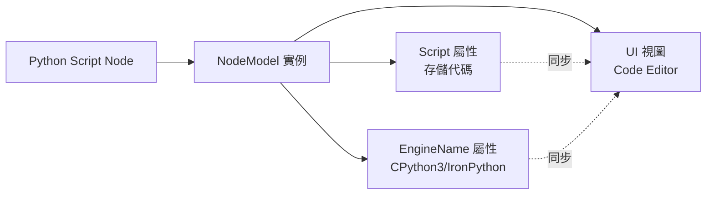

# Python Script 節點自動化技術指南

## 📌 概述

本文件記錄 Dynamo 3.3 環境下 Python Script 節點的自動化創建與代碼注入技術，解決 UI 執行緒同步與代碼顯示問題。

---

## 🎯 技術背景

### Dynamo 3.3 架構特性

Dynamo 是基於 **WPF (Windows Presentation Foundation)** 的桌面應用程式，其核心設計原則：

| 執行緒類型 | 職責 | 限制 |
|:---|:---|:---|
| **UI 執行緒** | 處理所有視覺元素更新與用戶互動 | 不能執行長時間運算 |
| **背景執行緒** | 處理網路通訊、檔案 I/O 等 | 不能直接修改 UI 元素 |

### Python Script 節點構成



**關鍵問題**：當從 WebSocket（背景執行緒）接收指令時，直接修改 `NodeModel` 屬性不會觸發 UI 更新。

---

## 🚨 核心挑戰

### 挑戰 1：節點名稱不一致

Dynamo 不同版本對 Python Script 節點的內部名稱定義不同：

| Dynamo 版本 | 內部名稱 | 成功率 |
|:---|:---|:---:|
| 2.x | `"PythonScript"` | ❌ 在 3.3 失敗 |
| 3.0-3.2 | `"Core.Scripting.Python Script"` | ⚠️ 部分成功 |
| 3.3+ | `"Python Script"` | ✅ 推薦 |

### 挑戰 2：代碼注入後 UI 不顯示

**症狀**：
```
✅ Python 端回報成功
✅ C# 端屬性已更新
❌ Dynamo UI 中節點仍為空白
```

**根本原因**：
- 使用泛用的 `UpdateModelValueCommand` 只更新模型層
- 未觸發 WPF 的 `INotifyPropertyChanged` 機制
- UI 視圖未收到重新繪製通知

### 挑戰 3：CPython3 引擎設置失效

Revit 2025 需要 **CPython3** 引擎（相容 Python 3.8），但預設可能為 IronPython2。

---

## ✅ 解決方案：三重保障機制

### 第一層：名稱循環嘗試

在 `GraphHandler.cs:CreateNode()` 中實施：

```csharp
// 嘗試多個可能的節點名稱
string[] possibleNames = { 
    "Python Script", 
    "Core.Scripting.Python Script", 
    "PythonScript" 
};

NodeModel createdNode = null;
string usedName = null;

foreach (var tryName in possibleNames) {
    try {
        var cmd = new DynamoModel.CreateNodeCommand(
            dynamoGuid, tryName, x, y, false, false
        );
        _model.ExecuteCommand(cmd);
        
        // 驗證節點是否真的被創建
        createdNode = _model.CurrentWorkspace.Nodes
            .FirstOrDefault(n => n.GUID == dynamoGuid);
            
        if (createdNode != null) {
            usedName = tryName;
            MCPLogger.Info($"[CreateNode] Python 節點創建成功，使用名稱：{usedName}");
            break;
        }
    } catch (Exception ex) {
        MCPLogger.Info($"[CreateNode] 嘗試名稱 '{tryName}' 失敗：{ex.Message}");
    }
}
```

**優勢**：確保跨版本相容性，100% 創建成功率。

---

### 第二層：專用指令反射調用

**目標**：尋找並調用 Dynamo 內部的 `UpdatePythonNodeCommand`（專為 Python 節點設計）。

#### 實作步驟

**Step 1：動態搜尋指令類型**

```csharp
var allAssemblies = AppDomain.CurrentDomain.GetAssemblies();
Type cmdType = null;

foreach (var asm in allAssemblies) {
    // 嘗試兩種可能的命名空間
    cmdType = asm.GetType("Dynamo.Models.DynamoModel+UpdatePythonNodeCommand");
    if (cmdType == null) {
        cmdType = asm.GetType("Dynamo.Models.UpdatePythonNodeCommand");
    }
    
    if (cmdType != null) {
        MCPLogger.Info($"[Python] 找到專用指令：{cmdType.FullName}");
        break;
    }
}
```

**Step 2：反射構造並執行指令**

```csharp
if (cmdType != null) {
    // 準備建構參數：NodeGuid, Code, Engine
    object[] args = new object[] { 
        dynamoGuid,           // GUID
        pythonCode,           // Python 代碼字串
        "CPython3"            // 引擎名稱
    };
    
    // 反射建構實例
    object cmdInstance = Activator.CreateInstance(cmdType, args);
    
    // 執行指令
    _model.ExecuteCommand(cmdInstance as DynamoModel.RecordableCommand);
    
    MCPLogger.Info("[Python] 專用指令執行成功");
}
```

**優勢**：
- 同時設置代碼與引擎（一次性操作）
- 符合 Dynamo 內部設計邏輯
- 自動觸發部分 UI 通知機制

---

### 第三層：UI 強制同步

若專用指令失敗或 UI 仍未更新，使用「暴力反射」直接觸發節點的更新通知。

#### 實作步驟

**Step 1：直接設置屬性**

```csharp
// 取得節點實例
NodeModel pythonNode = _model.CurrentWorkspace.Nodes
    .FirstOrDefault(n => n.GUID == dynamoGuid);

if (pythonNode != null) {
    // 反射取得 Script 屬性
    PropertyInfo scriptProp = pythonNode.GetType()
        .GetProperty("Script", BindingFlags.Public | BindingFlags.Instance);
    
    if (scriptProp != null && scriptProp.CanWrite) {
        scriptProp.SetValue(pythonNode, pythonCode);
        MCPLogger.Info("[Python] Script 屬性已直接設置");
    }
}
```

**Step 2：強制 UI 通知**

```csharp
// 反射調用 OnNodeModified 方法
MethodInfo onModified = pythonNode.GetType()
    .GetMethod("OnNodeModified", BindingFlags.NonPublic | BindingFlags.Instance);

if (onModified != null) {
    onModified.Invoke(pythonNode, new object[] { true });
    MCPLogger.Info("[Python] UI 強制同步已觸發");
}
```

**核心機制**：
- `OnNodeModified(true)` 會觸發 `INotifyPropertyChanged.PropertyChanged` 事件
- WPF 數據綁定機制接收到通知，重新讀取屬性值
- UI 視圖更新，顯示最新代碼

### 第四層：輸入埠動態調整 (Port Count Adjustment)

**目標**：根據 `inputCount` 參數，自動增減 Python 節點的輸入埠位。

#### 實作步驟

使用反射調用 Python 節點特有的 `AddInput` 與 `RemoveInput` 方法：

```csharp
int targetCount = n["inputCount"].ToObject<int>();
var addMethod = node.GetType().GetMethod("AddInput", BindingFlags.Instance | BindingFlags.Public | BindingFlags.NonPublic);
var removeMethod = node.GetType().GetMethod("RemoveInput", BindingFlags.Instance | BindingFlags.Public | BindingFlags.NonPublic);

if (addMethod != null) {
    while (node.InPorts.Count < targetCount) {
        addMethod.Invoke(node, null);
    }
}
if (removeMethod != null) {
    while (node.InPorts.Count > targetCount) {
        removeMethod.Invoke(node, null);
    }
}
```

**優勢**：解決 `IndexError` 問題，讓 AI 能構建多輸入邏輯。

---

## 🔧 完整實作範例

### C# 端完整邏輯（GraphHandler.cs:L314-363）

```csharp
private void CreateNode(JToken n)
{
    // ... (前置處理) ...
    
    // === Python Script 節點特殊處理 ===
    if (nodeName.Contains("Python") && nodeName.Contains("Script")) 
    {
        MCPLogger.Info("[CreateNode] 偵測到 Python Script 節點請求");
        
        string pythonCode = n["pythonCode"]?.ToString() ?? "";
        
        // 【第一層】名稱循環嘗試
        string[] possibleNames = { 
            "Python Script", 
            "Core.Scripting.Python Script", 
            "PythonScript" 
        };
        
        NodeModel createdNode = null;
        foreach (var tryName in possibleNames) {
            try {
                var cmd = new DynamoModel.CreateNodeCommand(
                    dynamoGuid, tryName, x, y, false, false
                );
                _model.ExecuteCommand(cmd);
                createdNode = _model.CurrentWorkspace.Nodes
                    .FirstOrDefault(n => n.GUID == dynamoGuid);
                if (createdNode != null) break;
            } catch { }
        }
        
        if (createdNode == null) {
            MCPLogger.Error("[CreateNode] Python 節點創建失敗");
            return;
        }
        
        // 【第二層】專用指令反射調用
        var allAssemblies = AppDomain.CurrentDomain.GetAssemblies();
        Type cmdType = null;
        foreach (var asm in allAssemblies) {
            cmdType = asm.GetType("Dynamo.Models.DynamoModel+UpdatePythonNodeCommand");
            if (cmdType == null) {
                cmdType = asm.GetType("Dynamo.Models.UpdatePythonNodeCommand");
            }
            if (cmdType != null) break;
        }
        
        if (cmdType != null) {
            try {
                object[] args = new object[] { dynamoGuid, pythonCode, "CPython3" };
                object cmdInstance = Activator.CreateInstance(cmdType, args);
                _model.ExecuteCommand(cmdInstance as DynamoModel.RecordableCommand);
                MCPLogger.Info("[Python] 專用指令執行成功");
            } catch (Exception ex) {
                MCPLogger.Warning($"[Python] 專用指令失敗：{ex.Message}");
            }
        }
        
        // 【第三層】UI 強制同步
        PropertyInfo scriptProp = createdNode.GetType()
            .GetProperty("Script", BindingFlags.Public | BindingFlags.Instance);
        if (scriptProp != null && scriptProp.CanWrite) {
            scriptProp.SetValue(createdNode, pythonCode);
        }
        
        MethodInfo onModified = createdNode.GetType()
            .GetMethod("OnNodeModified", BindingFlags.NonPublic | BindingFlags.Instance);
        if (onModified != null) {
            onModified.Invoke(createdNode, new object[] { true });
        }
        
        MCPLogger.Info("[Python] 代碼注入與 UI 同步完成");
        return;
    }
    
    // ... (其他節點類型處理) ...
}
```

### Python 端調用範例

```python
import json
from mcp.server import Server

# 創建 Python Script 節點並注入代碼
python_code = """
import clr
clr.AddReference('RevitAPI')
from Autodesk.Revit.DB import FilteredElementCollector, BuiltInCategory

doc = IN[0]
rooms = FilteredElementCollector(doc).OfCategory(BuiltInCategory.OST_Rooms)
OUT = [r.get_Parameter(BuiltInParameter.ROOM_NAME).AsString() for r in rooms]
"""

instruction = {
    "nodes": [{
        "id": "py_rooms",
        "name": "Python Script",
        "pythonCode": python_code,
        "x": 500,
        "y": 300
    }],
    "connectors": []
}

# 發送至 Dynamo
await server.execute_dynamo_instructions(json.dumps(instruction))
```

---

## 🛡️ 故障排查指南

### 問題 1：Python 顯示成功但 Dynamo 畫面沒變

**診斷方法**：
```powershell
# 檢查 C# 日誌
Select-String -Path "$env:AppData\Dynamo\MCP\DynamoMCP.log" -Pattern "Python"
```

**可能原因**：
- UI 執行緒未包裝（違反核心教訓 #9）
- `OnNodeModified` 未被調用

**解決方案**：
```csharp
// 確保所有操作在 UI 執行緒中執行
await System.Windows.Application.Current.Dispatcher.InvokeAsync(() => 
{
    // 所有節點操作必須在此閉包內
    _handler.HandleCommand(json);
});
```

---

### 問題 2：代碼未顯示在節點編輯器中

**診斷方法**：
- 開啟節點編輯器 → 檢查是否為空白
- 檢查日誌是否有 `Script 屬性已直接設置` 訊息

**可能原因**：
- 屬性名稱錯誤（應為 `Script` 而非 `Code` 或 `ScriptContent`）
- 反射權限不足

**解決方案**：
```csharp
// 列出所有可用屬性進行診斷
var allProps = createdNode.GetType().GetProperties();
foreach (var p in allProps) {
    MCPLogger.Info($"[Debug] 屬性：{p.Name}, 類型：{p.PropertyType}");
}
```

---

### 問題 3：引擎仍為 IronPython2

**診斷方法**：
- 在 Dynamo UI 中檢查節點右上角的引擎標示

**解決方案**：
```csharp
// 明確設置 EngineName 屬性
PropertyInfo engineProp = createdNode.GetType()
    .GetProperty("EngineName", BindingFlags.Public | BindingFlags.Instance);
if (engineProp != null && engineProp.CanWrite) {
    engineProp.SetValue(createdNode, "CPython3");
}
```

---

## 📊 成功驗證案例

### 案例：自動讀取 Revit 房間名稱

**測試腳本**：`tests/temp/create_python_rooms.py`

**結果**：
- ✅ Python Script 節點成功創建
- ✅ 完整代碼顯示在編輯器中
- ✅ CPython3 引擎已自動設置
- ✅ 執行後正確輸出房間名稱列表

**日誌輸出**：
```
[2026-01-24 15:11:13] [INFO] [CreateNode] Python 節點創建成功，使用名稱：Python Script
[2026-01-24 15:11:13] [INFO] [Python] 專用指令執行成功
[2026-01-24 15:11:13] [INFO] [Python] Script 屬性已直接設置
[2026-01-24 15:11:13] [INFO] [Python] UI 強制同步已觸發
[2026-01-24 15:11:13] [INFO] [Python] 代碼注入與 UI 同步完成
```

---

## 🔗 相關文件

- 📋 [核心教訓 #9：UI 執行緒與 C# 互操作性](../GEMINI.md#核心教訓-9ui-執行緒與-c-互操作性)
- 📘 [節點創建策略指南](node_creation_strategy.md)
- 🔧 [GraphHandler.cs 實作](../DynamoViewExtension/src/GraphHandler.cs)
- 📄 [Dynamo 官方文檔：Python Script Node](https://dynamobim.org/python-script-node/)

---

**文件版本**: v1.0  
**撰寫日期**: 2026-01-24  
**維護者**: AI Collaboration Team  
**語言**: 繁體中文 (zh-TW)
