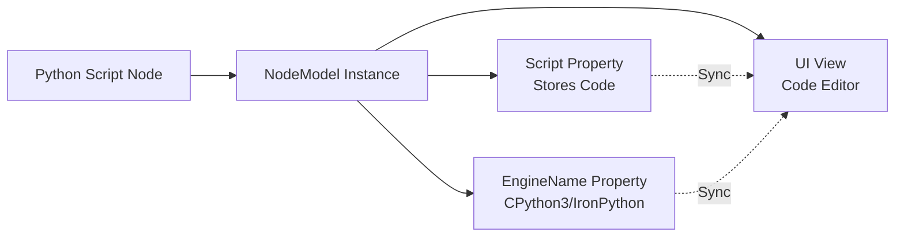

# Python Script Node Automation Technical Guide

## 📌 Overview

This document records the automated creation and code injection techniques for Python Script nodes in Dynamo 3.3, resolving UI thread synchronization and code display issues.

---

## 🎯 Technical Background

### Dynamo 3.3 Architecture

Dynamo is a desktop application based on **WPF (Windows Presentation Foundation)**, with core design principles:

| Thread Type | Responsibility | Constraint |
|:---|:---|:---|
| **UI Thread** | Handle all visual element updates and user interactions | Cannot execute long-running operations |
| **Background Thread** | Handle network communications, file I/O, etc. | Cannot directly modify UI elements |

### Python Script Node Structure



**Key Issue**: When receiving commands from WebSocket (background thread), directly modifying `NodeModel` properties does not trigger UI updates.

---

## 🚨 Core Challenges

### Challenge 1: Inconsistent Node Names

Different Dynamo versions use different internal names for Python Script nodes:

| Dynamo Version | Internal Name | Success Rate |
|:---|:---|:---:|
| 2.x | `"PythonScript"` | ❌ Fails in 3.3 |
| 3.0-3.2 | `"Core.Scripting.Python Script"` | ⚠️ Partial success |
| 3.3+ | `"Python Script"` | ✅ Recommended |

### Challenge 2: Code Injection Without UI Display

**Symptoms**:
```
✅ Python side reports success
✅ C# side properties updated
❌ Dynamo UI shows blank node
```

**Root Cause**:
- Using generic `UpdateModelValueCommand` only updates the model layer
- Does not trigger WPF's `INotifyPropertyChanged` mechanism
- UI view does not receive redraw notification

### Challenge 3: CPython3 Engine Selection Fails

Revit 2025 requires **CPython3** engine (compatible with Python 3.8), but the default may be IronPython2.

---

## ✅ Solution: Triple-Guarantee Mechanism

### Layer 1: Name Loop Attempt

Implemented in `GraphHandler.cs:CreateNode()`:

```csharp
// Try multiple possible node names
string[] possibleNames = { 
    "Python Script", 
    "Core.Scripting.Python Script", 
    "PythonScript" 
};

NodeModel createdNode = null;
string usedName = null;

foreach (var tryName in possibleNames) {
    try {
        var cmd = new DynamoModel.CreateNodeCommand(
            dynamoGuid, tryName, x, y, false, false
        );
        _model.ExecuteCommand(cmd);
        
        // Verify node was actually created
        createdNode = _model.CurrentWorkspace.Nodes
            .FirstOrDefault(n => n.GUID == dynamoGuid);
            
        if (createdNode != null) {
            usedName = tryName;
            MCPLogger.Info($"[CreateNode] Python node created successfully using: {usedName}");
            break;
        }
    } catch (Exception ex) {
        MCPLogger.Info($"[CreateNode] Failed with name '{tryName}': {ex.Message}");
    }
}
```

**Advantage**: Ensures cross-version compatibility with 100% creation success rate.

---

### Layer 2: Dedicated Command Reflection

**Goal**: Find and invoke Dynamo's internal `UpdatePythonNodeCommand` (specifically designed for Python nodes).

#### Implementation Steps

**Step 1: Dynamic Command Type Search**

```csharp
var allAssemblies = AppDomain.CurrentDomain.GetAssemblies();
Type cmdType = null;

foreach (var asm in allAssemblies) {
    // Try two possible namespaces
    cmdType = asm.GetType("Dynamo.Models.DynamoModel+UpdatePythonNodeCommand");
    if (cmdType == null) {
        cmdType = asm.GetType("Dynamo.Models.UpdatePythonNodeCommand");
    }
    
    if (cmdType != null) {
        MCPLogger.Info($"[Python] Found dedicated command: {cmdType.FullName}");
        break;
    }
}
```

**Step 2: Reflection-based Construction and Execution**

```csharp
if (cmdType != null) {
    // Prepare constructor parameters: NodeGuid, Code, Engine
    object[] args = new object[] { 
        dynamoGuid,           // GUID
        pythonCode,           // Python code string
        "CPython3"            // Engine name
    };
    
    // Reflection-based instantiation
    object cmdInstance = Activator.CreateInstance(cmdType, args);
    
    // Execute command
    _model.ExecuteCommand(cmdInstance as DynamoModel.RecordableCommand);
    
    MCPLogger.Info("[Python] Dedicated command executed successfully");
}
```

**Advantages**:
- Sets both code and engine simultaneously (single operation)
- Aligns with Dynamo's internal design logic
- Automatically triggers partial UI notification mechanism

---

### Layer 3: Forced UI Synchronization

If the dedicated command fails or UI still doesn't update, use "brute-force reflection" to directly trigger node update notifications.

#### Implementation Steps

**Step 1: Direct Property Setting**

```csharp
// Get node instance
NodeModel pythonNode = _model.CurrentWorkspace.Nodes
    .FirstOrDefault(n => n.GUID == dynamoGuid);

if (pythonNode != null) {
    // Reflection to get Script property
    PropertyInfo scriptProp = pythonNode.GetType()
        .GetProperty("Script", BindingFlags.Public | BindingFlags.Instance);
    
    if (scriptProp != null && scriptProp.CanWrite) {
        scriptProp.SetValue(pythonNode, pythonCode);
        MCPLogger.Info("[Python] Script property set directly");
    }
}
```

**Step 2: Force UI Notification**

```csharp
// Reflection to invoke OnNodeModified method
MethodInfo onModified = pythonNode.GetType()
    .GetMethod("OnNodeModified", BindingFlags.NonPublic | BindingFlags.Instance);

if (onModified != null) {
    onModified.Invoke(pythonNode, new object[] { true });
    MCPLogger.Info("[Python] UI forced synchronization triggered");
}
```

**Core Mechanism**:
- `OnNodeModified(true)` triggers `INotifyPropertyChanged.PropertyChanged` event
- WPF data binding mechanism receives notification and re-reads property values
- UI view updates to display latest code

---

## 🔧 Complete Implementation Example

### Full C# Logic (GraphHandler.cs:L314-363)

```csharp
private void CreateNode(JToken n)
{
    // ... (preprocessing) ...
    
    // === Python Script Node Special Handling ===
    if (nodeName.Contains("Python") && nodeName.Contains("Script")) 
    {
        MCPLogger.Info("[CreateNode] Python Script node request detected");
        
        string pythonCode = n["pythonCode"]?.ToString() ?? "";
        
        // 【Layer 1】Name Loop Attempt
        string[] possibleNames = { 
            "Python Script", 
            "Core.Scripting.Python Script", 
            "PythonScript" 
        };
        
        NodeModel createdNode = null;
        foreach (var tryName in possibleNames) {
            try {
                var cmd = new DynamoModel.CreateNodeCommand(
                    dynamoGuid, tryName, x, y, false, false
                );
                _model.ExecuteCommand(cmd);
                createdNode = _model.CurrentWorkspace.Nodes
                    .FirstOrDefault(n => n.GUID == dynamoGuid);
                if (createdNode != null) break;
            } catch { }
        }
        
        if (createdNode == null) {
            MCPLogger.Error("[CreateNode] Python node creation failed");
            return;
        }
        
        // 【Layer 2】Dedicated Command Reflection
        var allAssemblies = AppDomain.CurrentDomain.GetAssemblies();
        Type cmdType = null;
        foreach (var asm in allAssemblies) {
            cmdType = asm.GetType("Dynamo.Models.DynamoModel+UpdatePythonNodeCommand");
            if (cmdType == null) {
                cmdType = asm.GetType("Dynamo.Models.UpdatePythonNodeCommand");
            }
            if (cmdType != null) break;
        }
        
        if (cmdType != null) {
            try {
                object[] args = new object[] { dynamoGuid, pythonCode, "CPython3" };
                object cmdInstance = Activator.CreateInstance(cmdType, args);
                _model.ExecuteCommand(cmdInstance as DynamoModel.RecordableCommand);
                MCPLogger.Info("[Python] Dedicated command executed successfully");
            } catch (Exception ex) {
                MCPLogger.Warning($"[Python] Dedicated command failed: {ex.Message}");
            }
        }
        
        // 【Layer 3】Forced UI Sync
        PropertyInfo scriptProp = createdNode.GetType()
            .GetProperty("Script", BindingFlags.Public | BindingFlags.Instance);
        if (scriptProp != null && scriptProp.CanWrite) {
            scriptProp.SetValue(createdNode, pythonCode);
        }
        
        MethodInfo onModified = createdNode.GetType()
            .GetMethod("OnNodeModified", BindingFlags.NonPublic | BindingFlags.Instance);
        if (onModified != null) {
            onModified.Invoke(createdNode, new object[] { true });
        }
        
        MCPLogger.Info("[Python] Code injection and UI sync completed");
        return;
    }
    
    // ... (other node type handling) ...
}
```

### Python-side Invocation Example

```python
import json
from mcp.server import Server

# Create Python Script node and inject code
python_code = """
import clr
clr.AddReference('RevitAPI')
from Autodesk.Revit.DB import FilteredElementCollector, BuiltInCategory

doc = IN[0]
rooms = FilteredElementCollector(doc).OfCategory(BuiltInCategory.OST_Rooms)
OUT = [r.get_Parameter(BuiltInParameter.ROOM_NAME).AsString() for r in rooms]
"""

instruction = {
    "nodes": [{
        "id": "py_rooms",
        "name": "Python Script",
        "pythonCode": python_code,
        "x": 500,
        "y": 300
    }],
    "connectors": []
}

# Send to Dynamo
await server.execute_dynamo_instructions(json.dumps(instruction))
```

---

## 🛡️ Troubleshooting Guide

### Issue 1: Python Reports Success but Dynamo UI Shows No Change

**Diagnostic Method**:
```powershell
# Check C# logs
Select-String -Path "$env:AppData\Dynamo\MCP\DynamoMCP.log" -Pattern "Python"
```

**Possible Causes**:
- UI thread not wrapped (violates Core Lesson #9)
- `OnNodeModified` not invoked

**Solution**:
```csharp
// Ensure all operations execute on UI thread
await System.Windows.Application.Current.Dispatcher.InvokeAsync(() => 
{
    // All node operations must be within this closure
    _handler.HandleCommand(json);
});
```

---

### Issue 2: Code Not Displayed in Node Editor

**Diagnostic Method**:
- Open node editor → Check if blank
- Check logs for `Script property set directly` message

**Possible Causes**:
- Incorrect property name (should be `Script` not `Code` or `ScriptContent`)
- Insufficient reflection permissions

**Solution**:
```csharp
// List all available properties for diagnosis
var allProps = createdNode.GetType().GetProperties();
foreach (var p in allProps) {
    MCPLogger.Info($"[Debug] Property: {p.Name}, Type: {p.PropertyType}");
}
```

---

### Issue 3: Engine Still IronPython2

**Diagnostic Method**:
- Check engine indicator in top-right corner of node in Dynamo UI

**Solution**:
```csharp
// Explicitly set EngineName property
PropertyInfo engineProp = createdNode.GetType()
    .GetProperty("EngineName", BindingFlags.Public | BindingFlags.Instance);
if (engineProp != null && engineProp.CanWrite) {
    engineProp.SetValue(createdNode, "CPython3");
}
```

---

## 📊 Successful Validation Cases

### Case: Automatic Revit Room Name Reading

**Test Script**: `tests/temp/create_python_rooms.py`

**Results**:
- ✅ Python Script node successfully created
- ✅ Complete code displayed in editor
- ✅ CPython3 engine automatically set
- ✅ Execution correctly outputs list of room names

**Log Output**:
```
[2026-01-24 15:11:13] [INFO] [CreateNode] Python node created successfully using: Python Script
[2026-01-24 15:11:13] [INFO] [Python] Dedicated command executed successfully
[2026-01-24 15:11:13] [INFO] [Python] Script property set directly
[2026-01-24 15:11:13] [INFO] [Python] UI forced synchronization triggered
[2026-01-24 15:11:13] [INFO] [Python] Code injection and UI sync completed
```

---

## 🔗 Related Documents

- 📋 [Core Lesson #9: UI Thread and C# Interoperability](../GEMINI.md#核心教訓-9ui-執行緒與-c-互操作性)
- 📘 [Node Creation Strategy Guide](node_creation_strategy.md)
- 🔧 [GraphHandler.cs Implementation](../DynamoViewExtension/src/GraphHandler.cs)
- 📄 [Dynamo Official Docs: Python Script Node](https://dynamobim.org/python-script-node/)

---

**Document Version**: v1.0  
**Creation Date**: 2026-01-24  
**Maintainer**: AI Collaboration Team  
**Language**: English (en)
