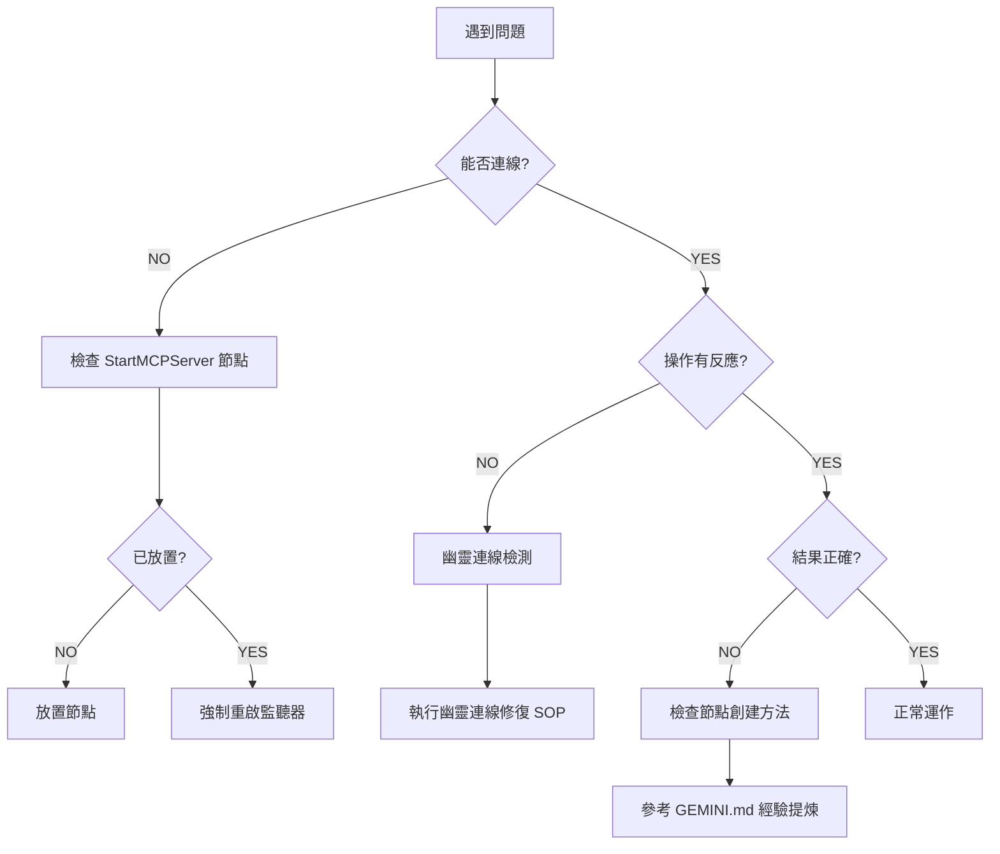

# Dynamo MCP 故障排除 SOP

> **目的**：提供結構化的故障診斷與修復流程，確保 AI 與使用者能快速解決連線與操作問題。

---

## 🔴 連線失敗

### 症狀
- `analyze_workspace` 回傳 `Connection Refused`
- AI 顯示「❌ 失敗: Dynamo 監聽器未啟動」
- HTTP 請求超時

### 診斷步驟

#### 1. 檢查 Dynamo 是否開啟
```
Q: Dynamo 視窗是否開啟？
└─ NO → 請開啟 Dynamo（Sandbox 或 Revit 內建）
└─ YES → 繼續下一步
```

#### 2. 檢查 StartMCPServer 節點
```
Q: 工作區是否已放置 MCPControls.StartMCPServer 節點？
└─ NO → 從節點庫搜尋並放置該節點
└─ YES → 檢查節點狀態是否顯示 "Active"
```

#### 3. 檢查連接埠佔用
**手動檢測**（PowerShell）：
```powershell
netstat -ano | findstr :5050
```

**預期結果**：
- 若顯示 `LISTENING` 且 PID 對應 Dynamo 程序 → 正常
- 若無任何結果 → StartMCPServer 節點未成功啟動
- 若 PID 對應其他程序 → Port 被佔用，需終止該程序

#### 4. 強制重啟監聽器
**修復 SOP**：
1. 放置 `MCPControls.StopMCPServer` 節點
2. 確認顯示 "successfully stopped"
3. **刪除** Stop 節點
4. 重新放置 `StartMCPServer` 節點
5. 執行 `analyze_workspace` 驗證

---

## 👻 幽靈連線

### 症狀
- AI 顯示操作成功（HTTP 200），但 **Dynamo 畫面無反應**
- `nodeCount` 顯示舊資料，但使用者表示「剛開新檔案」
- 使用者回報「看不到節點」

### 發生場景
- 在 **Revit 中重新開啟 Dynamo 視窗**（未關閉 Revit）
- Dynamo 窗口崩潰後重啟
- 多個 Dynamo 實例同時運行

### 診斷方法

#### 自動偵測
```
IF analyze_workspace.nodeCount > 1 
   AND 使用者回報「空白檔案」或「看不到東西」
THEN 判定為幽靈連線
```

#### 手動確認
1. 執行 `analyze_workspace`
2. 查看回傳的 `sessionId`
3. 對比前次記錄的 `sessionId`
4. 若不一致 → 確認為新實例，但連線到舊 Session

### 修復流程

**標準 SOP**（強制執行）：
```
1. StopMCPServer
   └─ 放置 MCPControls.StopMCPServer 節點
   └─ 確認顯示 "successfully stopped"

2. 清理節點
   └─ **必須手動刪除** Stop 節點
   └─ 若有其他舊節點，建議一併清除

3. 重新建立連線
   └─ 放置 MCPControls.StartMCPServer 節點
   └─ 確認顯示 "Active"

4. 驗證修復
   └─ 執行 analyze_workspace
   └─ 確認 nodeCount 恢復為 1
   └─ 確認 sessionId 已更新
```

### 預防措施
- 每次對話開始時，強制執行 [`startup_checklist.md`](startup_checklist.md)
- 若 Dynamo 視窗被重開，**必須**引導使用者執行完整修復流程
- 關閉 Dynamo 前，建議先執行 `StopMCPServer`

---

## ⚠️ 多程序衝突

### 症狀
- `analyze_workspace` 回傳警告：「⚠️ 嚴重警告: 偵測到多個 Dynamo/Revit 程序」
- 指令發送成功，但不確定哪個 Dynamo 接收到

### 診斷步驟

#### 1. 檢查系統程序
**PowerShell**：
```powershell
tasklist | findstr /i "DynamoSandbox Revit"
```

**預期結果**：
- 僅一個 `DynamoSandbox.exe` 或 `Revit.exe` 程序 → 正常
- 多個程序 → 確認為多程序衝突

#### 2. 識別連線目標
- 執行 `analyze_workspace`
- 查看回傳的 `processId`
- 對照 `tasklist` 結果，確認當前連線至哪個程序

### 修復流程

**強制終止法**（推薦）：
```
1. 儲存所有 Dynamo 檔案
2. 關閉所有 Dynamo 與 Revit 視窗
3. 工作管理員 → 強制結束所有 Dynamo/Revit 程序
4. 重新啟動 Dynamo
5. 放置 StartMCPServer 節點
6. 執行 analyze_workspace 驗證
```

**選擇性終止法**（進階）：
```
1. 識別目標 PID（透過 analyze_workspace.processId）
2. 終止非目標 PID 的其他程序
3. 執行 analyze_workspace 確認警告消失
```

---

## 🔧 節點創建失敗

### 症狀
- `execute_dynamo_instructions` 回傳成功，但節點未出現
- 回傳錯誤訊息：「Node creation failed」
- 節點位置錯誤或參數缺失

### 常見原因

#### 1. 使用錯誤的節點名稱
**錯誤範例**：
```json
{"name": "Point.ByCoordinates"}  // ❌ 無法直接創建
```

**正確方法**：
```json
{
  "name": "Number",
  "value": "Point.ByCoordinates(0, 0, 0);"
}
```

**參考文件**：[`GEMINI.md#經驗提煉`](../GEMINI.md#核心教訓-1code-block-是唯一可靠的節點創建方法)

#### 2. 分散式節點 + 連線反模式
**錯誤做法**：試圖創建多個 `Number` 節點並透過 `connectors` 連接

**解決方案**：將所有參數內嵌於單一 Code Block 的 DesignScript 中

#### 3. DesignScript 語法錯誤
**常見錯誤**：
- 缺少分號 `;`
- 參數類型錯誤（字串未加引號）
- Overload 選擇錯誤（2D vs 3D）

**診斷方法**：
1. 檢查 `value` 欄位是否以 `;` 結尾
2. 在 Dynamo 內手動建立 Code Block 測試語法
3. 查詢 `DynamoViewExtension/common_nodes.json` 確認節點簽名

---

## 📌 通用故障排除流程



---

## 🔗 相關文件

- **啟動檢查**：[`startup_checklist.md`](startup_checklist.md)
- **快速參考**：[`QUICK_REFERENCE.md`](../QUICK_REFERENCE.md)
- **節點創建規範**：[`GEMINI.md#經驗提煉`](../GEMINI.md)
- **技術實作**：`DynamoViewExtension/src/SimpleHttpServer.cs`

---

## 📞 升級路徑

若上述 SOP 無法解決問題，請：

1. **檢查日誌**：
   - `DynamoViewExtension` 日誌位置：`%AppData%\Dynamo\[Version]\MCPListener_*.log`
   - 查找錯誤訊息或堆疊追蹤

2. **提供診斷資訊**：
   - `analyze_workspace` 完整回應
   - Dynamo 版本與 Revit 版本
   - 重現步驟

3. **社群支援**：
   - 提交 Issue 至專案 GitHub
   - 附上日誌與診斷資訊
