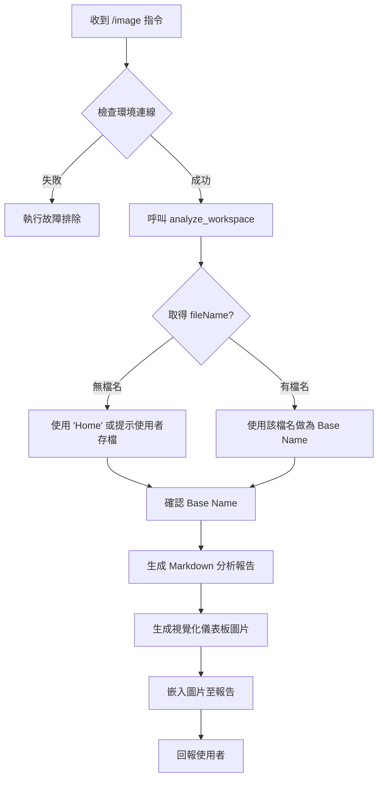

# 📸 Dynamo 腳本視覺化分析 SOP

> **目的**：標準化 `/image` 指令的執行流程，確保能正確捕捉當前工作區狀態、識別檔案名稱，並產出高品質的技術文檔與視覺化圖表。

---

## 📋 執行流程圖

---

## 🛠️ 詳細步驟規範

### 1️⃣ 環境偵測與資訊獲取
**執行動作**：呼叫 `analyze_workspace()`
**關鍵欄位驗證**：
- `nodeCount`: 必須 > 0
- `fileName`: **[關鍵更新]** 優先使用此欄位作為檔案識別。若為 null 或空字串，表示使用者尚未存檔。

### 2️⃣ 命名策略 (Naming Strategy)
為確保產出檔案的一致性，請遵循以下命名規則：
- **Base Name**: 去除路徑與副檔名後的純檔名 (e.g., `MyScript.dyn` -> `MyScript`)
- **分析報告**: `image/[Base Name]_analysis.md`
- **視覺化圖表**: `image/[Base Name]_analysis.png`

### 3️⃣ 內容生成規範

#### 📄 Markdown 分析報告
必須包含以下章節：
1.  **Header**: 標題、日期、狀態。
2.  **腳本資訊快報**: 包含檔名、節點數、複雜度評級。
3.  **輸入參數列表**: 識別 `Input` 類型的節點。
4.  **執行過程**: 條列式邏輯說明。
5.  **產出結果**: 預期生成的 Revit 元件或幾何。
6.  **Mermaid 流程圖**: 視覺化節點邏輯。
7.  **[必要] 視覺化圖表嵌入**: ``

#### 🖼️ 視覺化儀表板 (Dashboard Image)
使用 `generate_image` 工具生成，Prompt 必須包含：
- **風格**: Dark mode, Neon accents, Blueprint aesthetic, Engineering dashboard.
- **規格**: **16:9 Aspect Ratio**, **2K Resolution** (High Definition).
- **關鍵數據**: Node Count, Complexity Rating.
- **核心視覺**: 根據腳本功能 (e.g. 樓板切割、樑柱生成) 描繪的 3D 示意圖。

---

## ⚠️ 異常處理

| 情境 | 處理方式 |
| :--- | :--- |
| **fileName 為空** | 提示使用者：「偵測到未儲存的工作區 (Home)。建議先儲存檔案以獲得正確命名。」若使用者堅持，則使用 `Home` 作為 Base Name。 |
| **節點數為 0** | 中止執行，回報：「工作區為空，無法進行分析。」 |
| **圖片生成失敗** | 僅產出 Markdown 報告，並在結尾註記：「視覺化圖片生成失敗，但技術分析已完成。」 |

---

## 🔗 相關指令
- `/image` : 觸發本流程
- `analyze_workspace` : 核心資料來源
