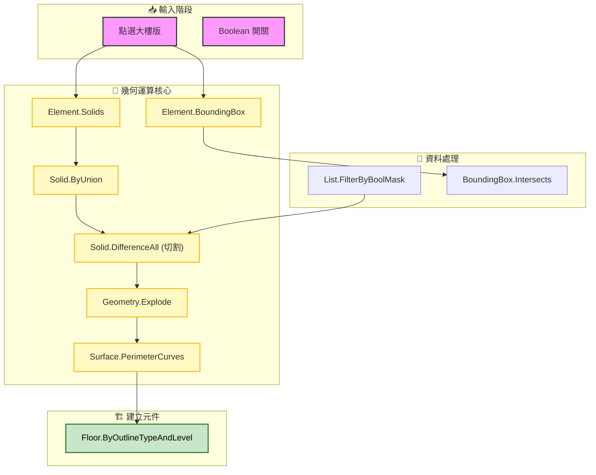

# 📊 Dynamo 腳本視覺化分析報告

## 📋 腳本資訊快報 (Script Info)

| 項目 | 內容 |
| :--- | :--- |
| **📁 腳本名稱** | **樓板生成-20190329(切割法)+BoundingBox.dyn** |
| **🔢 節點總數** | **39** 個節點 |
| **🧠 邏輯複雜度** | ⭐⭐⭐⭐ (中高) - 涉及複雜幾何運算與 Revit 元件建立 |
| **🎯 主要用途** | **自動化樓板建立 (Automated Floor Creation)** 透過選取模型元素，分析其實體幾何與邊界框，並進行布林運算（扣除/聯集），最終依據輪廓自動建立樓板。此版本特別結合了 BoundingBox 進行範圍篩選。 |
| **🏷️ 關鍵標籤** | `Geometry` `Solid` `Boolean` `Floor` `BoundingBox` `切割法` |

---

## 📥 輸入參數 (Inputs)

腳本偵測到以下關鍵輸入節點，使用者需在執行前確認：

| 輸入節點名稱 | 類型 | 說明 |
| :--- | :--- | :--- |
| **點選大樓版** | `DSModelElementSelection` | 選擇 Revit 中的參考元素（可能是大樓量體或參考底圖）。 |
| **Boolean** | `BoolSelector` | 布林切換開關，控制篩選邏輯或執行模式。 |
| **Code Block** | `CodeBlockNodeModel` | 多個程式碼區塊，內含參數設定值。 |

---

## ⚙️ 執行過程 (Execution Process)

系統依據節點邏輯推演的執行步驟如下：

1.  **元素選取**: 使用者透過 `點選大樓版` 節點選擇 Revit 模型中的來源物件。
2.  **幾何擷取**:
    *   透過 `Element.Solids` 提取選取物件的 3D 實體幾何。
    *   透過 `Element.BoundingBox` 取得元素的邊界框，用於快速篩選與碰撞偵測。
3.  **資料篩選與處理**:
    *   使用 `List.Flatten` 攤平清單結構。
    *   使用 `List.FilterByBoolMask` 依據 `BoundingBox.Intersects` (交集) 結果篩選目標幾何。
4.  **幾何布林運算 (核心邏輯)**:
    *   **實體聯集 (`Solid.ByUnion`)**: 將多個零碎實體合併。
    *   **實體差集 (`Solid.DifferenceAll`)**: 執行「切割法」運算，扣除干涉部分。
    *   **幾何炸開 (`Geometry.Explode`)**: 分解為基礎元件。
5.  **輪廓提取**:
    *   使用 `Surface.PerimeterCurves` 取得底面邊界。
6.  **樓板建立**:
    *   最終呼叫 `Floor.ByOutlineTypeAndLevel`，依據輪廓、類型與樓層生成實體樓板。

---

## 📤 產出結果 (Outputs)

| 產出類型 | 說明 | 相關節點 |
| :--- | :--- | :--- |
| **Revit 樓板** | 自動生成的樓板元件 | `Floor.ByOutlineTypeAndLevel` |
| **幾何實體** | 運算過程中的 3D 實體預覽 | `Solid.ByUnion`, `Solid.DifferenceAll` |

---

## 📦 必要外掛清單 (Dependencies)

- **Dynamo Core**
- **Dynamo Revit**
- **DynamoMCPListener**

---

## 📊 邏輯流程圖 (Logic Flowchart)

