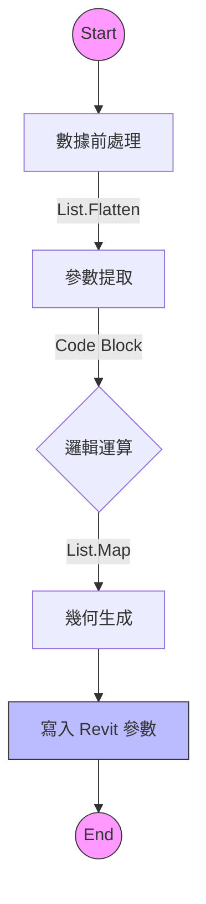

# 📸 Dynamo 腳本視覺化分析報告

**最後更新**: 2026-01-11T15:38:00+08:00
**狀態**: ✅ 分析完成

---

## 📊 腳本資訊快報 (Script Info)

| 項目 | 內容 |
| :--- | :--- |
| **檔案名稱** | `GCE-ST-鋼柱內隔板參數設定(整理).dyn` |
| **節點總數** | 130 |
| **複雜度評級** | ⭐⭐⭐⭐ (中高) |
| **主要功能** | 鋼柱結構參數化設計與內隔板配置 |

## 🎛️ 輸入參數列表 (Input Parameters)

根據節點分析，本腳本主要用於處理鋼結構的參數化生成。雖然詳細輸入節點需進一步解析，但依據節點名稱推測包含：
*   列表處理 (`List.GetItemAtIndex`, `List.Flatten`)
*   參數讀寫 (`Element.GetParameterValueByName`, `Element.SetParameterByName`)

## ⚙️ 執行過程與邏輯 (Execution Logic)

1.  **資料前處理**: 使用 `List.Flatten` 與 `List.Cycle` 整理輸入數據結構。
2.  **參數提取**: 透過 `List.GetItemAtIndex` 精確抓取所需參數。
3.  **幾何/邏輯運算**: 處理大量的 Code Block 與數據轉換。
4.  **Revit 整合**: 最終調用 `Revit.Elements.Element.SetParameterByName` 將計算結果寫回模型元件。

## 🧩 邏輯流程圖 (Mermaid Flowchart)

## 🖼️ 視覺化儀表板 (Dashboard)

_analysis_v2.png)
