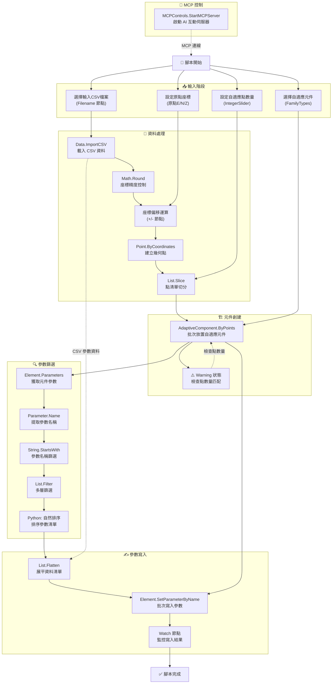

# Dynamo 腳本視覺化分析報告
## 0-讀取CSV-Point放置自適應元件(曲線可用)+參數設定+欄位更新

---

## 📋 腳本資訊快報

### 用途目的
此 Dynamo 腳本用於**從 CSV 檔案讀取座標資料，自動在 Revit 中批次放置自適應元件**，並根據 CSV 資料設定元件的自訂參數值。適用於需要精確控制元件位置與參數的大規模族群配置任務（如幕牆、參數化構件陣列等）。

### 複雜難度
**⭐⭐⭐⭐☆ (困難)**  
- 涉及 CSV 資料處理、座標轉換、幾何運算、清單操作
- 使用 Python 節點進行自然排序
- 包含參數篩選與批次寫入邏輯
- 需要理解 Revit 自適應元件的放置機制

### 使用情境
- 🏢 **幕牆系統配置**：根據設計座標批次放置參數化幕牆面板
- 🌉 **橋梁/鋼構**：依 CSV 提供的空間座標放置結構桿件
- 🔧 **設備管線**：精確放置設備族群並設定規格參數
- 📊 **資料驅動設計**：外部資料（Excel/CSV）驅動的 BIM 模型生成

---

## 📥 輸入參數

| 參數名稱 | 類型 | 預設值 | 說明 |
|:---------|:-----|:-------|:-----|
| **選擇輸入CSV檔案** | File Path | 使用者選擇 | CSV 檔案路徑，包含座標與參數資料 |
| **選擇自適應元件** | FamilyType | Revit 族群選擇器 | 要放置的自適應元件族群類型 |
| **原點E** | Double | 預設值（由使用者設定） | 座標系統原點的東向（X）偏移量 |
| **原點N** | Double | 預設值（由使用者設定） | 座標系統原點的北向（Y）偏移量 |
| **原點Z** | Double | 預設值（由使用者設定） | 座標系統原點的高程（Z）偏移量 |
| **自適應點數量** | Integer | 預設值（Slider） | 每個自適應元件所需的定位點數量 |

---

## ⚙️ 執行過程說明

### 1️⃣ **資料讀取與預處理**
   - 使用者透過 `Filename` 節點選擇 CSV 檔案
   - 調用 `Data.ImportCSV` 節點載入 CSV 內容（假設包含 E, N, Z 座標欄位與參數欄位）
   - 座標資料經過 `Math.Round` 節點進行精度控制

### 2️⃣ **座標轉換與點位創建**
   - 從 CSV 提取的 E、N、Z 值經過「原點偏移運算」（使用 `+` 和 `-` 節點）
   - 將偏移後的座標透過 `Point.ByCoordinates` 轉換為 Dynamo 幾何點
   - 使用 `List.Slice` 節點根據「自適應點數量」參數切分點清單

### 3️⃣ **自適應元件批次放置**
   - 調用 `AdaptiveComponent.ByPoints` 節點，傳入：
     - 二維點陣列（每組點對應一個元件實例）
     - 選定的族群類型（`FamilyTypes` 節點）
   - ⚠️ **Warning 狀態**：可能原因為 CSV 資料結構與自適應點數量不匹配

### 4️⃣ **參數篩選與排序**
   - 使用 `Element.Parameters` 節點獲取所有已放置元件的參數列表
   - 透過 `Parameter.Name` + `String.StartsWith` 節點篩選特定前綴的參數（例如以特定字串開頭的欄位）
   - 多層 `List.Filter` 節點串聯，精確篩選目標參數
   - Python 節點「自然排序」對參數名稱進行排序（確保參數寫入順序）

### 5️⃣ **參數批次寫入**
   - 使用 `List.Flatten` 節點展平資料清單
   - 調用 `Element.SetParameterByName` 節點將 CSV 對應欄位的值寫入元件參數
   - 多次呼叫用於設定不同參數群組（如尺寸參數、標記參數、規格參數等）

### 6️⃣ **監控與偵錯**
   - 多個 `Watch` 節點用於即時查看中間結果
   - `MCPControls.StartMCPServer` 節點用於啟動 MCP 伺服器（AI 互動控制）

---

## 📤 產出結果

| 輸出類型 | 說明 |
|:---------|:-----|
| **Revit 自適應元件實例** | 根據 CSV 座標批次創建的族群實例，精確放置於 3D 空間 |
| **已設定參數的元件** | 所有元件的自訂參數已寫入 CSV 對應的數值 |
| **Watch 節點視覺化資料** | 座標清單、參數名稱清單、參數值清單等中間資料 |

### ⚠️ 當前狀態警告
- **部分節點處於 Warning 狀態**（如 `AdaptiveComponent.ByPoints`、`Element.SetParameterByName`）
- **部分節點處於 Dead 狀態**（未連接或邏輯不完整，如 `String.StartsWith` 節點）
- 建議檢查：
  1. CSV 資料結構是否符合「自適應點數量」參數
  2. 參數名稱篩選條件是否正確
  3. 點切分邏輯是否與族群定義一致

---

## 📦 必要外掛清單

| 外掛/套件名稱 | 用途 | 版本需求 |
|:-------------|:-----|:---------|
| **Dynamo for Revit** | 核心運行環境 | ≥ 2.x |
| **DSOffice** | 讀取 CSV 檔案 (`Data.ImportCSV`) | 內建套件 |
| **Revit API** | 自適應元件操作 (`AdaptiveComponent.ByPoints`) | Revit 2020+ |
| **Python 2.7 或 3.x** | 執行自然排序節點 | Dynamo 內建 IronPython |
| **DynamoMCPListener** | MCP 伺服器控制 (`MCPControls.StartMCPServer`) | 自訂套件 |

---

## 📊 邏輯流程圖 (Mermaid)

---

## 🎯 關鍵技術要點

1. **二維點陣列處理**：`List.Slice` 確保每組點數量與自適應元件定義一致
2. **座標系統轉換**：原點偏移機制允許快速調整整體位置
3. **參數名稱過濾**：使用 `String.StartsWith` 精準篩選 CSV 對應欄位
4. **Python 自然排序**：確保參數寫入順序與 CSV 欄位順序一致
5. **MCP 整合**：支援 AI 助手即時監控與偵錯

---

## 🔧 故障排除建議

| 問題現象 | 可能原因 | 解決方案 |
|:---------|:---------|:---------|
| `AdaptiveComponent.ByPoints` 警告 | 點數量不匹配族群定義 | 檢查「自適應點數量」參數是否與族群一致 |
| `Element.SetParameterByName` 失敗 | 參數名稱錯誤或唯讀 | 使用 Watch 節點檢查篩選後的參數名稱 |
| CSV 資料未正確讀取 | 檔案編碼或格式錯誤 | 確保 CSV 使用 UTF-8 編碼，欄位分隔符號正確 |
| 點位座標偏移錯誤 | 原點設定錯誤 | 驗證「原點E/N/Z」節點的數值是否符合專案基準 |

---

**📅 分析時間**: 2026-01-11 12:35 (GMT+8)  
**🆔 Session ID**: `61a32a69-38a9-4db6-bf77-2aeba5ef6a55`  
**📊 節點總數**: 59  
**✅ Active 節點**: 38  
**⚠️ Warning 節點**: 17  
**☠️ Dead 節點**: 4
