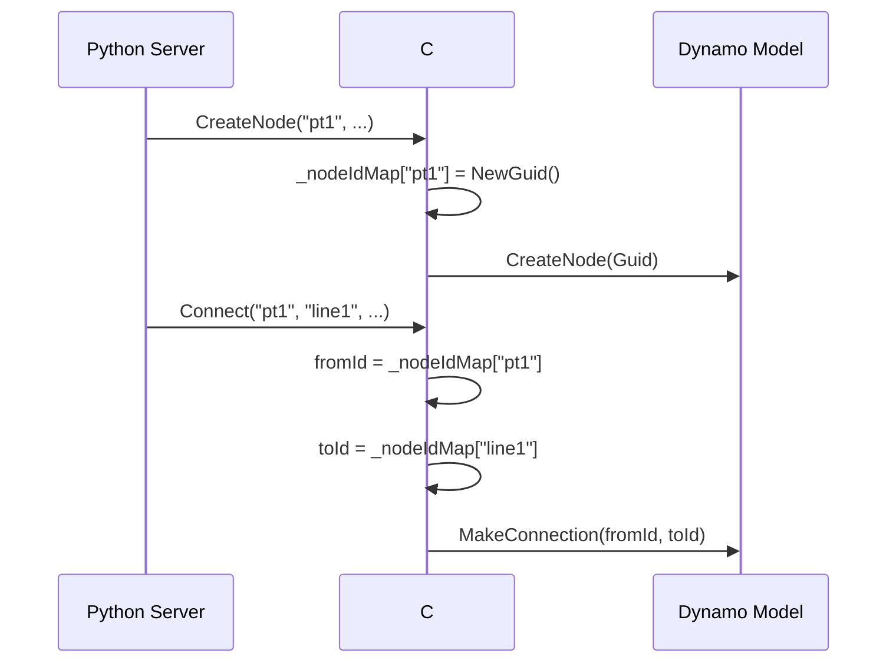

# 核心教訓 #12：節點連線的跨語言 ID 映射

> **最後更新**: 2026-01-24  
> **核心機制**: Python 字串 ID ↔ C# GUID 雙向映射

---

## 技術挑戰

Python 端使用人類可讀的字串 ID（如 `"pt1"`, `"cube_width_1234"`），但 Dynamo 內部要求 GUID 格式。連線時必須正確映射兩種 ID。

---

## 解決方案：映射表機制

### 1. 節點創建時記錄映射

`GraphHandler.cs:L120-127`:

```csharp
Guid dynamoGuid = Guid.TryParse(nodeIdStr, out Guid parsedGuid) 
    ? parsedGuid : Guid.NewGuid();
_nodeIdMap[nodeIdStr] = dynamoGuid;  // 記錄 "pt1" -> GUID
```

### 2. 連線時查詢映射

`GraphHandler.cs:L244-256`:

```csharp
if (!_nodeIdMap.TryGetValue(fromIdStr, out fromId)) {
    fromId = Guid.Parse(fromIdStr);  // 降級處理
}
```

### 3. JSON 連線格式規範

```json
{
  "connectors": [{
    "from": "pt1",       // 字串 ID
    "to": "line1",       // 字串 ID
    "fromPort": 0,       // 必須使用 fromPort（不是 fromIndex）
    "toPort": 0          // 必須使用 toPort（不是 toIndex）
  }]
}
```

---

## 關鍵欄位

| 欄位 | 狀態 | 說明 |
|:---|:---|:---|
| `fromPort` / `toPort` | ✅ 正確 | 0-indexed 埠位索引 |
| `fromIndex` / `toIndex` | ❌ 錯誤 | 無效欄位，會被忽略 |

---

## 映射流程圖



---

## 參考文件

- 📘 詳細技術說明：[`domain/node_connection_workflow.md`](../../domain/node_connection_workflow.md)
- 📘 English Version: [`domain/node_connection_workflow_EN.md`](../../domain/node_connection_workflow_EN.md)
- 🔧 C# 實作：`DynamoViewExtension/src/GraphHandler.cs:L244-256`
