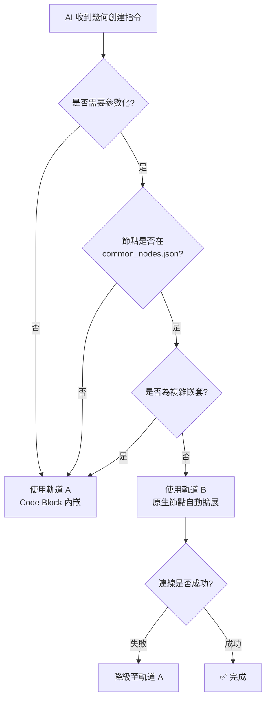

# 核心教訓 #1：雙軌節點創建與自動降級策略

> **最後更新**: 2026-01-20  
> **版本**: v1.2

Dynamo MCP 採用雙軌制策略，並具備自動修復能力。

---

## 🛤️ 軌道 A：Code Block 內嵌模式 (穩定 / 降級路徑)

**適用情境**：
- 複雜嵌套（布林運算）
- 多層循環
- 軌道 B 執行失敗時

**行為**：將邏輯封裝在單一 Code Block 中，不依賴外部連線，成功率 100%。

**黃金法則**：

| 規則 | 說明 |
|:---|:---|
| 節點名稱 | `"Number"` (不是 `"Code Block"`) |
| 代碼欄位 | `value` 存放完整 DesignScript |
| 語法結尾 | 必須以 `;` 結尾 |

**JSON 範例**：
```json
{
  "nodes": [{
    "id": "line1",
    "name": "Number",
    "value": "Line.ByStartPointEndPoint(Point.ByCoordinates(0,0,0), Point.ByCoordinates(100,100,100));",
    "x": 300, "y": 300
  }]
}
```

**優勢**：
- ✅ 100% 可靠，無連線失敗風險
- ✅ 適合複雜嵌套幾何
- ✅ 與 Dynamo 原生設計哲學一致

**劣勢**：
- ❌ JSON 可讀性差
- ❌ 難以參數化

---

## 🛤️ 軌道 B：原生節點自動擴展 (首選 - 參數化優先)

**適用情境**：
- 常規幾何（點、線、立方體）
- 需要參數化的節點
- 腳本庫復用

**行為**：Python 會自動將 `params` 分解為 Number 節點，C# 優先透過埠位名稱確保連線正確性。

**JSON 範例**：
```json
{
  "nodes": [{
    "id": "cube1",
    "name": "Cuboid.ByLengths",
    "params": {"width": 100, "length": 50, "height": 30},
    "x": 500, "y": 300,
    "preview": false
  }]
}
```

**自動轉換結果** (Python 端)：
```json
{
  "nodes": [
    {"id": "cube1", "name": "Cuboid.ByLengths", "x": 500, "y": 300},
    {"id": "cube1_width_1234", "name": "Number", "value": "100", "x": 300, "y": 300},
    {"id": "cube1_length_1234", "name": "Number", "value": "50", "x": 300, "y": 380},
    {"id": "cube1_height_1234", "name": "Number", "value": "30", "x": 300, "y": 460}
  ],
  "connectors": [
    {"from": "cube1_width_1234", "to": "cube1", "fromPort": 0, "toPort": 0}
  ]
}
```

**優勢**：
- ✅ JSON 結構清晰，語義化強
- ✅ 易於參數化

**劣勢**：
- ❌ 依賴跨語言 ID 映射機制
- ❌ 若連線失敗會產生殭屍節點

---

## 🛡️ 自動降級機制

當軌道 B 執行失敗時，Python Server 自動：

1. 偵測錯誤節點類型
2. 將原生節點指令轉換為 DesignScript 代碼
3. 重新打包為軌道 A 模式
4. **自動重試**

---

## 🔀 決策流程



---

## 📎 相關文件

- 📘 詳細技術說明：[`domain/node_creation_strategy.md`](../../domain/node_creation_strategy.md)
- 📋 架構分析報告：[`domain/architecture_analysis.md`](../../domain/architecture_analysis.md)
- 🔧 節點簽名定義：`DynamoViewExtension/common_nodes.json`
