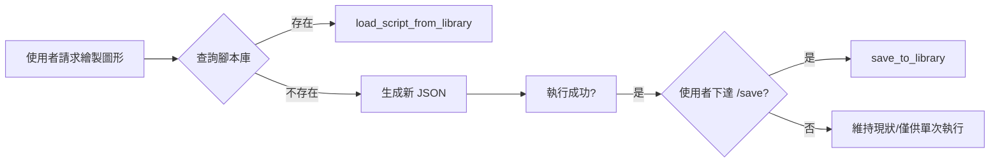

# 核心教訓 #5, #7, #8：腳本庫組織與去重規範

---

## #5：腳本庫復用優先於重新生成

### 最佳實踐流程



### 腳本命名規範

| 規則 | 範例 |
|:---|:---|
| 描述性名稱 | `grid_10x10`, `basic_cube_param` |
| 不包含副檔名 | ✅ `welcome_test` ❌ `welcome_test.json` |
| 小寫 + 底線 | ✅ `random_line` ❌ `RandomLine` |

### 參數化載入

```python
# 偏移 500 單位避免重疊
json_content = mcp.load_script_from_library(
    "basic_house", 
    base_x=500, 
    base_y=0
)
```

---

## #7：嚴禁重複性開發與檔案亂丟

### 強制規範

1. **禁止重複開發**
   - 在建立新腳本前，必須檢查 `tests/` 與 `examples/`
   - 若已有類似功能的腳本，應予以優化或合併
   - 禁止建立 `script_v2.py`、`check_new.py` 等冗餘檔案

2. **產出物歸位**

   | 類型 | 存放位置 |
   |:---|:---|
   | 臨時測試資料 | `tests/temp/` |
   | 正式分析報告/圖像 | `image/` |
   | 核心工具產出 | 嚴禁放根目錄 |

3. **根目錄定點化**
   - 僅允許存放核心配置 (`mcp_config.json`)
   - 服務入口 (`server.py`)
   - 文件 (`GEMINI.md`, `README.md`)

---

## #8：腳本整合範例

### 案例：重複的 analyze_current_workspace.py

| 項目 | 決定 | 理由 |
|:---|:---|:---|
| **保留位置** | `examples/` | 屬於可重複使用的標準工具 |
| **功能來源** | 合併 `tests/` 版本 | 包含完整錯誤處理 |
| **刪除對象** | `tests/` 版本 | 已被 `.gitignore` 屏蔽 |

### 整合後的黃金標準

```python
# examples/analyze_current_workspace.py
✅ 完整的 Apache 2.0 授權聲明
✅ 詳細的 Docstring 說明
✅ 雙重 JSON 解析機制（處理轉義與編碼）
✅ 自動儲存至 tests/temp/workspace_analysis.json
✅ 友善的中文輸出與錯誤訊息
```

---

## 資料夾職責表

| 資料夾 | 用途 | 內容類型 |
|:---|:---|:---|
| `DynamoScripts/` | Dynamo 腳本庫 | JSON (給機器執行) |
| `examples/` | API 使用範例 | Python (教學用途) |
| `tests/` | 測試與診斷 | Python (臨時性質) |
| `domain/` | 技術規格與 SOP | Markdown (文件) |
