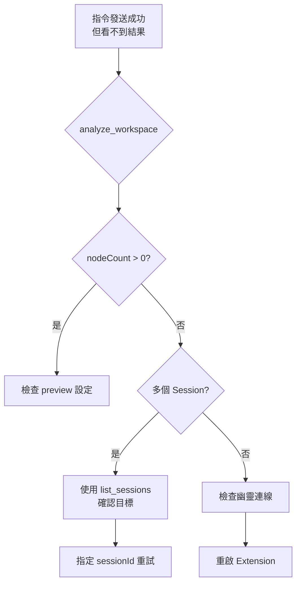

# 核心教訓 #13-14：Session 路由與防幽靈自動清理

> **最後更新**: 2026-01-25

---

## #13：WebSocket Session 衝突診斷

### 幽靈指令症狀

- 指令發送顯示「成功」
- 但 `analyze_workspace` 回報 `nodeCount: 0`
- 使用者看不到任何變化

### 原因

指令發送至了一個「非活動」或「後台監聽」的 Session，而非 Dynamo Extension 真正使用的作用中 Session。

### 解決方案：統一透過 Bridge Server

| 方式 | 狀態 | 說明 |
|:---|:---|:---|
| 直接連線 `ws://localhost:65535` | ❌ 錯誤 | 自訂 Session 可能不被路由 |
| 透過 `ws://localhost:65296` | ✅ 正確 | Bridge Server 自動路由 |

**優勢**：`server.py` 會自動鎖定最後一個有效的 Dynamo Session ID 並進行路由。

### 預檢流程

每次重連或發送指令前，先執行 `analyze_workspace` 以取得當前作用中的 `sessionId`。

---

## #14：多會話路由與防幽靈自動清理

### 精確路由 (Strict Routing)

當開啟多個 Dynamo 視窗時，`execute_dynamo_instructions` 支援 `sessionId` 參數：

```python
result = execute_dynamo_instructions(
    json_data,
    sessionId="specific-session-uuid"  # 可選
)
```

**工具實踐**：
1. 使用 `list_sessions` 取得帶有檔名的會話列表
2. 識別目標視窗
3. 手動指定 Session ID

### 自動清理 (Auto Anti-Ghosting)

`server.py` 會記錄每個連線的 `lastSeen` 時間：

```
analyze_workspace 執行時
  └── 自動觸發 cleanup_stale_sessions
        └── 剔除 > 30 秒無心跳的死連線
```

**優勢**：徹底解決「連線還在但指令無效」的幽靈連線困擾。

### 效能監控

新增 `get_server_stats` 工具，可回傳：
- Uptime
- 累計指令數
- 活躍連線數

---

## 診斷流程圖



---

## 參考檔案

- 🔧 Python 實作：`bridge/python/server.py`
- 📋 故障排除 SOP：[`domain/troubleshooting.md`](../../domain/troubleshooting.md)
