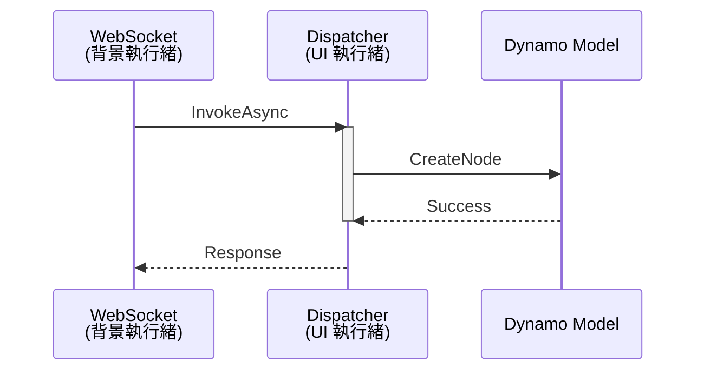

# 核心教訓 #9：UI 執行緒與 C# 互操作性

> **發現日期**: 2026-01-19  
> **嚴重程度**: CRITICAL (違反會導致所有指令靜默失敗)

---

## 背景問題

Dynamo 的核心是一個 WPF 應用程式。當我們從 WebSocket (背景執行緒) 接收指令並試圖建立節點時，會觸發 `NotifyCollectionChanged` 異常，導致程式崩潰或無反應，但外部 Python 端卻顯示成功。

---

## 強制規範

任何涉及 Dynamo 模型修改的操作，**必須**包裝在 UI 執行緒中：

- `CreateNode`
- `MakeConnection`
- `DeleteModel`

---

## C# 實作範本

```csharp
await System.Windows.Application.Current.Dispatcher.InvokeAsync(() => 
{
    // 所有 GraphHandler 的操作必須在此閉包內執行
    response = _handler.HandleCommand(json);
});
```

---

## AI Debug 指南

**症狀判定**：

1. Python 顯示 `✅ 成功`
2. 但 Dynamo 畫面沒有任何變化
3. `analyze_workspace` 回報 `nodeCount: 0`

**診斷步驟**：

1. 檢查 `DynamoMCP.log`
2. 搜尋 `CollectionChanged` 相關錯誤
3. 若發現該錯誤，幾乎 100% 是因為沒有在 UI 執行緒執行

---

## 技術原理



---

## 相關檔案

- 🔧 C# 實作：`DynamoViewExtension/src/DynamoViewExtension.cs`
- 📄 日誌位置：`%TEMP%/DynamoMCP.log`
