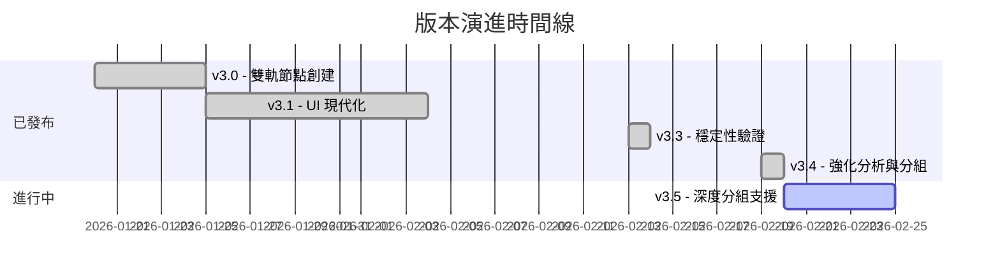

# 專案進度追蹤

> **專案**: AutodeskDynamo_MCP  
> **當前版本**: v3.4

## 📍 版本狀態

| 版本 | 發布日期 | 狀態 |
|:---|:---|:---|
| v3.0 | 2026-01-20 | ✅ 已發布 |
| v3.1 | 2026-01-25 | ✅ 已發布 |
| v3.2 | 2026-02-05 | ✅ 已發布 |
| v3.3 | 2026-02-13 | ✅ 已發布 (System Stability Verified) |
| v3.4 | 2026-02-19 | ✅ 已發布 (Enhanced Analysis & Visualization) |
| v3.5 | 2026-02-?? | 🚧 進行中 (Node Grouping Support) |

---

## 🔄 v3.3 → v3.4 重大變更

| 變更項目 | 說明 | 影響範圍 |
|:---|:---|:---|
| `/image` 指令 | 實作圖表分析功能，可生成 Mermaid 圖表與腳本結構報告 | `server.py`, `GraphHandler.cs` |
| 逾時機制修復 | 將 Session 清理逾時從 30s 提高至 300s，解決大型圖表讀取中斷問題 | `server.py` |
| 倉儲結構清理 | 將輔助腳本移至 `tools/`，日誌移至 `logs/`，保持根目錄整潔 | 專案目錄結構 |
| 節點分組功能 | 實作 `create_group` 入口，支援將節點組織化 | `GraphHandler.cs`, `server.py` |

---

## ✅ 已完成功能

### 核心功能
- [x] 雙軌節點創建 (Code Block + 原生節點)
- [x] 自動降級機制 (連線失敗自動轉 Code Block)
- [x] Python Script 注入與 CPython3 引擎設置
- [x] 跨語言 ID 映射 (Python → C# GUID)
- [x] WebSocket 持久連線與心跳機制
- [x] **Server 自動啟動 (Zero-touch Startup)**
- [x] **外掛節點 GUID 建立支援**
- [x] **知識庫復用 (Script Library)**
- [x] **大型圖表分析 (Enhanced Analysis)**

### 工具與指令
- [x] `analyze_workspace` - 環境分析 (增強: 顯示真實 ID)
- [x] `execute_dynamo_instructions` - 指令執行
- [x] `search_nodes` - 節點搜尋
- [x] `get_script_library` - 腳本庫查詢
- [x] `list_sessions` - 會話列表
- [x] `create_group` - 節點分組 (Beta)
- [x] `/image` - 腳本視覺化分析

---

## 🚧 進行中

- [ ] 外掛 GUID 映射表建置
- [ ] 節點分組穩定性驗證

---

## ❓ 已知問題

| ID | 描述 | 嚴重程度 | 狀態 |
|:---|:---|:---|:---|
| MCP-001 | 工具載入延遲 | 中 | 觀察中 |
| BUG-003 | Custom Node 無法依名稱建立 | 中 | ✅ 用 GUID 解決 |

---

## 📊 版本演進圖

