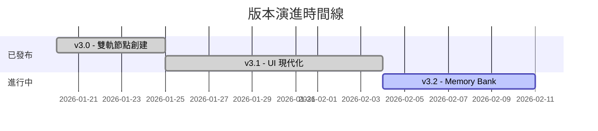

# 專案進度追蹤

> **專案**: AutodeskDynamo_MCP  
> **當前版本**: v3.1

## 📍 版本狀態

| 版本 | 發布日期 | 狀態 |
|:---|:---|:---|
| v3.0 | 2026-01-20 | ✅ 已發布 |
| v3.1 | 2026-01-25 | ✅ 已發布 |
| v3.2 | 規劃中 | 🔄 進行中 |

---

## 🔄 v3.0 → v3.1 重大變更

| 變更項目 | 說明 | 影響範圍 |
|:---|:---|:---|
| UI 現代化 | 移除節點控制，改用選單操作 | Extension UI |
| Python Script 自動化 | 三重保障機制 | `GraphHandler.cs` |
| WebSocket 心跳機制 | 30 秒逾時自動清理 | `server.py` |
| Session 精確路由 | 支援多實例操作 | `server.py` |

---

## 🔄 v3.1 → v3.2 規劃變更

| 變更項目 | 說明 | 影響範圍 |
|:---|:---|:---|
| Memory Bank 架構 | 結構化知識管理系統 | `memory-bank/`, `GEMINI.md` |
| 斜線指令 SOP | 為所有指令建立詳細 SOP | `domain/commands/` |
| 效能監控儀表板 | (待規劃) | - |

---

## ✅ 已完成功能

### 核心功能
- [x] 雙軌節點創建 (Code Block + 原生節點)
- [x] 自動降級機制 (連線失敗自動轉 Code Block)
- [x] Python Script 注入與 CPython3 引擎設置
- [x] 跨語言 ID 映射 (Python → C# GUID)
- [x] WebSocket 持久連線與心跳機制

### 工具與指令
- [x] `analyze_workspace` - 環境分析
- [x] `execute_dynamo_instructions` - 指令執行
- [x] `search_nodes` - 節點搜尋
- [x] `get_script_library` - 腳本庫查詢
- [x] `list_sessions` - 會話列表

---

## 🚧 進行中

- [ ] Memory Bank 架構建置 (v3.2)
- [x] 斜線指令 SOP 文件化 (v3.2)
- [ ] MCP Server 穩定性優化 (解決 asyncio event loop 問題)
- [ ] 自動化測試流程整合 (Autotest)
- [ ] README 文件更新

---

## ❓ 已知問題

| ID | 描述 | 嚴重程度 | 狀態 |
|:---|:---|:---|:---|
| MCP-001 | 工具載入延遲 | 中 | 觀察中 |

---

## 📊 版本演進圖

