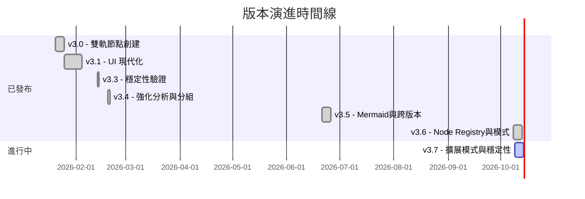

# 專案進度追蹤

> **專案**: AutodeskDynamo_MCP  
> **當前版本**: v3.6

## 📍 版本狀態

| 版本 | 發布日期 | 狀態 |
|:---|:---|:---|
| v3.0 | 2026-01-20 | ✅ 已發布 |
| v3.1 | 2026-01-25 | ✅ 已發布 |
| v3.2 | 2026-02-05 | ✅ 已發布 |
| v3.3 | 2026-02-13 | ✅ 已發布 (System Stability Verified) |
| v3.4 | 2026-02-19 | ✅ 已發布 (Enhanced Analysis & Visualization) |
| v3.5 | 2026-06-21 | ✅ 已發布 (Mermaid Skill & Cross-Revit Support) |
| v3.6 | 2026-10-08 | ✅ 已發布 (Node Registry & Connection Patterns) |

---

## 🔄 v3.3 → v3.4 重大變更

| 變更項目 | 說明 | 影響範圍 |
|:---|:---|:---|
| `/image` 指令 | 實作圖表分析功能，可生成 Mermaid 圖表與腳本結構報告 | `server.py`, `GraphHandler.cs` |
| 逾時機制修復 | 將 Session 清理逾時從 30s 提高至 300s，解決大型圖表讀取中斷問題 | `server.py` |
| 倉儲結構清理 | 將輔助腳本移至 `tools/`，日誌移至 `logs/`，保持根目錄整潔 | 專案目錄結構 |
| 節點分組功能 | 實作 `create_group` 入口，支援將節點組織化 | `GraphHandler.cs`, `server.py` |

---

## 🔄 2026-06 Mermaid Skill 強化（v3.5 里程碑）

| 變更項目 | 說明 | 影響範圍 |
|:---|:---|:---|
| `generate_workspace_mermaid` 模式化 | 新增 `mode` 參數：`pipeline` / `semantic` / `detail`，預設 `pipeline` | `bridge/python/server.py` |
| 預設方向調整 | Mermaid 預設方向改為 `TD`（由上到下） | `bridge/python/server.py`, `tools/generate_mermaid_artifacts.py` |
| Pipeline 可讀邏輯圖 | 依工作流階段自動合併節點並輸出中文語意標籤（如輸入參數、曲線生成、曲面運算） | `bridge/python/server.py` |
| 循環邊修正 | 以 stage rank 過濾反向邊，避免圖中出現互相指向導致線段難讀 | `bridge/python/server.py` |
| Mermaid 工程化腳本 | 新增 `tools/generate_mermaid_artifacts.py`，支援產生/驗證/轉圖（PNG/SVG） | `tools/generate_mermaid_artifacts.py` |
| Skill/SOP 同步 | `.skills/dynamo-script-analysis` 與 `domain/commands/image.md` 同步到 TD + pipeline + mode 三種模式 | `.skills/dynamo-script-analysis/SKILL.md`, `domain/commands/image.md` |
| 測試同步 | `verify_generate_workspace_mermaid.py` 改為驗證 `TD + pipeline` 輸出 | `tests/verify_generate_workspace_mermaid.py` |
| 跨版本安裝與驗證 | 支援跨 Revit 2020-2027 部署，並提供驗證用的獨立 Python 與 PowerShell 測試指令 | `deploy.ps1`, `tests/` |

---

## 🔄 2026-10 節點知識庫與模式復用（v3.6 里程碑）

| 變更項目 | 說明 | 影響範圍 |
|:---|:---|:---|
| Node Registry | 實作 `get_node_recipe`，供建圖前批次查詢正確的建置名稱與埠口順序 | `domain/node_registry.json`, `server.py` |
| 連接模式復用 | 新增 `get_node_pattern` 與 `save_node_pattern`，以實現常用節點組合的提取與自動驗證復用 | `server.py`, `GraphHandler.cs` |
| 畫面擷取模式 | 實作 `capture_node_pattern` 讓使用者能手動在畫面上圈選節點後擷取成模式檔案 | `server.py` |
| 節點輸入輸出屬性 | 建立節點支援 `isInput`/`isOutput`，對應 Dynamo Player 的設定屬性 | `GraphHandler.cs` |
| 可變參數節點支援 | 將 `inputCount` 擴充支援 `List.Create`、`String.Split` 等可變長度參數節點 | `GraphHandler.cs` |
| 依賴與 Node.js 升級 | Node bridge 套件更新，明確要求 Node.js 20 以上執行環境 | `bridge/node/package.json` |

---

## ✅ 已完成功能

### 核心功能
- [x] 雙軌節點創建 (Code Block + 原生節點)
- [x] 自動降級機制 (連線失敗自動轉 Code Block)
- [x] Python Script 注入與 CPython3 引擎設置
- [x] 跨語言 ID 映射 (Python → C# GUID)
- [x] WebSocket 持久連線與心跳機制
- [x] **Server 自動啟動 (Zero-touch Startup)**
- [x] **外掛節點 GUID 建立支援**
- [x] **知識庫復用 (Script Library)**
- [x] **大型圖表分析 (Enhanced Analysis)**

### 工具與指令
- [x] `analyze_workspace` - 環境分析 (增強: 顯示真實 ID)
- [x] `execute_dynamo_instructions` - 指令執行
- [x] `search_nodes` - 節點搜尋
- [x] `get_script_library` - 腳本庫查詢
- [x] `list_sessions` - 會話列表
- [x] `create_group` - 節點分組 (Beta)
- [x] `/image` - 腳本視覺化分析
- [x] `generate_workspace_mermaid(mode=...)` - 三模式邏輯圖 (`pipeline` / `semantic` / `detail`)
- [x] `tools/generate_mermaid_artifacts.py` - Mermaid 產生 + 驗證 + 轉圖
- [x] `get_node_recipe` - 節點建置規則查詢
- [x] `get_node_pattern` / `save_node_pattern` / `capture_node_pattern` - 節點組合模式管理

---

## 🚧 進行中

- [ ] 外掛 GUID 映射表建置 (持續補充)
- [ ] 更豐富的節點連接模式 (.dyn) 收集與測試

---

## ❓ 已知問題

| ID | 描述 | 嚴重程度 | 狀態 |
|:---|:---|:---|:---|
| MCP-001 | 工具載入延遲 | 中 | 觀察中 |
| BUG-003 | Custom Node 無法依名稱建立 | 中 | ✅ 用 GUID 解決 |

---

## 📊 版本演進圖

```mermaid
gantt
    title 版本演進時間線
    dateFormat  YYYY-MM-DD
    section 已發布
    v3.0 - 雙軌節點創建     :done, v30, 2026-01-20, 5d
    v3.1 - UI 現代化        :done, v31, 2026-01-25, 10d
    v3.3 - 穩定性驗證       :done, v33, 2026-02-13, 1d
    v3.4 - 強化分析與分組   :done, v34, 2026-02-19, 1d
    v3.5 - Mermaid與跨版本  :done, v35, 2026-06-21, 5d
    v3.6 - Node Registry與模式:done, v36, 2026-10-08, 5d
    section 進行中
    v3.7 - 擴展模式與穩定性 :active, v37, 2026-10-09, 5d
```

